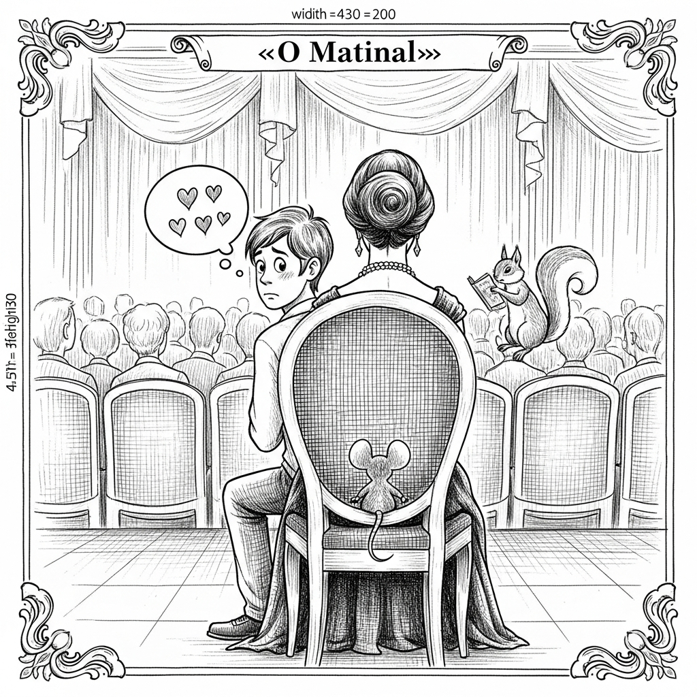

  

  

    
  

  
Anime & Manga

  

  

    
Actor Rif Hutton Dies At 73

    
ANN - Anime News

    
    
Actor voiced roles in Astro Boy, The Wind Rises, Kingsglaive: Final Fantasy XV, more

    <a href="https://www.animenewsnetwork.com/news/2026-04-20/actor-rif-hutton-dies-at-73/.236604" class="article-link">Leia na fonte →</a>
  

  

    
Additional Cast for 'Tongari Boushi no Atelier' Announced

    
MyAnimeList News

    
    
The official website of the Tongari Boushi no Atelier (Witch Hat Atelier) television anime revealed additional cast on Monday. The anime series adapting Kamome Shirahama&#039;s fantasy manga began airing on April 6 at 11:00 p.m. on Tokyo MX, BS11, followed by KBS Kyoto, Sun TV, and AT-X. Voice actors Mutsumi Tamura (Ragna Crimson) and Yoshito Yasuhara (Teogonia) are joining the cast as Tartah and Nolnoa, respectively. Ayumu Watanabe (Summertime Render) is directing the anime at BUG FILMS. Hirosh...

    <a href="https://myanimelist.net/news/74156977?_location=rss" class="article-link">Leia na fonte →</a>
  

  
Brasil

  

  

    
Como um brasileiro buscou apoio de Thomas Jefferson, autor da independência americana, para separar o Brasil de Portugal

    
Folha - Poder

    
    
Uma turística visita às ruínas romanas da cidade de Nimes, no sul da França, serviu como subterfúgio para o encontro secreto entre o então embaixador norte-americano Thomas Jefferson (1743-1826), principal autor da declaração de Independência dos Estados Unidos, e o estudante brasileiro de medicina José Joaquim Maia e Barbalho (1757-1788), que usava o pseudônimo Vendek. Leia mais (04/21/2026 - 17h28)

    <a href="https://redir.folha.com.br/redir/online/poder/rss091/*https://www1.folha.uol.com.br/poder/2026/04/como-um-brasileiro-buscou-apoio-de-thomas-jefferson-autor-da-independencia-americana-para-separar-o-brasil-de-portugal.shtml" class="article-link">Leia na fonte →</a>
  

  

    
Promotoria vê omissão de ex-comandante da PM em apuração sobre vazamentos para o PCC

    
Folha - Cotidiano

    
    
O Ministério Público de São Paulo vê indícios de que o ex-comandante-geral da Polícia Militar José Augusto Coutinho foi omisso ao não apurar vazamentos de operações e de informações sigilosas relacionadas a investigações contra o PCC (Primeiro Comando da Capital), mesmo tendo sido alertado sobre o problema. Leia mais (04/21/2026 - 18h07)

    <a href="https://redir.folha.com.br/redir/online/cotidiano/rss091/*https://www1.folha.uol.com.br/cotidiano/2026/04/promotoria-ve-omissao-de-ex-comandante-da-pm-em-apuracao-sobre-vazamentos-para-o-pcc.shtml" class="article-link">Leia na fonte →</a>
  

  

    
Lula defende acordo UE-Mercosul e propõe Portugal como porta de entrada para empresas brasileiras

    
Folha - Mercado

    
    
Na declaração conjunta que deu ao lado do premiê português Luís Montenegro, durante uma visita-relâmpago de cinco horas a Lisboa, o presidente Luiz Inácio Lula da Silva elogiou a globalização, defendeu o acordo entre o Mercosul e a União Europeia e disse que Portugal poderia ser "a grande porta de entrada dos interesses empresariais brasileiros". Leia mais (04/21/2026 - 17h24)

    <a href="https://redir.folha.com.br/redir/online/mercado/rss091/*https://www1.folha.uol.com.br/mercado/2026/04/lula-defende-acordo-ue-mercosul-e-propoe-portugal-como-porta-de-entrada-para-empresas-brasileiras.shtml" class="article-link">Leia na fonte →</a>
  

  
Cultura & História

  

  

    
Novo 'O Diabo Veste Prada' é uma versão água com açúcar do original?

    
Folha - Ilustrada

    
    
"O Diabo Veste Prada 2" é um dos filmes mais aguardados de 2026 até agora. Mas a campanha de divulgação indica que a sátira do original foi suavizada ?assim como a vilã tóxica interpretada por Meryl Streep. Leia mais (04/21/2026 - 17h50)

    <a href="https://redir.folha.com.br/redir/online/ilustrada/rss091/*https://www1.folha.uol.com.br/ilustrada/2026/04/novo-o-diabo-veste-prada-e-uma-versao-agua-com-acucar-do-original.shtml" class="article-link">Leia na fonte →</a>
  

  
Games

  

  

    
The Sonos Era 100 Smart Speaker Drops to Just $134 Shipped During the Earth Day Sale

    
IGN

    
    
Certified refurbished from Sonos direct with the same warranty as buying new.

    <a href="https://www.ign.com/articles/sonos-era-100-smart-speaker-deal-earth-day-sale" class="article-link">Leia na fonte →</a>
  

  

    
A ‘Game Show’ That’s Basically Dropout For Word Nerds Is The Funniest Thing I’ve Watched In Years

    
Kotaku

    
    
A dreaded school competition has never been this entertaining.

    <a href="https://kotaku.com/game-show-dropout-word-nerds-guy-montgomery-2000689430" class="article-link">Leia na fonte →</a>
  

  
Holanda & Brabant

  

  

    
All 3500 Dutch train conductors to have bodycams by end of year

    
DutchNews

    
    
Train operator NS has begun equipping its conductors with bodycams in the hope of deterring aggression against its staff. A...

    <a href="https://www.dutchnews.nl/2026/04/all-3500-dutch-train-conductors-to-have-bodycams-by-end-of-year/" class="article-link">Leia na fonte →</a>
  

  

    
Meerderheid Kamer wil beheer DigiD bij Solvinity weghalen bij Amerikaanse overname

    
NOS.nl

    
    
De Tweede Kamer doet een dringend beroep op het kabinet om af te zien van verlenging van het DigiD-contract met Solvinity. Het bedrijf dreigt in Amerikaanse handen te komen en de Kamer vindt het veiliger als het DigiD-beheer bij bij Solvinity na zo'n overname wordt weggehaald door het contract dan te beëindigen. Een meerderheid stemde vandaag in met een voorstel daartoe van GroenLinks-PvdA. Liever zien partijen dat het bedrijf helemaal niet in Amerikaanse handen komt, maar de vraag is of de op handen zijnde overname door het Amerikaanse Kyndryl nog te voorkomen is. Het DigiD-contract zou tot 2028 lopen, maar in een briefing in januari bleek dat dit jaar besloten kan worden of het inderdaad tot 2028 wordt verlengd. De keuze om te stoppen zou ook nu gemaakt kunnen worden, zegt GroenLinks-PvdA-Kamerlid Kathmann tegen de NOS. Ze hoopt dat een meerderheid in de Kamer dat steunt. "Als je in augustus zou willen stoppen, moet je dat voor 6 mei aangeven." Ze wil daarover snel in debat maar onder meer coalitiepartijen D66, VVD en CDA willen eerst meer informatie van het kabinet door een brief of technische briefing. 'Veiligheid gegevens onder druk' De zorgen over de overname zijn groot: een meerderheid zei eerder dit jaar al dat alles op alles moet worden gezet om een overname te voorkomen. Gevreesd wordt dat Amerika - als het ons land wil dwarsbomen - overheidsdiensten kan blokkeren of stilleggen. Ook experts waarschuwen daarvoor: mensen zouden dan geen belastingaangifte kunnen doen of via DigiD niet bij diensten en gegevens kunnen. Volgens een belangrijke privacy-ambtenaar gaat het nog veel verder. Hij waarschuwde vorige week in de Volkskrant dat de Amerikaanse overheid na een overname bij persoonlijke gegevens van vrijwel alle Nederlanders kan. Pieter van Oordt trad met zijn waarschuwing naar buiten, omdat hij naar eigen zeggen niet met de staatssecretaris van Binnenlandse Zaken in gesprek kwam. Hij pleit voor een plan B, in plaats van de voorgenomen overname door Kyndryl. In een brief vanmorgen aan de Kamer schrijft staatssecretaris Van der Burg dat dat juridisch geen optie is. 'Klokkenluider opgestaan' "Er is een klokkenluider opgestaan. Dat vergt heel veel moed", aldus Kathmann. Volgens haar schijnt zijn informatie nieuw licht op de zaak en zou de politiek het besluit moeten nemen om het DigiD-beheer zo snel mogelijk bij Solvinity weg te halen. Op de vraag of er zo snel een andere bedrijf gevonden kan worden om het beheer over te nemen, zegt Kathman dat bekend is dat er "al een Nederlandse koper staat te trappelen". Onderzoek naar overname loopt nog Het kabinet ziet tot nu toe geen aanknopingspunten om de Amerikaanse overname tegen te houden. Daar loopt nog onderzoek naar. Van der Burg schijft in zijn brief dat het Bureau Toetsing Investeringen (BTI) toeziet op de risico's voor de nationale veiligheid bij de beoogde overname. Dat advies wordt eerst afgewacht, aldus de staatssecretaris. De Kamer vroeg om het bekendmaken van een veiligheidsanalyse, maar volgens Van der Burg zou gevoelige informatie dan bij kwaadwillenden kunnen belanden. Hij schrijft wel bereid te zijn de Kamer in een vertrouwelijk briefing bij te praten over de veiligheidsrisico's. Hoewel een brede Kamermeerderheid het voorstel van GroenLinks-PvdA om het contract van Solvinity met DigiD na een Amerikaanse overname te verbreken steunde, was er ook kritiek. JA21 stemde tegen. Volgens Kamerlid Van den Berg generaliseert het voorstel "alle Amerikaanse bedrijven". Volgens hem moet er niet gehandeld worden met "teveel anti-amerikanisme" en "symboolpolitiek" en staat het voorstel op "gespannen voet" met de aanbestedingswet.

    <a href="https://nos.nl/l/2611503" class="article-link">Leia na fonte →</a>
  

  
Mundo

  

  

    
Hezbollah dispara foguetes contra Israel e acusa rival de violar cessar-fogo

    
Folha - Mundo

    
    
O grupo libanês Hezbollah afirmou ter disparado foguetes e drones contra o norte de Israel nesta terça-feira (21), acusando o Exército israelense de violar o cessar-fogo antes das negociações mediadas pelos Estados Unidos entre Tel Aviv e Beirute nesta semana. Leia mais (04/21/2026 - 18h03)

    <a href="https://redir.folha.com.br/redir/online/mundo/rss091/*https://www1.folha.uol.com.br/mundo/2026/04/hezbollah-dispara-foguetes-contra-israel-e-acusa-rival-de-violar-cessar-fogo.shtml" class="article-link">Leia na fonte →</a>
  

  
Tecnologia & IA

  

  

    
Framework Has a Better, More Take-Apartable Laptop

    
WIRED

    
    
The company announced its new Framework Laptop 13 Pro, along with updates to its 16-inch model.

    <a href="https://www.wired.com/story/framework-laptop-13-pro/" class="article-link">Leia na fonte →</a>
  

  

    
Apple TV's Hit Show 'Silo' is Returning Soon: Release Date and Trailer

    
MacRumors

    
    
Apple today announced that its hit sci-fi series "Silo" is returning for a third season starting Friday, July 3, and it shared a teaser trailer. "Silo" follows the lives of 10,000 people living in an underground bunker to escape the seemingly toxic wasteland outside. The people are unaware of why the silo was built, and those who seek the truth face deadly consequences. Rebecca Ferguson stars as Juliette Nichols, an engineer who attempts to unravel the mysteries surrounding the silo following a loved one's murder. The show is based on Hugh Howey's best-selling book series, and it is one of the most popular original series on the Apple TV streaming service. The third season will have 10 episodes, with one released every Friday through September 4. Apple already renewed "Silo" for a fourth and final season as well. "With the final two chapters of 'Silo,' we can't wait to give fans of the show an incredibly satisfying conclusion to the many mysteries and unanswered questions contained within the walls of these silos," said showrunner and executive producer Graham Yost, regarding the third and fourth seasons of the show. About Season Three (Spoilers Ahead) Apple says the third season "continues the saga of a dystopian society." "In the present, Juliette Nichols (Rebecca Ferguson) survives her forced 'cleaning' but returns with memory loss as the silo recovers from rebellion and faces a dangerous new threat," says Apple. "Meanwhile, in the 'Before Times,' journalist Helen Drew (Jessica Henwick) and Congressman Daniel Keene (Ashley Zukerman) uncover a conspiracy that pulls them into a chain of events with catastrophic, irreversible consequences." Trailer Apple TV In the U.S., Apple TV is priced at &#36;12.99 per month or &#36;129 per year, with a free one-week trial available for new subscribers. Apple TV is also included in Apple One and Peacock bundles, with all of the options outlined on Apple's website. You can stream Apple TV in the Apple TV app, which is available on the iPhone, iPad, Mac, Apple TV 4K, Apple Vision Pro, Android, PlayStation, Xbox, Roku, Amazon Fire TV, select smart TVs, on the web at tv.apple.com, and more.Related Roundup: Apple TVTags: Apple TV Service, Apple TV ShowsBuyer's Guide: Apple TV (Don't Buy)Related Forum: Apple TV and Home TheaterThis article, "Apple TV&#039;s Hit Show &#039;Silo&#039; is Returning Soon: Release Date and Trailer" first appeared on MacRumors.comDiscuss this article in our forums

    <a href="https://www.macrumors.com/2026/04/21/apple-tv-silo-season-three-release-date/" class="article-link">Leia na fonte →</a>
  

  

    
Regulador britânico de mídia investiga Telegram por conteúdos de abuso sexual infantil

    
Folha - Tec

    
    
O regulador britânico de mídia, Ofcom, anunciou nesta terça-feira (21) a abertura de uma investigação contra o Telegram, após indícios que sugerem que "material de abuso sexual infantil" pode ter sido compartilhado na plataforma de mensagens. Leia mais (04/21/2026 - 13h34)

    <a href="https://redir.folha.com.br/redir/online/tec/rss091/*https://www1.folha.uol.com.br/mercado/2026/04/regulador-britanico-de-midia-investiga-telegram-por-conteudos-de-abuso-sexual-infantil.shtml" class="article-link">Leia na fonte →</a>
  

  
Piadas & Humor

  

  

  

    <strong>DOIS ANIMAIS: Em uma função pública estava um mancebo, mui tímido, sentado atrás de uma senhora, de quem gostava muito, e que não reparava nele. Desejoso de travar conversação, aproveitou a circunstância de ver uma mosca pousada na manta da sua formosa vizinha, e disse-lhe: — Minha senhora, advirto-lhe que tem um animal atrás de si. — Ai me Deus! – respondeu a senhora, muito assustada – não sabia que o sr. estava aí.</strong>
  

  

    <strong>A PACIÊNCIA DO CAPELÃO: Na época da Guerra do Paraguai, um capelão após rezar uma missa para as tropas brasileiras, onde proferira uma homilia em que fizera certa citação histórica, juntou-se à roda dos oficiais para conversar. Um oficial implicante, que, aliás, vivia a atormentá-lo com remoques insolentes, o questionou: — Padre, como é isto? Se em França nunca houve D. Manuel I, como é que o senhor descobriu este D. Manuel III?. Apesar de já a ira lhe subir às faces, anda contemporizou o frade: — Ora esta! Pouco importa a questão do nome do rei, o que vale é a filosofia, a essência do caso! Se não era D. Manuel, seria D. Antônio ou D. José&#8230; — Também nunca os houve em França – redargüiu o pouco amável oficial. Aí perdeu o bom padre as estribeiras, e respondeu-lhe com veemência: — Olhe, quer saber de uma coisa? Se não era D. Manuel, D. Antônio ou D. José, seria D&#8230; Vá Plantar Batatas ou D&#8230; Vá Para o Diabo que o Carregue!</strong>
  

  

    <strong>INQUÉRITO: O tropeiro apeia-se à porta de um armazém e pede a um pequeno para lhe segurar o cavalo. — Não morde? – perguntou o pequeno. — E não são precisos dois para o segurar? — Nesse caso, segure-o você, que tem idade para isso.</strong>
  

  

    <strong>EXPLICAÇÃO DA BÍBLIA: Um frade disputava acaloradamente com um militar, porque este dizia que a terra girava em roda do sol. — O senhor não se lembra, — dizia o enfurecido monge – que Josué fez parar o sol? — Por essa mesma razão lhe digo, — respondeu mui gravemente o militar – que desde essa ocasião ficou imóvel!</strong>
  

  

    <strong>MOTIVO DE PREOCUPAÇÃO: Quando morreu o padre de uma paróquia, puseram um aviso à porta da igreja onde ele costumava rezar missa: “O nosso estimado Padre Fulano de Tal, partiu para encontra-se com Cristo, esta manhã às 10 horas.” Uma mão irreverente escreveu mais embaixo, a lápis: “Três horas da tarde. Ainda não voltou. Começamos a ficar inquietos.”</strong>
  

