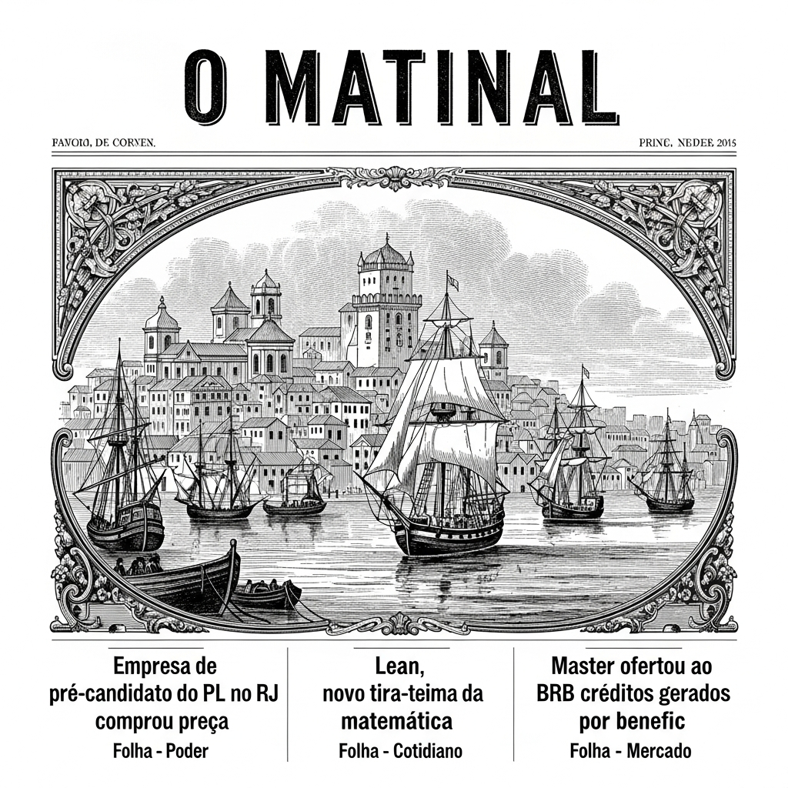
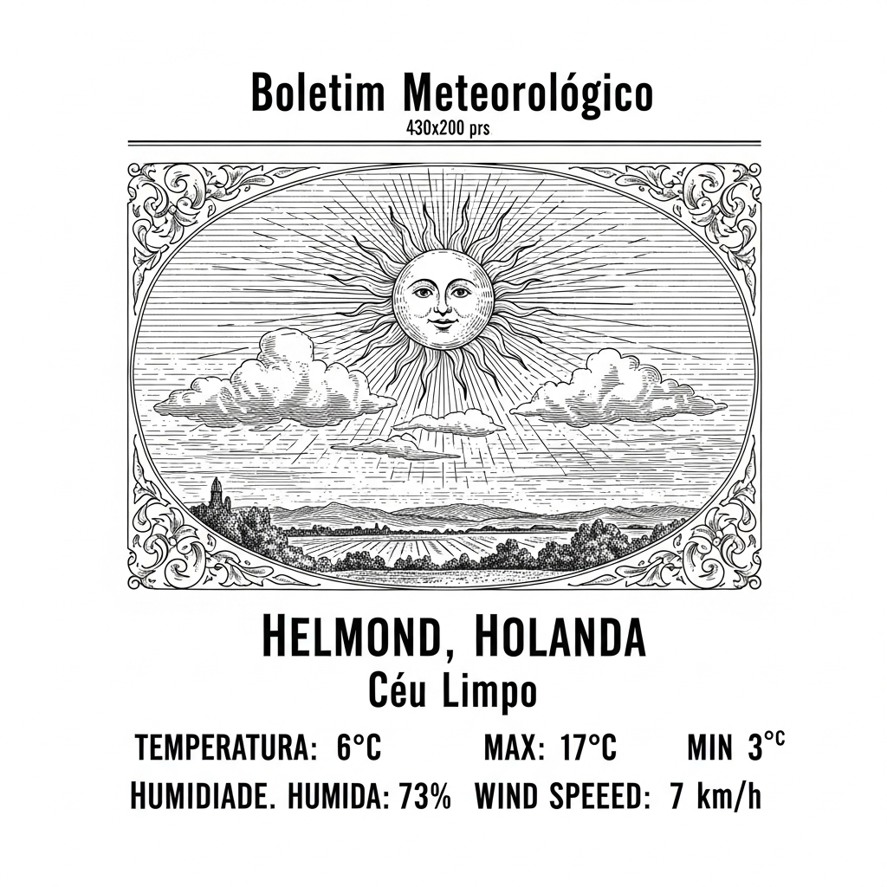

  

  

    
  

  
Anime & Manga

  

  

    
Antiquarian Bookshop Biblia Mystery Novels Get TV Anime in 2027

    
ANN - Anime News

    
    
**O Malho – Notícias Frescas do Cenário Artístico!**  **A Magia Literária de "Antiquarian Bookshop Biblia Mystery Novels" Transposta para as Telas em Formato Anime no Ano da Graça de 2027!**  Prezados leitores e diletantes das belas-artes, é com indizível prazer que este periódico, sempre atento às novidades que adornam o firmamento cultural, lhes traz uma notícia que, sem sombra de dúvida, fará vibrar os corações mais sensíveis e os espíritos mais ávidos por entretenimento de fina estirpe.  Chega-nos de terras distantes, mas com o ímpeto e a clareza de um raio de sol matinal, a gloriosa informação de que a aclamada série literária, conhecida por todos como "Antiquarian Bookshop Biblia Mystery Novels", obra que tem arrebatado almas e mentes com seus enredos intricados e personagens de invulgar profundidade, será em breve transfigurada para o formato de animação televisiva. Sim, meus caros, em um futuro não tão longínquo, no ano da graça de 2027, as páginas que tanto nos deleitam ganharão vida, cor e movimento nas telas de vossos lares!  E para que a empreitada se revista de todo o esplendor e a grandiosidade que a obra original merece, já se anuncia um elenco de vozes de notável talento e prestígio. A sublime Riko Akechi, cuja arte de interpretação é por todos enaltecida, e o distinto Shunsuke Takeuchi, cuja voz é um bálsamo para os ouvidos, emprestarão seus dons para dar vida aos personagens que tanto amamos. Uma escolha que, sem dúvida alguma, garante a excelência da produção.  Ademais, a direção deste promissor projeto estará a cargo do insigne Mamoru Kanbe, um mestre na arte de conduzir narrativas visuais, e a animação será confiada aos hábeis e renomados estúdios Cloverworks, cujo nome é sinônimo de primor técnico e apuro estético. Com tal constelação de talentos reunida, podemos antever que o resultado será uma verdadeira joia, digna de figurar entre as mais memoráveis produções do gênero.  Assim, meus prezados, aguardemos com serena expectativa e inabalável entusiasmo a chegada deste evento que, de pronto, se anuncia como um marco na história da animação. Que as peripécias e os mistérios da "Antiquarian Bookshop Biblia Mystery Novels" continuem a nos encantar, agora em uma nova e vibrante roupagem, para gáudio de todos os apreciadores das boas histórias e da arte que eleva o espírito. O futuro promete ser deveras luminoso para os amantes da cultura!

    <a href="https://www.animenewsnetwork.com/news/2026-04-21/antiquarian-bookshop-biblia-mystery-novels-get-tv-anime-in-2027/.236656" class="article-link">Leia na fonte →</a>
  

  

    
'Biblia Koshodou no Jiken Techou' Reveals Main Cast, Staff, Teaser Promo for 2027 Premiere

    
MyAnimeList News

    
    
**O Malho**  **Uma Novidade Literária de Grande Vulto!**  Meus caros e prezados leitores, preparem-se para uma notícia que, sem sombra de dúvida, trará um sorriso de satisfação aos vossos lábios e um brilho de curiosidade aos vossos olhos! A ilustre e mui respeitável companhia Aniplex, cujo nome já é sinónimo de primor e excelência em terras distantes, acaba de nos brindar com um anúncio de suma importância.  Foi com grande pompa e circunstância que esta empresa, digna de todo o nosso apreço, inaugurou um sítio oficial na vasta teia da internet, desvendando os pormenores de uma adaptação televisiva que promete encantar a todos. Trata-se da afamada obra de En Mikami, intitulada "Biblia Koshodou no Jiken Techou", ou, para os que preferem a nossa doce língua, "Os Arquivos da Livraria Biblia".  Com efeito, os corações dos aficionados pela arte da narrativa e da imagem em movimento regozijaram-se ao saber que o elenco principal já foi escolhido a dedo, contando com os talentosíssimos Riko Akechi e Shunsuke Takeuchi, cujas vozes já ecoam com distinção em outras produções notáveis. A equipe de produção também foi revelada, garantindo que esta empreitada será conduzida com o máximo de esmero e dedicação.  Para aguçar ainda mais a nossa expectativa, foram divulgados um visual de tirar o fôlego e um vídeo promocional que nos permite vislumbrar, em breves instantes, a beleza e a intriga que nos aguardam. A estreia deste magnificente trabalho está agendada para o ano de 2027, um futuro que, embora ainda distante, já nos enche de esperança e ansiedade por tão nobre espetáculo.  Que alegria, meus senhores, poder testemunhar o florescimento de tais iniciativas artísticas, que prometem enriquecer o nosso quotidiano e nos transportar para mundos de fantasia e conhecimento. Aguardemos, pois, com a devida paciência e o coração repleto de entusiasmo, por esta joia que a Aniplex nos prepara com tanto carinho!

    <a href="https://myanimelist.net/news/74160246?_location=rss" class="article-link">Leia na fonte →</a>
  

  
Brasil

  

  

    
Empresa de pré-candidato do PL no RJ comprou precatório de anistiada da ditadura

    
Folha - Poder

    
    
Prezados leitores, é com a devida vénia e a mais escrupulosa atenção que trazemos à luz um facto deveras curioso, que ecoa pelos salões da nossa estimada urbe, o Rio de Janeiro. Parece que, nos meandros da alta finança, onde os caminhos da pecúnia se entrelaçam com as aspirações políticas, uma notícia requere a nossa mais polida consideração.  Com efeito, assevera-se que certas empresas, mui ligadas ao ilustre senhor Douglas Ruas, figura proeminente do Partido Liberal e, como bem sabeis, digníssimo presidente de nossa Assembleia Legislativa Fluminense, e que, ademais, almeja o honroso posto de governador do nosso Estado, teriam empreendido uma operação algo peculiar.  Conta-se que estas respeitáveis entidades comerciais dedicaram-se à aquisição de precatórios. E aqui reside o ponto de maior interesse, meus caros. Tais títulos de crédito, de valor considerável, haviam sido emitidos em nome de uma cidadã que, com todo o respeito, foi agraciada com a anistia política, em virtude de acontecimentos passados, que a todos nos são, de alguma forma, conhecidos e que remontam àquele período de exceção que o país atravessou.  Não bastasse, a história ganha um toque ainda mais pitoresco, pois, entre os precatórios adquiridos, figuram também os de um antigo agente da Polícia Civil. Este cavalheiro, conforme os anais da instituição, fora desonerado de suas funções sob a grave acusação de, pasme-se, corrupção.  Assim sendo, eis que se desenha um quadro de notável complexidade, onde os interesses de figuras públicas e as transações financeiras se entrelaçam de modo que, sem dúvida, desperta a curiosidade dos mais atentos observadores de nossa vida política e social. Que ilações se poderão tirar de tal panorama, deixamos ao discernimento de vossas excelências, prezados leitores. É o que nos cumpre informar, com a usual deferência.

    <a href="https://redir.folha.com.br/redir/online/poder/rss091/*https://www1.folha.uol.com.br/poder/2026/04/empresa-de-pre-candidato-do-pl-no-rj-comprou-precatorio-de-anistiada-da-ditadura.shtml" class="article-link">Leia na fonte →</a>
  

  

    
Lean, novo tira-teima da matemática

    
Folha - Cotidiano

    
    
**O Fascinante Desafio Matemático: O Lean e a Incontestável Verdade**  Prezados e ilustres leitores de "O Malho", permitam-me compartilhar convosco uma reflexão digna de vossa elevada inteligência, acerca da mais nobre das ciências: a Matemática. Há algo de intrinsecamente sedutor e absolutamente cativante neste domínio do saber, que sempre me atraiu com uma força quase magnética. Refiro-me à sua singular e gloriosa capacidade de oferecer respostas definitivas, irrefutáveis, a praticamente qualquer indagação que se lhe apresente.  Imaginem, meus caros, que quando um preclaro matemático, com sua mente aguçada e seu espírito incansável, dedica-se à tarefa de provar – ou, em igual medida, desprovar – um teorema, esse debate, outrora talvez acalorado nos salões acadêmicos, simplesmente se encerra. Não há mais espaço para conjecturas, para suposições ou para as incertezas que tantas vezes toldam outros campos do conhecimento humano. A verdade, qual diamante lapidado, brilha em sua pureza cristalina.  E é precisamente neste ponto, caros amigos, que reside a beleza e a altivez desta ciência. Uma vez estabelecida a verdade, uma vez dissipada qualquer dúvida, a mente humana, livre do fardo da incerteza, pode então prosseguir. Avançamos, com renovado vigor e inextinguível curiosidade, para novas questões, para novos horizontes a serem desvendados, sempre sob a égide da lógica e da razão.  Esta é a essência do que ora vos apresento, um novo "tira-teima" da Matemática, o qual, por sua natureza, reafirma o poder e a autoridade inquestionáveis desta disciplina. Que esta breve divagação sirva para iluminar ainda mais vossa apreciação pela majestade da Matemática, um baluarte da certeza num mundo de constantes indagações.  *Publicado em 21 de abril de 1902, às 23 horas.*

    <a href="https://redir.folha.com.br/redir/online/cotidiano/rss091/*https://www1.folha.uol.com.br/colunas/marceloviana/2026/04/lean-novo-tira-teima-da-matematica.shtml" class="article-link">Leia na fonte →</a>
  

  

    
Master ofertou ao BRB créditos gerados por beneficiários de auxílio social e gestora de cemitérios

    
Folha - Mercado

    
    
**NOTÍCIAS DA CAPITAL FEDERAL E ADJACÊNCIAS**  Prezados leitores e prezadas leitoras,  Com a devida vênia e o respeito que lhes são próprios, permitam-me compartilhar uma notícia de singular interesse que tem circulado nos salões mais abastados e nas rodas de conversa mais esclarecidas de nossa pátria.  Recentemente, fomos testemunhas de um acontecimento digno de nota envolvendo o distinto Banco Master e o nosso respeitável Banco de Brasília, o BRB. Parece que, em virtude de certas vicissitudes e, ousaria dizer, de alguns infortúnios, foi necessário proceder a uma troca de carteiras de crédito entre estas duas veneráveis instituições.  Acontece, meus caros, que as carteiras originais, aquelas primeiramente adquiridas pelo nosso zeloso banco público do Distrito Federal, foram acometidas por certas irregularidades, que, com a delicadeza que o assunto requer, foram identificadas como "fraudes". Uma situação deveras lamentável, não é mesmo?  E o que dizer dos ativos que compunham estas carteiras? É com certa perplexidade que informamos que entre os titulares desses créditos figuravam, em sua maioria, pessoas que haviam sido agraciadas com o auxílio emergencial, um benefício tão caro aos corações generosos de nossa nação. Além destes, encontrávamos empresas de capital social modesto, variando entre a quantia de cento e cinquenta a mil réis, o que nos faz refletir sobre a natureza das operações.  Para completar o quadro, e não menos intrigante, um consórcio responsável pela gestão de cemitérios na progressista São Paulo também estava envolvido. Ora, a gestão do descanso eterno de nossos entes queridos em meio a tais transações... é um tema que nos convida à profunda meditação.  Em suma, prezados, este episódio nos lembra da complexidade dos negócios financeiros e da constante vigilância que se faz necessária para a manutenção da probidade e da confiança em nossas instituições. Que a luz da verdade sempre ilumine os caminhos de nossa economia.  Com os mais sinceros votos de paz e prosperidade,  O Malho.

    <a href="https://redir.folha.com.br/redir/online/mercado/rss091/*https://www1.folha.uol.com.br/mercado/2026/04/master-ofertou-ao-brb-creditos-gerados-por-beneficiarios-de-auxilio-social-e-gestora-de-cemiterios.shtml" class="article-link">Leia na fonte →</a>
  

  
Cultura & História

  

  

    
BBB 26: Com vitória de Ana Paula Renault, reality tem segunda pior final da história

    
Folha - Ilustrada

    
    
**O MALHO**  **A GRANDE FINAL DO "GRANDE IRMÃO" – UM FENÔMENO DE NOSSA ÉPOCA**  Prezados leitores e diletos amigos do progresso e do entretenimento moderno, é com a devida deferência e o esmero que nos é peculiar que vos trazemos as últimas novas do aclamado certame televisivo, conhecido por "Grande Irmão". Na passada terça-feira, dia 21 do corrente mês, os corações de muitos patrícios bateram em uníssono, aguardando o desfecho da vigésima sexta edição deste afamado programa.  A vitória, como já é de conhecimento público, sorriu à distinta senhora Ana Paula Renault, cuja presença cativante e personalidade marcante a levaram ao pódio da consagração. Sua ascensão ao título de vencedora foi acompanhada por uma plêiade de espectadores, gerando, para os padrões hodiernos da emissora, um considerável número de afeição e atenção.  Entretanto, não poderíamos deixar de registrar, com a acuidade que nos é peculiar, um pormenor que, embora não macule o brilho da vitória da senhora Renault, merece a vossa ponderação. Ao perscrutar os anais deste notável divertimento, que teve seu alvorecer no ano de 2002, observa-se que o epílogo desta edição, em termos de audiência comparativa, posiciona-se como o segundo menos expressivo em toda a sua gloriosa trajetória. Uma nuance, sim, mas que nos convida à reflexão sobre os caprichos do gosto público e as inconstâncias do destino televisivo.  Assim, encerramos esta breve crónica, com a certeza de que a senhora Ana Paula Renault desfrutará de sua merecida glória, e que o "Grande Irmão" continuará a ser, por muitos anos vindouros, um espelho das paixões e aspirações de nossa querida nação.

    <a href="https://redir.folha.com.br/redir/online/ilustrada/rss091/*https://f5.folha.uol.com.br/colunistas/outro-canal/2026/04/bbb-26-com-vitoria-de-ana-paula-renault-reality-tem-segunda-pior-final-da-historia.shtml" class="article-link">Leia na fonte →</a>
  

  
Games

  

  

    
Daredevil: Born Again Season 2, Episode 6 Review - "Requiem"

    
IGN

    
    
**O Malho – Notícias de Além-Mar**  **Um Requiem de Emoções na Tela Cinematográfica: A Volta Triunfal e o Dilema Moral**  Meus caros e distintas leitoras, prezados senhores da boa sociedade, é com o mais profundo apreço e a devida reverência que vos trago as últimas novidades do universo das projeções animadas, essas maravilhas que tanto encantam e preenchem nossos serões. A mais recente exibição da afamada série "Daredevil: Born Again", em seu sexto episódio da segunda temporada, intitulado com a melodia sombria de "Requiem", ofereceu-nos um espetáculo deveras memorável, digno de ser debatido em nossos mais ilustres salões.  Pois bem, imaginem a grata surpresa, o contentamento geral que tomou conta da vasta plateia com o retorno triunfal de uma figura já tão querida e esperada! A notável atriz Krysten Ritter, com sua interpretação sempre tão vívida e cativante, reapareceu nas telas, encarnando novamente a personagem de Jessica Jones. Ah, que deleite para os olhos e para a alma ver essa dama novamente a desfilar sua presença marcante, conquistando, como sempre, os corações de todos os que a admiram. Foi, sem sombra de dúvida, um momento de jubilosa aclamação, um verdadeiro bálsamo para os aficionados por essas narrativas de aventura e mistério.  Contudo, não foi apenas o regresso de uma face amiga que marcou este episódio. A trama, com a fineza de um bordado minucioso, debruçou-se sobre um tema de profunda reflexão moral, elevando a narrativa a patamares de seriedade e consideração. O personagem principal, o intrépido Matt, confrontou-se, de maneira bastante tocante e convincente, com a sua arraigada recusa em ceifar uma vida. Este dilema, meus caros, foi apresentado com uma força dramática singular, convidando-nos a ponderar sobre as complexas questões da justiça, da compaixão e dos limites da ação humana.  Assim, entre o júbilo do reencontro e a profundidade de um conflito ético, "Requiem" se estabeleceu como um capítulo de grande valia, digno de figurar entre os mais notáveis desta fascinante saga. Que as próximas projeções nos brindem com igual primor e nos inspirem a tão edificantes discussões.

    <a href="https://www.ign.com/articles/daredevil-born-again-season-2-episode-6-review-recap" class="article-link">Leia na fonte →</a>
  

  

    
A ‘Game Show’ That’s Basically Dropout For Word Nerds Is The Funniest Thing I’ve Watched In Years

    
Kotaku

    
    
Prezados Leitores e Estimadas Leitoras,  Com a devida vênia e um sorriso nos lábios, venho por meio desta rubrica informar-lhes sobre um acontecimento que, tenho certeza, despertará o mais genuíno interesse entre os diletos amantes da palavra e do bom divertimento. Imagino que muitos de vossas excelências, em tempos de mocidade, tenham participado ou ao menos testemunhado aquelas competições escolares, onde o saber era posto à prova e o temor do "branco" na memória pairava como uma nuvem carregada. Pois bem, preparem-se para uma reviravolta digna de nota!  Recentemente, tive o grato prazer de presenciar um certame que, embora evoque a estrutura de um "game show" — termo estrangeiro que ousamos empregar para melhor ilustrar a modernidade do formato —, transcende em muito a mera disputa. Trata-se, meus caros, de uma espécie de "Dropout" para os eruditos da lexicologia, para aqueles que encontram na etimologia e na sintaxe um verdadeiro deleite.  Ainda ressoa em meus ouvidos o eco das gargalhadas contidas e dos aplausos espontâneos que pontuavam cada momento deste espetáculo. Confesso-lhes, sem qualquer pudor, que há longos anos não me deparava com algo tão intrinsecamente hilário e, ao mesmo tempo, tão edificante. A sagacidade dos participantes, a argúcia das questões e a leveza com que o conhecimento era partilhado criaram uma atmosfera de pura alegria.  Longe de ser uma temível prova, este concurso se revelou um festival de inteligência e bom humor, onde a rivalidade cedeu lugar à camaradagem e à admiração mútua. É, sem sombra de dúvida, a coisa mais divertida que tive o privilégio de assistir nos últimos tempos. Convido-os, pois, a imaginarem a cena: mentes brilhantes, em um palco de luzes, desvendando os mistérios da língua pátria com uma desenvoltura que faria inveja aos mais renomados gramáticos.  Que este exemplo sirva de inspiração para que o saber continue a ser celebrado não apenas nos recintos acadêmicos, mas também nos palcos da vida, com a leveza e a graça que a verdadeira inteligência merece.  Com os meus mais respeitosos cumprimentos,  Um Observador Atento.

    <a href="https://kotaku.com/game-show-dropout-word-nerds-guy-montgomery-2000689430" class="article-link">Leia na fonte →</a>
  

  
Holanda & Brabant

  

  

    
Dutch consumer confidence plunges as Middle East war continues

    
DutchNews

    
    
**NOVO REVÉS NO ÂNIMO HOLANDÊS!**  Com a devida vênia de Vossas Excelências, prezados leitores e leitoras que nos honram com sua assídua atenção, permitimo-nos trazer à baila uma notícia de além-mar que, se bem observada, espelha as complexas interconexões de nosso mundo moderno. Desta feita, a pátria dos simpáticos moinhos e das tulipas mais formosas, a Holanda, vê-se acometida por um certo desassossego, um tanto melancólico, em sua alma consumidora.  É com um quê de pesar que informamos que a confiança dos distintos cidadãos neerlandeses, no que tange às suas perspectivas econômicas e à estabilidade de seus alfarrábios, sofreu um notável e, quiçá, preocupante abalo. Qual seria a causa, perguntarão Vossas Senhorias, para tão repentina mudança de humor em terras tão prósperas?  Pois bem, a resposta, meus caros, jaz na persistência de um conflito que, embora distante geograficamente, projeta suas sombras funestas sobre os mercados e os espíritos em todas as latitudes. A guerra no Oriente Médio, com suas vicissitudes e incertezas, tem sido o algoz implacável do ânimo holandês.  Os prezados consumidores, outrora mais otimistas em relação ao porvir, agora se veem enredados em preocupações sobre o inevitável aumento dos preços. Talvez seja o custo do pão, do carvão para aquecer os lares, ou mesmo daquele finíssimo queijo Gouda que tanto apreciam. O receio de que seus escudos monetários percam poder de compra assombra os lares e os armazéns, gerando um clima de prudência, senão de apreensão.  É, portanto, um momento de reflexão sobre como os grandes eventos mundiais, por mais distantes que pareçam, ressoam em cada lar, em cada bolsa, e no coração de cada indivíduo. Que a paz, tão almejada, possa em breve restaurar a serenidade e a confiança em todos os quadrantes do globo.

    <a href="https://www.dutchnews.nl/2026/04/dutch-consumer-confidence-plunges-as-middle-east-war-continues/" class="article-link">Leia na fonte →</a>
  

  

    
Kabinet onderzoekt of Kanye West toch geweigerd kan worden

    
NOS.nl

    
    
**Urgente Notícia do Velho Mundo!**  **O Gabinete Holandês e a Questão do Artista Americano**  Prezados leitores de "O Malho", com a devida vénia e a atenção que merecem os acontecimentos do Velho Mundo, trazemos hoje à vossa consideração uma curiosa e delicada questão que agita os Países Baixos.  Imaginem, meus caros, que o ilustre Gabinete holandês, com a seriedade que lhe é peculiar, debruça-se sobre a possibilidade de vedar a entrada em suas plagas a um afamado artista norte-americano, o senhor Kanye West, também conhecido por "Ye". O digníssimo Ministro do Asilo e Migração, Senhor Van den Brink, mandou investigar com o máximo esmero se haveria "pontos de apoio" legais para tal recusa.  O motivo de tamanho alvoroço? Ora, o artista, que tem dois concertos agendados para junho no Gelredome, em Arnhem, tem sido alvo de veementes críticas, inclusive na respeitável Segunda Câmara do parlamento. É que, em tempos passados, lá por 2025 – notem bem, meus amigos, como o tempo voa mesmo para as notícias –, o senhor Ye proferiu considerações de teor antissemita e, pasmem, expressou apreço pela figura de Adolf Hitler. Contudo, este ano, em um gesto de contrição, declarou arrependimento, atribuindo seu comportamento a uma condição de saúde, a chamada "perturbação bipolar".  Ontem mesmo, em um debate parlamentar sobre o antissemitismo, o Ministro da Justiça e Segurança, Senhor Van Weel, asseverou que seu colega examina a fundo a questão. Mas, com a prudência de um bom estadista, fez "uma advertência de lucro", como se diz. "Temos nos Países Baixos um limiar bastante elevado para negar a alguém a entrada. É mister que haja uma iminente perturbação da ordem pública ou da segurança." E ponderou o Senhor Van Weel que ainda é cedo para afirmar se tal condição se aplica a este músico.  O ministro, aliás, fez questão de reiterar, por diversas vezes, que pessoalmente considera as declarações do rapper deveras reprováveis. "Ele não se apresentará na minha festa de 50 anos este ano, digamos assim", gracejou, com a finura que se espera de um homem de Estado.  É de notar que outras nações europeias, como o Reino Unido, a França e a Polónia, já declararam o senhor Ye persona non grata. Mas, como bem lembrou o Senhor Van Weel, cada país possui as suas próprias regras e idiossincrasias.  Assim, meus prezados, aguardemos com a serenidade que nos é peculiar o desfecho deste intrincado caso, que nos recorda, uma vez mais, a complexidade das relações humanas e dos caminhos da arte no concerto das nações. Que a luz da razão sempre prevaleça!

    <a href="https://nos.nl/l/2611521" class="article-link">Leia na fonte →</a>
  

  
Mundo

  

  

    
Ratos, pulgas e parasitas proliferam em abrigos em Gaza

    
Folha - Mundo

    
    
Ah, meus caros leitores e distintas leitoras, que a paz de Nosso Senhor ilumine vossos corações ao debruçar-vos sobre estas linhas que vos trago, com a pena imbuída de um sentimento de profunda compaixão. É com um suspiro de melancolia que vos narro a triste sina de um povo, que, mesmo após o silêncio dos canhões e o cessar das hostilidades, ainda não encontra o merecido repouso.  Em terras distantes, na longínqua Gaza, onde outrora ecoavam os estampidos da guerra, hoje ressoa um outro clamor, mais sutil, porém não menos aflitivo. Imaginai, por um instante, a desventura do senhor Mohamed al Raqab, um distinto cavalheiro que, meses após a tão almejada trégua, ainda se vê privado do doce ópio do sono. Não são mais as terríveis explosões que lhe roubam a quietude noturna, não, meus amigos. A desdita que o acomete é outra, mais insidiosa e persistente.  Neste campo de deslocados, onde a providência se mostra por vezes tão avara, o pobre senhor Mohamed e seus coirmãos de infortúnio enfrentam uma batalha diária contra uma legião de pequenos, porém vorazes, inimigos. Oh, quão deplorável é constatar que, em meio à penúria e à incerteza do amanhã, ratos, pulgas e outros parasitas de toda sorte proliferam com uma audácia que beira o descaramento! Esses pequeninos flagelos, invisíveis aos olhos desatentos, mas tão presentes na vida daqueles que buscam abrigo, transformam cada noite numa vigília incansável, onde o repouso é um luxo inatingível.  Que este relato, meus caros, sirva não apenas para informar, mas para tocar as fibras mais sensíveis de vossa alma caridosa. Que possamos, em nossos corações, enviar uma prece e um alento a esses irmãos distantes, para que a luz da esperança e o conforto de um sono tranquilo finalmente os alcance, afastando de seus leitos a indesejável companhia desses persistentes intrusos. Que a civilidade e a decência, tão caras a nós, brasileiros de bom-tom, possam um dia prevalecer em todos os recantos deste vasto mundo.

    <a href="https://redir.folha.com.br/redir/online/mundo/rss091/*https://www1.folha.uol.com.br/mundo/2026/04/ratos-pulgas-e-parasitas-proliferam-em-abrigos-em-gaza.shtml" class="article-link">Leia na fonte →</a>
  

  
Tecnologia & IA

  

  

    
Valvoline Coupons & Promo Codes for April 2026

    
WIRED

    
    
**O Malho – Edição de Abril de 1902**  **Notícias da Boa Fortuna para Vossas Máquinas!**  Ilustres leitores e prezados entusiastas da mecânica fina, é com a mais elevada deferência que o vosso periódico predileto, "O Malho", traz-lhes hoje uma nova de grande regozijo e notável economia! Na senda do progresso e da manutenção esmerada, que tanto prezamos em nossos veículos, anuncia-se um acontecimento deveras auspicioso para este vindouro mês de Abril de 1902.  Sim, meus caros, para todos aqueles que zelam com afinco pela saúde e longevidade de suas preciosas máquinas, sejam elas os altivos automóveis ou as diligentes bicicletas motorizadas, a renomada Casa Valvoline, sinônimo de excelência e lubrificação superior, oferece agora uma oportunidade ímpar. Reunimos, com o labor e a dedicação que nos são peculiares, os mais vantajosos cupons e códigos promocionais, verdadeiros bilhetes para a boa fortuna, que permitirão a Vossas Senhorias desfrutar de serviços automotivos e trocas de óleo com uma economia digna de nota.  Imaginem, por obséquio, poder usufruir de uma troca de óleo completamente sintético, o néctar mais puro para o coração de vossas engrenagens, ou outros serviços de manutenção essencial, com um desconto que agradará sobremaneira ao vosso pecúlio. É a Valvoline, em sua generosidade e reconhecimento da lealdade de seus estimados clientes, que abre as portas para que vossas máquinas desfilem pelas ruas com a suavidade e o desempenho que merecem, sem que o vosso bolso sinta o peso de tais cuidados.  Portanto, prezados amigos, não percam tempo! Este mês de abril de 1902 é o ensejo perfeito para garantir que vossos veículos recebam o tratamento régio que a Valvoline proporciona, e que "O Malho", com seu faro para as boas notícias, tem o prazer de lhes apresentar. Que a prosperidade acompanhe vossas jornadas e que vossas máquinas rodem com a leveza de uma pluma, graças a esta venturosa iniciativa!

    <a href="https://www.wired.com/story/valvoline-coupons/" class="article-link">Leia na fonte →</a>
  

  

    
MacRumors Readers React to Tim Cook Stepping Down as CEO

    
MacRumors

    
    
**O Malho**  **Uma Notícia de Grande Vulto no Mundo das Inovações Tecnológicas: A Apple Anuncia Mudanças em Sua Liderança**  Meus caros leitores, em meio ao turbilhão de notícias que nos alcançam diariamente, eis que uma de particular relevância para o progresso e a modernidade nos chega dos rincões da indústria tecnológica! A afamada empresa Apple, conhecida por suas maravilhas eletrônicas que tanto fascinam a sociedade contemporânea, fez um anúncio de peso: o prezado senhor Tim Cook, que por longos anos conduziu com mão firme os destinos da companhia, planeja afastar-se de suas funções de Diretor Executivo. Seu sucessor, para alegria dos amantes da engenharia e da precisão, será o ilustre John Ternus, atualmente à frente da engenharia de hardware.  Circulam pelas rodas da imprensa e nos salões mais abastados os augúrios de que Ternus trará de volta à Apple aquela sagacidade e decisão que tanto caracterizaram o saudoso Steve Jobs. Mas, para além das opiniões dos proeminentes líderes mundiais, que tal ouvir o que pensam os nossos estimados leitores do MacRumors, fervorosos apreciadores dessas máquinas do futuro?  As reações, como era de se esperar, são um verdadeiro mosaico de sentimentos. Há os que, com gratidão no coração, exaltam o legado do senhor Cook, e há os que, com ânimo renovado, celebram a iminente transição.  **Entre os Admiradores do Senhor Cook:**  O distinto "nfl46" exclama: "Agradecemos, Tim! Deixou John numa posição financeira deveras invejável!" O cavalheiro "RMMediccc" acrescenta, com melodia na voz: "Grato por ter sido o homem certo no momento certo, Tim. Sentiremos sua falta, mas era a hora, e a decisão é acertada, tal qual a de Steve." O culto "DocMultimedia" parabeniza o senhor Cook pelo "crescimento assombroso da Apple ao longo de tantos anos," esperando que o progresso continue sob a batuta do senhor Ternus. O perspicaz "Adelphos33" lamenta algumas "respostas decepcionantes," lembrando que Cook, desde 2005, foi um dos mais importantes executivos de todos os tempos, enriquecendo a muitos. E o preclaro "KPOM" vaticina que Tim Cook será lembrado como um dos melhores CEOs de uma Fortune 500, esperando que permaneça como presidente executivo, embaixador da Apple no mundo político.  **E Entre os Críticos do Senhor Cook:**  Mas nem tudo são flores, meus amigos! O impaciente "Kylo83" anseia por "mudanças reais." O jovial "firstcitazen" saúda a saída com um sonoro "Ding Dong!" E o arguto "iPedro" argumenta que Tim Cook "não era um visionário," tendo, inclusive, falhado na visão de Steve Jobs para a Siri. "Novo sangue é necessário," conclui, "e um engenheiro meticuloso é um excelente começo." O efusivo "turbineseaplane" proclama: "Tempo de festa! Notícia fantástica! É tempo de nova ideologia!" E o anônimo "Anonymous123" brada: "Finalmente! Que esta partida marque uma nova e melhor direção para a Apple. Menos foco em serviços, mais em software e hardware de alta qualidade, por favor!"  **Vozes em Louvor ao Senhor Ternus:**  Em meio a este coro de opiniões, os entusiastas do senhor Ternus também se fazem ouvir. O diligente "Nismo73" afirma: "John é o homem certo para o cargo. Parabéns!" O entusiasmado "venom600" regozija-se por ter "um homem de hardware no comando." E o espirituoso "spritle" o batiza de "THE TERNUSATOR!" O visionário "jonnyb098" considera esta a "melhor notícia da Apple em muito tempo," pois a empresa necessita de um "visionário de produtos após 5 anos de estagnação."  **Considerações Gerais:**  O ponderado "terminator-jq" observa que Tim Cook teve "grandes sapatos a preencher," mas fez um "ótimo trabalho" ao tornar a Apple uma das empresas mais valiosas. Contudo, a mudança de CEO "não poderia ter vindo em melhor hora," com a estagnação dos smartphones e a aproximação da era da realidade aumentada. Ter um homem de hardware no leme pode ser a melhor aposta. Já o cético "Brother Cavil" adverte que aqueles que esperam "mudanças significativas de Ternus" podem se desapontar, pois "as pessoas amam seus produtos Apple."  Em suma, meus caros, a Apple, em sua incessante marcha para o futuro, prepara-se para um novo capítulo. O senhor Tim Cook, após anos de dedicação, passará o bastão ao senhor John Ternus em 1º de setembro de 2026, embora permaneça como presidente executivo. Que esta transição traga ainda mais brilho e inovação para o mundo que tanto se beneficia das invenções desta notável companhia!

    <a href="https://www.macrumors.com/2026/04/21/macrumor-readers-react-john-ternus-ceo/" class="article-link">Leia na fonte →</a>
  

  

    
SpaceX anuncia opção de compra do editor de código Cursor por US$ 60 bilhões

    
Folha - Tec

    
    
**NOTÍCIA DE GRANDE VULTUOSO NO MUNDO DA CIÊNCIA E DA INDÚSTRIA!**  Caríssimos leitores,  Com a devida vênia e o mais profundo respeito, permitimo-nos trazer à vossa distinta atenção uma novidade que, decerto, fará reverberar os salões mais ilustres e os gabinetes mais ponderosos de nossa bem-amada pátria e além-fronteiras. A veneranda empresa SpaceX, de notória e crescente projeção no cenário das inovações que elevam o engenho humano aos céus, dignou-se a anunciar, nesta terça-feira, dia vinte e um do corrente mês, uma aliança de notável envergadura.  Trata-se, meus bons amigos, de um consórcio com o afamado "Cursor", um editor de códigos de programação que, mercê de sua inteligência artificial, tem granjeado os mais eloquentes louvores entre os sagazes artífices da computação moderna. Este "Cursor", digno de todas as honras, é tido como um instrumento de inestimável valor, um verdadeiro auxiliar para os que labutam nas intricadas teias da tecnologia.  Mas, eis o ponto que mais fulgura nesta notícia, e que nos impele a compartilhar com a mais solene deferência: tal parceria, de um vulto verdadeiramente assombroso, contempla uma opção de compra. Sim, meus senhores e minhas senhoras, uma opção de compra que permite à SpaceX adquirir a totalidade do "Cursor" pelo impressionante montante de sessenta bilhões de dólares americanos. Em nossa moeda pátria, essa cifra alcança a vertiginosa quantia de duzentos e noventa e nove bilhões de réis, um número que desafia a imaginação e atesta a grandiosidade dos empreendimentos hodiernos.  Esta transação, que se afigura como um marco nos anais da indústria e da tecnologia, deverá ser concretizada até o findar deste ano. E assim, observamos com admiração o progresso incessante da mente humana, que, impulsionada pela sagacidade e pela ousadia, desbrava novos horizontes e forja o porvir com a mesma destreza com que nossos antepassados desbravaram selvas e construíram impérios. Que o futuro nos reserve ainda muitas destas gratas surpresas!

    <a href="https://redir.folha.com.br/redir/online/tec/rss091/*https://www1.folha.uol.com.br/tec/2026/04/spacex-anuncia-opcao-de-compra-do-editor-de-codigo-cursor-por-us-60-bilhoes.shtml" class="article-link">Leia na fonte →</a>
  

  
Piadas & Humor

  

  

  

    <strong>DOIS ANIMAIS: Em uma função pública estava um mancebo, mui tímido, sentado atrás de uma senhora, de quem gostava muito, e que não reparava nele. Desejoso de travar conversação, aproveitou a circunstância de ver uma mosca pousada na manta da sua formosa vizinha, e disse-lhe: — Minha senhora, advirto-lhe que tem um animal atrás de si. — Ai me Deus! – respondeu a senhora, muito assustada – não sabia que o sr. estava aí.</strong>
  

  

    <strong>EXPLICAÇÃO DA BÍBLIA: Um frade disputava acaloradamente com um militar, porque este dizia que a terra girava em roda do sol. — O senhor não se lembra, — dizia o enfurecido monge – que Josué fez parar o sol? — Por essa mesma razão lhe digo, — respondeu mui gravemente o militar – que desde essa ocasião ficou imóvel!</strong>
  

  

    <strong>HUMOR MILITAR: Entre a soldadesca brasileira que participava da Guerra do Paraguai, era hábito, como em todos os exércitos, e em todas as eras; inventar pilhérias e atribuí-las a certos oficiais. A principal vítima dessas gaiatices era um velho brigadeiro, tão conhecido pela bravura como pela ignorância. Dele se contava que, ditando ao secretário a parte relativa a um combate, dissera: “Não se esqueça de escrever que o inimigo fugiu tomado de terror pândego!” A conversa deste brigadeiro era uma série de batatadas, como se dizia então no Exército. De uma formosa rapariga por quem um oficial fazia grandes sacrifícios, referia: “Aquela rapariga sustenta um luxo asinático”, asiático, queria exprimir o bom homem. Casa aritmeticamente fechada, casa de genealogias verdes, eram coisas que lhe atribuíam entre muitas outras. Por exemplo, relatavam que uma vez fizera com ar pesaroso a seguinte observação, ao contemplar enormes rolos de fio telegráfico, deixados numa estação pelos paraguaios: — Que pena não nos poder servir tudo isto! — Mas por que, General? — Ora e que palerma! Não passariam senão palavras em guarani!</strong>
  

  

    <strong>A PACIÊNCIA DO CAPELÃO: Na época da Guerra do Paraguai, um capelão após rezar uma missa para as tropas brasileiras, onde proferira uma homilia em que fizera certa citação histórica, juntou-se à roda dos oficiais para conversar. Um oficial implicante, que, aliás, vivia a atormentá-lo com remoques insolentes, o questionou: — Padre, como é isto? Se em França nunca houve D. Manuel I, como é que o senhor descobriu este D. Manuel III?. Apesar de já a ira lhe subir às faces, anda contemporizou o frade: — Ora esta! Pouco importa a questão do nome do rei, o que vale é a filosofia, a essência do caso! Se não era D. Manuel, seria D. Antônio ou D. José&#8230; — Também nunca os houve em França – redargüiu o pouco amável oficial. Aí perdeu o bom padre as estribeiras, e respondeu-lhe com veemência: — Olhe, quer saber de uma coisa? Se não era D. Manuel, D. Antônio ou D. José, seria D&#8230; Vá Plantar Batatas ou D&#8230; Vá Para o Diabo que o Carregue!</strong>
  

  

    <strong>INQUÉRITO: O tropeiro apeia-se à porta de um armazém e pede a um pequeno para lhe segurar o cavalo. — Não morde? – perguntou o pequeno. — E não são precisos dois para o segurar? — Nesse caso, segure-o você, que tem idade para isso.</strong>
  

