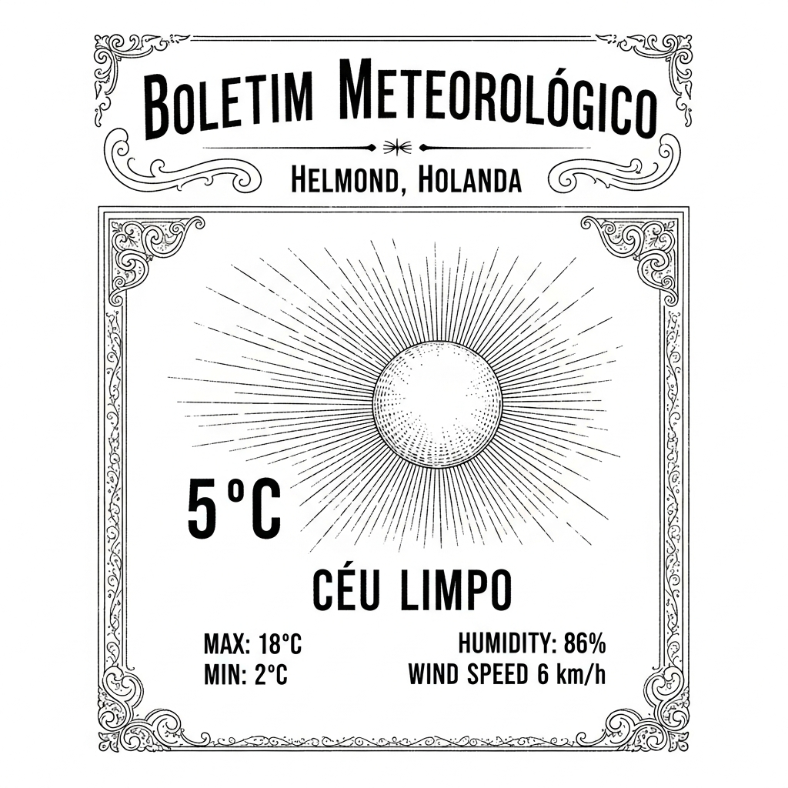

  

  

    
  

  
Anime & Manga

  

  

    
Red River Anime Announces 5 Cast Members

    
ANN - Anime News

    
    
NOTÍCIAS DO MUNDO ARTÍSTICO  **A Anunciada Obra "Red River" e Seus Distintos Atores**  Caros leitores e prezadas leitoras, é com inefável contentamento que trazemos à vossa dileta atenção as mais recentes e auspiciosas novas provenientes do efervescente universo das artes dramáticas, especificamente no que tange à aguardada produção intitulada "Red River". Esta obra, que promete cativar os corações e mentes do nosso distinto público, anuncia, com pompa e circunstância, a adesão de notáveis talentos ao seu elenco.  Em um recente e solene comunicado, os diligentes produtores desta promissora empreitada revelaram os nomes de cinco ilustres artistas que emprestarão suas vozes e suas interpretações a esta narrativa que, sem dúvida, se tornará um marco. É com grande regozijo que registramos a participação da exímia senhorita **Aya Uchida**, cuja graça e talento já são por muitos decantados. Ao seu lado, teremos o prazer de ver atuar o distinto cavalheiro **Shōya Chiba**, cuja arte é reconhecida por sua profundidade e versatilidade.  Não menos importantes, e com igual entusiasmo, anunciamos a presença do distinto senhor **Tomoaki Maeno**, cuja voz ressoa com inegável carisma, e do preclaro senhor **Kōji Yusa**, cuja experiência e maestria prometem enriquecer sobremaneira a tapeçaria desta produção. Finalmente, e para completar este quinteto de estrelas, teremos a honra de contar com a colaboração do talentoso senhor **Kōsuke Toriumi**, cuja capacidade de dar vida a personagens complexos é amplamente admirada.  Assim, meus caros, com este elenco de tamanha envergadura, a obra "Red River" ergue-se no horizonte cultural como um farol de excelência, prometendo momentos de sublime fruição estética e, quiçá, reflexões profundas. Aguardemos, pois, com a devida e elegante paciência, o desdobramento desta grandiosa e esperançosa iniciativa artística.

    <a href="https://www.animenewsnetwork.com/news/2026-04-22/red-river-anime-announces-5-cast-members/.236698" class="article-link">Leia na fonte →</a>
  

  

    
Manga 'Megane, Tokidoki, Yankee-kun' Gets TV Anime

    
MyAnimeList News

    
    
**O Malho**  **Uma Novidade Encantadora no Horizonte da Animação Japonesa!**  Prezados leitores e diletos apreciadores das belas-artes e das mais recentes invenções que nos chegam dos recantos do mundo, é com inestimável prazer que anunciamos uma feliz e promissora notícia que, sem dúvida, fará vibrar os corações mais sensíveis. Chega-nos, de terras longínquas do Oriente, a mui grata informação de que a obra literária ilustrada, de autoria da talentosa Naruki, intitulada "Megane, Tokidoki, Yankee-kun" – cujo título poderíamos traduzir, com certa liberdade poética, como "Óculos com um Toque de Delinquente" – será agraciada com uma adaptação para as telas televisivas!  Foi na última quinta-feira que um sítio eletrônico oficial, dedicado exclusivamente a esta grandiosa empreitada, abriu suas portas virtuais ao público, revelando, para o deleite de todos, uma primorosa ilustração festiva, concebida com maestria pela própria Naruki. Tal imagem, digna de admiração, serve como um convite irrecusável ao universo encantador que nos espera.  A célebre Naruki, de cuja pena brotam enredos tão cativantes, iniciou a serialização desta comédia romântica nas páginas da conceituada revista "Bessatsu Friend" em janeiro do ano de 2021. Desde então, a obra tem conquistado um público fiel e cada vez maior, culminando na publicação do décimo volume em dezembro de 2025. E, para a alegria dos ávidos leitores, o décimo primeiro volume já está agendado para o dia 13 de maio vindouro, prometendo novas e emocionantes peripécias.  É digno de nota que "Megane, Tokidoki, Yankee-kun" já alcançou a impressionante marca de um milhão de exemplares em circulação, um feito que atesta a sua popularidade e o carinho com que é recebida por um vasto número de admiradores.  Assim, aguardamos com a mais pura e sincera expectativa a chegada desta adaptação, que promete levar aos lares de todos a delicadeza, o humor e a doçura que caracterizam a obra original. Que esta nova empreitada seja coroada de êxito e continue a encantar as gerações futuras com suas histórias tão singulares e seus personagens tão memoráveis. Viva a arte e a engenhosidade que nos brindam com tamanhas maravilhas!

    <a href="https://myanimelist.net/news/74167535?_location=rss" class="article-link">Leia na fonte →</a>
  

  
Brasil

  

  

    
Nunes começa articular nome para sua sucessão na Prefeitura de SP

    
Folha - Poder

    
    
**O Futuro da Edilidade Paulistana: Primeiros Murmúrios na Corte Municipal**  Meus caros e prezados leitores do "O Malho", permitam-me trazer-lhes, com a devida e sempre presente deferência, as mais recentes e discretas novas que circulam pelos corredores da nossa venerável Prefeitura de São Paulo.  É de conhecimento público, e não menos de profunda reflexão, que o insigne Prefeito Ricardo Nunes, figura tão estimada e laboriosa, aproxima-se, com a celeridade dos dias que passam, do meio-termo de sua segunda gestão à frente dos destinos desta pujante metrópole. E, como bem se sabe, a prudência e a previdência são virtudes que adornam os grandes estadistas.  Assim sendo, e com a discrição que o tema exige, vêm-se notando, nos últimos dias, algumas conversações de Sua Excelência com seus mais fiéis e conspícuos aliados políticos. Não se trata, por certo, de alardes ou proclamações em praça pública, mas sim de atenciosos e ponderados colóquios, travados com o intuito de, desde já, começar a delinear os contornos daquela que será a sua sucessão no comando da urbe paulistana.  É um tema de suma importância, meus caros, pois o futuro de nossa amada São Paulo depende, em grande medida, da escolha acertada de seu próximo timoneiro. E é com essa visão de futuro, com essa preocupação em garantir a continuidade do progresso e da boa administração, que o Prefeito Nunes, com a sabedoria que lhe é peculiar, já se dedica a tão relevante mister.  Fiquemos, pois, atentos aos próximos desenvolvimentos, que, por certo, serão acompanhados com o escrutínio e a elegância que "O Malho" sempre oferece aos seus distintos leitores. Que a providência divina ilumine os caminhos de nossa querida capital!

    <a href="https://redir.folha.com.br/redir/online/poder/rss091/*https://www1.folha.uol.com.br/colunas/painel/2026/04/nunes-comeca-articular-nome-para-sua-sucessao-na-prefeitura-de-sp.shtml" class="article-link">Leia na fonte →</a>
  

  

    
Servidores rejeitam proposta da USP para encerrar greve e ampliam demandas

    
Folha - Cotidiano

    
    
**A PERSISTÊNCIA DOS CLAROS PROPÓSITOS NA MAGNÍFICA USP**  Meus caros leitores e prezadas leitoras, que a benevolência do destino nos permita um instante de reflexão sobre os acontecimentos que, com notável distinção, se desenrolam nos veneráveis corredores da nossa excelsa Universidade de São Paulo. É com um misto de admiração e, por que não dizer, de um certo enternecimento, que acompanhamos a firmeza de propósitos dos dedicados servidores que, com galhardia e inegável zelo, mantêm-se em seu honroso movimento.  Na tarde desta quarta-feira, dia 22 do corrente mês, em um gesto que denota a nobre intenção de pacificação, a ilustre Reitoria, em sua sabedoria e munificência, apresentou uma proposta que visava ao desejado desfecho deste período de paralisação. Entretanto, e aqui reside o ponto de maior interesse para a nossa crónica, os ínclitos servidores, após profunda e ponderada deliberação, acharam por bem não acolher a referida oferta.  Com efeito, e para o espanto daqueles que imaginavam um rápido e fácil epílogo, a situação não apenas persiste, como, com ares de notável determinação, os ditos servidores, em um ato de coesão e clarividência, não somente mantiveram suas reivindicações originais, mas as ampliaram, apresentando novas e bem fundamentadas demandas.  É um espetáculo, convenhamos, de rara beleza cívica. Ver tamanha união e a defesa intransigente de seus ideais, mesmo diante das tentativas de conciliação, é algo que nos faz refletir sobre a força do trabalho e a dignidade de cada um que contribui para o bom funcionamento de uma instituição tão grandiosa. Que os céus iluminem os caminhos de diálogo, para que, em breve, a harmonia plena retorne aos pátios e gabinetes da nossa querida USP. O Malho, sempre atento aos pulsos da nossa sociedade, continuará a acompanhar, com a devida deferência, os próximos capítulos desta notável epopeia.

    <a href="https://redir.folha.com.br/redir/online/cotidiano/rss091/*https://www1.folha.uol.com.br/educacao/2026/04/servidores-rejeitam-proposta-da-usp-para-encerrar-greve-e-ampliam-demandas.shtml" class="article-link">Leia na fonte →</a>
  

  

    
Desenrola 2.0 deve atrair mais bancos que na primeira versão, diz setor

    
Folha - Mercado

    
    
**O ALVORECER DE UMA NOVA ESPERANÇA PARA OS BOLSOS APERTADOS: O "DESENROLA 2.0" PROMETE AMPLIAR HORIZONTES BANCÁRIOS!**  Caros leitores e prezadas leitoras deste venerável matutino, que a cada aurora vos traz as mais fidedignas novas do nosso querido Brasil! É com a pena em riste e o coração a pulsar de otimismo que vos anunciamos um alento para as agruras financeiras que, por vezes, assombram os lares de nossa gente laboriosa. Chega-nos a grata notícia de que o afamado programa de renegociação de dívidas do governo federal, agora em sua versão "Desenrola 2.0", promete um abraço mais caloroso e inclusivo por parte de nossas instituições bancárias.  Segundo as abalizadas palavras do Senhor Everton Gonçalves, preclaro diretor de Economia, Regulação e Produtos da ABBC – a Associação Brasileira de Bancos, que zelosa representa os pequenos e médios estabelecimentos financeiros de nossa pátria –, o atual delineamento desta benfazeja iniciativa se apresenta deveras mais convidativo. Assevera o ilustre cavalheiro que os custos operacionais e de infraestrutura foram concebidos de forma a serem sobremaneira reduzidos, tornando a adesão ao programa uma perspectiva muito mais viável e aprazível, mormente para as instituições bancárias de menor porte.  Esta sábia concepção significa, em termos mais claros, que um número consideravelmente maior de bancos poderá, enfim, participar deste esforço nacional de auxílio às famílias e indivíduos que se veem enredados nas teias de débitos. É uma verdadeira lufada de ar fresco, um raio de sol a penetrar nas sombras da preocupação, oferecendo um caminho mais sereno para a regularização da vida financeira de tantos.  Assim, com esta promessa de maior abrangência e acessibilidade, o "Desenrola 2.0" surge no horizonte como um farol de esperança, iluminando o porvir e garantindo que o amparo chegue a um espectro mais vasto de nossos concidadãos. Aguardemos, pois, com a serenidade que nos é peculiar, os frutos venturosos desta louvável empreitada governamental.  *Do O Malho, 22 de abril de 1902.*

    <a href="https://redir.folha.com.br/redir/online/mercado/rss091/*https://www1.folha.uol.com.br/mercado/2026/04/desenrola-20-deve-atrair-mais-bancos-que-na-primeira-versao-diz-setor.shtml" class="article-link">Leia na fonte →</a>
  

  
Cultura & História

  

  

    
Como a biografia de Michael Jackson fez o 'moonwalk' e fugiu de polêmicas do astro

    
Folha - Ilustrada

    
    
Prezados e finíssimos leitores,  Com a permissão de vossas mercês, permitimo-nos hoje trazer à vossa distinta atenção uma nota sobre os recônditos do cinematógrafo, essa maravilha moderna que tanto nos encanta. Chega-nos a notícia de que a biografia filmada do notável artista Michael Jackson, cujo nome artístico ressoa em tantos salões, intitulada simplesmente "Michael", está prestes a ser exibida nas telas escuras de nossos cinemas.  Ora, é de se notar, com certa sagacidade e espírito de observação, que não se esperava, de modo algum, que tal obra cinematográfica ousasse adentrar os meandros mais delicados e as controvérsias que, porventura, tenham acompanhado a vida e a gloriosa carreira do que muitos chamam, com toda a propriedade, de o "Rei do Pop".  Parece que a película, com a discrição que se espera de uma obra de arte respeitosa, fará o seu próprio "moonwalk" – essa peculiar e engenhosa dança que o artista tão bem executava – e, com a elegância de um cavalheiro em um baile, esquivará-se das veredas mais espinhosas, evitando as polêmicas que, porventura, pudessem ensombrar a memória do ilustre cantor.  Assim, meus caros, teremos a oportunidade de apreciar uma narrativa que, ao que tudo indica, preferirá celebrar o gênio e a arte, deixando de lado os capítulos que, talvez, não fossem tão edificantes para o grande público. Uma escolha, sem dúvida, que preza pela harmonia e pelo bom-tom, digna de ser apreciada em uma tarde de lazer.  É o que se aguarda, com a devida curiosidade, desta nova produção que promete encantar e, talvez, até mesmo inspirar, sem jamais perturbar a tranquilidade dos corações mais sensíveis.

    <a href="https://redir.folha.com.br/redir/online/ilustrada/rss091/*https://www1.folha.uol.com.br/ilustrada/2026/04/como-a-biografia-de-michael-jackson-fez-o-moonwalk-nas-polemicas-do-rei-do-pop.shtml" class="article-link">Leia na fonte →</a>
  

  
Games

  

  

    
Australian Government Demands to Know What Roblox, Minecraft, Fortnite, and Steam are Doing to Prevent Grooming, Radicalisation

    
IGN

    
    
**O Imperioso Apelo do Governo Australiano aos Gigantes Virtuais: Uma Questão de Zelo e Cuidado**  Prezados leitores e diletos confrades,  Permitam-me que lhes traga à colação um assunto de suma importância, que ecoa nos mais recônditos gabinetes de poder e se estende pelos vastos domínios da modernidade, onde a juventude se deleita em divertimentos virtuais. Refiro-me, pois, à mui respeitosa, mas peremptória, interpelação que o ilustre Governo da Austrália endereçou a algumas das mais proeminentes empresas responsáveis por plataformas de entretenimento digital.  Com efeito, os valorosos mandatários da terra dos cangurus, imbuídos de um nobre espírito de proteção à sua prole, exigem, com a urbanidade que lhes é peculiar, mas com a firmeza que a causa impõe, que as companhias por detrás dos afamados "Roblox", "Minecraft", "Fortnite" e "Steam" apresentem, sem delongas, um pormenorizado relatório. A questão central, meus caros, e que assola os corações paternos e maternos em todo o orbe, concerne às medidas que estas entidades têm implementado para salvaguardar a inocência e a segurança de seus jovens usuários.  Não se trata de uma mera sugestão, mas sim de uma exigência irrecusável, onde a palavra "mandatório" ressoa com a gravidade de um decreto. O fito primordial desta iniciativa é o de conhecer, com clareza cristalina, as estratégias e os mecanismos empregados para prevenir condutas nefastas, como o aliciamento de menores – o que, com a devida vênia, é uma chaga social de proporções alarmantes – bem como a propagação de ideias radicalizadas, que podem desvirtuar mentes jovens e influenciáveis.  É louvável, deveras, a postura do Governo Australiano, que se ergue como um zeloso guardião dos valores éticos e da incolumidade de sua juventude. Num tempo em que as fronteiras entre o real e o virtual se esbatem com uma celeridade assombrosa, e onde os perigos podem espreitar sob as vestes da diversão, é imperioso que as grandes corporações assumam a sua quota-parte de responsabilidade social.  Aguarda-se, portanto, com a expectativa que o tema merece, as respostas dessas empresas, que, esperamos, demonstrarão o mesmo empenho e a mesma probidade na proteção de seus usuários que demonstram na inovação tecnológica. Que esta iniciativa sirva de farol para outras nações, inspirando-as a exigir um ambiente digital mais seguro e propício ao desenvolvimento saudável de nossas futuras gerações.  Com os meus mais cordiais cumprimentos,  Um Observador Atento.

    <a href="https://www.ign.com/articles/australian-government-demands-to-know-what-roblox-minecraft-fortnite-and-steam-are-doing-to-prevent-grooming-radicalisation" class="article-link">Leia na fonte →</a>
  

  

    
The Week In Games: Pottery Parties And A Long-Lost JRPG

    
Kotaku

    
    
**A Semana Recreativa: Novidades para o Divertimento dos Nossos Leitores**  Caros e prezados leitores do "O Malho", é com o mais puro deleite que vos trazemos as últimas novidades do universo dos jogos e passatempos, que prometem alegrar os vossos serões e as vossas tardes de ócio. Ah, como é bom ter um pouco de distração em meio às agruras da vida moderna!  Nesta segunda quinzena do mês de abril, tão gentil e primaveril, somos agraciados com o surgimento de verdadeiras joias para vossos aparelhos de diversão, sejam eles os computadores de vossas residências ou os consoles, que tantos jovens e adultos têm adotado com entusiasmo.  Pois bem, preparem-se para as "Festas da Cerâmica", um verdadeiro primor de divertimento que vos permitirá, em Kiln, explorar a arte milenar da olaria. Imaginem a satisfação de moldar o barro, de criar vossas próprias peças, de dar forma à vossa imaginação! É um passatempo que une a destreza manual à criatividade, e que, decerto, trará momentos de grande satisfação.  E não é só! Para os amantes de narrativas envolventes e de aventuras épicas, eis que ressurge um "JRPG" há muito tempo esquecido, como um tesouro perdido que finalmente vem à luz. Falamos de Traysia, um nome que talvez traga lembranças aos mais veteranos, ou que despertará a curiosidade dos mais jovens. Este jogo, com suas intrincadas tramas e seus desafios, é uma verdadeira pérola que promete horas de imersão e de escapismo para mundos fantásticos.  Além destas notáveis aparições, há ainda "mais" a ser descoberto, pequenas surpresas que surgem para enriquecer o panorama lúdico. É um convite ao deleite, à experimentação de novas formas de entretenimento que, sem dúvida, contribuem para o bem-estar e a alegria de todos.  Assim, meus caros, encerramos esta breve, mas informativa, coluna, certos de que estas novidades trarão um toque de frescor e de diversão à vossa rotina. Que a alegria de jogar e de explorar novos mundos vos acompanhe, sempre com a elegância e o bom gosto que caracterizam os leitores de "O Malho".

    <a href="https://kotaku.com/video-games-coming-out-april-2026-release-dates-2000689835" class="article-link">Leia na fonte →</a>
  

  
Holanda & Brabant

  

  

    
Prosecutors want 30 years for Syrian man accused of torture

    
DutchNews

    
    
**Uma Notícia de Grande Relevância para a Boa Ordem e a Justiça!**  Prezados leitores de "O Malho", com a devida vênia e o respeito que lhes são devidos, trazemos à baila um acontecimento de notável gravidade, que demonstra a firmeza de propósito dos preclaros defensores da lei e da equidade. Chega-nos a informação, por vias fidedignas, de que a augusta Promotoria Pública, em um gesto de inabalável zelo pela retidão, formulou um pedido de condenação deveras expressivo.  Trata-se, meus caros, de uma pena que ascende à respeitável cifra de trinta anos de reclusão, requerida para um indivíduo de nacionalidade síria, de cinquenta e sete primaveras, cuja conduta, segundo as acusações que pesam sobre ele, foi de uma natureza verdadeiramente perturbadora. Alega-se, com veemência e base em elementos probatórios, que este senhor teria exercido a infausta função de principal interrogador em ocasiões que, para o bem da civilidade e do decoro, preferimos não detalhar em demasia, mas que evocam imagens de sofrimento e de desrespeito à dignidade humana.  É, pois, um feito que merece a nossa mais atenta consideração, pois revela o empenho das autoridades em coibir atos que maculam a pureza dos bons costumes e a tranquilidade social. Que este exemplo sirva de baluarte para que a justiça, com sua venda nos olhos e sua balança em mãos, continue a dispensar a cada um o que lhe é devido, protegendo os fracos e coibindo os desmandos, para a glória de nossa amada pátria e a serenidade dos corações.  Com a mais profunda consideração, A Redação de "O Malho".

    <a href="https://www.dutchnews.nl/2026/04/prosecutors-want-30-years-for-syrian-man-accused-of-torture/" class="article-link">Leia na fonte →</a>
  

  

    
Treinbotsing in Denemarken: meerdere gewonden, hulpdiensten massaal ter plaatse

    
NOS.nl

    
    
**Horrível Desastre Férreo na Dinamarca: Muitos Feridos e Grande Mobilização de Socorros**  Meus caros leitores, com o coração apertado e a alma em sobressalto, trazemos hoje notícias de um acontecimento deveras lamentável, ocorrido nas terras longínquas da Dinamarca. Narra-nos o prestigiado jornal "Ekstra Bladet" que, em um dia que prometia ser tranquilo, o destino, em sua inexorável e por vezes cruel senda, preparou um terrível embate.  Na pitoresca região a noroeste da vibrante Copenhaga, entre as localidades de Hillerød e Kagerup, deu-se um choque pavoroso entre duas composições férreas. Imaginem os senhores, o estrondo medonho, o ranger de ferros, e o subsequente silêncio, apenas quebrado pelos gemidos dos desafortunados.  As primeiras informações, colhidas com a celeridade que a tragédia impõe, indicam que um número considerável de pessoas sofreu ferimentos. As autoridades, em um gesto de louvável presteza, mobilizaram-se em massa. A polícia, acompanhada de valorosos médicos e enfermeiros, acorreu ao local com uma frota de ambulâncias, buscando prestar o auxílio necessário aos que se encontravam em desventura.  Testemunhas oculares relatam cenas de grande comoção. O acesso à via férrea foi imediatamente interditado, e as autoridades rogam, com a polidez que lhes é peculiar, que os transeuntes respeitem os bloqueios, para que os trabalhos de socorro possam prosseguir sem embaraços. A estrada, segundo se presume, permanecerá fechada por tempo indeterminado.  E não é só! Para a remoção dos feridos mais graves, um espetáculo inusitado e de grande aparato foi presenciado: helicópteros militares, aeronaves de porte considerável, foram acionados, cortando os céus para transportar as vítimas com a máxima urgência. Um dos presentes descreveu a partida de um desses gigantes alados, levando consigo a esperança de vida para os que ali jaziam.  Enquanto isso, a polícia, com a seriedade que a situação exige, procedia à inquirição dos passageiros, buscando compreender as circunstâncias exatas deste infortúnio. Ambulâncias, em número considerável, iam e vinham, carregando consigo os que necessitavam de cuidados imediatos. Três carros de médicos, repletos de profissionais dedicados, também se faziam presentes, em um esforço conjunto para minorar o sofrimento.  Assim, prezados leitores, encerra-se esta triste narrativa, que nos lembra da fragilidade da vida e da importância da solidariedade humana em momentos de aflição. Que os feridos se restabeleçam prontamente e que a paz retorne a estas paragens.

    <a href="https://nos.nl/l/2611636" class="article-link">Leia na fonte →</a>
  

  
Mundo

  

  

    
Brasileiros são presos nos EUA sob a suspeita de fraude contra imigrantes

    
Folha - Mundo

    
    
**NOTÍCIA DE ÚLTIMA HORA!**  **Compatriotas Nossos Envolvidos em Lamentável Ocorrência Além-Mar**  Meus caros e prezados leitores do *O Malho*, é com um misto de pesar e assombro que trazemos à vossa distinta atenção uma nova que nos chega dos distantes Estados Unidos da América. A boa sociedade brasileira, sempre tão zelosa de sua honra e bom nome, certamente lamentará profundamente o ocorrido.  Soubemos, por intermédio de missivas e telegramas que cruzaram o vasto oceano, que quatro patrícios nossos foram detidos em terras estrangeiras. A notícia, que nos chega com a data de 23 de abril do corrente ano, relata que estes indivíduos encontram-se sob a grave suspeita de liderar um ardiloso esquema de extorsão e fraude, que teria lesado muitos, quiçá centenas, de pobres imigrantes que buscavam uma nova vida.  As autoridades americanas, em sua diligente investigação, alegam que estes quatro brasileiros teriam amealhado uma fortuna considerável – fala-se em vinte milhões de dólares, cifra deveras vultosa! – à frente de uma agência de imigração. Esta, ao invés de auxiliar os desvalidos, teria se tornado um instrumento de desvio e logro, subtraindo os parcos haveres daqueles que depositavam nela sua esperança.  É, sem dúvida, um episódio que mancha o brilho de nossa pátria em terras alheias, e que nos convida à reflexão sobre a conduta de alguns. Que a justiça, em sua sabedoria e imparcialidade, possa lançar luz sobre os fatos e que a verdade prevaleça, para que o bom nome do Brasil, tão querido e prezado, não seja maculado por tais desventuras. Aguardaremos, com a devida paciência, o desenrolar desta infeliz trama.

    <a href="https://redir.folha.com.br/redir/online/mundo/rss091/*https://www1.folha.uol.com.br/mundo/2026/04/brasileiros-sao-presos-nos-eua-sob-a-suspeita-de-fraude-contra-imigrantes.shtml" class="article-link">Leia na fonte →</a>
  

  
Tecnologia & IA

  

  

    
Hoka Coupon Codes: 30% Off | April 2026

    
WIRED

    
    
Prezados Leitores e Estimadas Leitoras,  Com a galhardia que nos é peculiar, e a benquerença que sempre dedicamos aos nossos diletos assinantes, cumpre-nos o grato dever de trazer à luz uma nova e auspiciosa notícia, digna de figurar nas páginas deste venerável O Malho. É com inegável satisfação que anunciamos aos amantes do conforto e da elegância em calçados uma oportunidade verdadeiramente singular, um aceno de prosperidade para este abril de dois mil e vinte e seis.  Imaginem, por obséquio, a ventura de calçar os renomados modelos da afamada Hoka, que tanto primam pela leveza e pelo bem-estar dos pés, agora com condições que fazem jus à vossa perspicácia. Graças a benfazejos códigos de desconto, que circulam com a discrição das boas novas, é possível, sim, obter uma redução de até trinta por cento nos valores habitualmente praticados. Uma economia que, convenhamos, agrada sobremaneira ao bolso e ao bom senso!  Adicionalmente, e para gáudio dos que apreciam a celeridade e a cortesia, informamos que, mediante a utilização de outros códigos, específicos para o dia de hoje, poderá o prezado cliente desfrutar de um envio expresso, sem qualquer custo adicional. Uma gentileza que agiliza a chegada das tão desejadas aquisições. Ou, se assim o preferir, um desconto imediato de dez por cento poderá ser aplicado, oferecendo uma flexibilidade que é sempre bem-vinda.  Assim, meus caros, para este mês de abril que se avizinha, com suas promessas de renovação e florescimento, a Hoka apresenta-se como uma escolha acertada, e as condições ora anunciadas tornam a aquisição de seus produtos um verdadeiro deleite. Que esta notícia sirva de estímulo para que os nossos leitores busquem o conforto e a distinção, sempre com a sabedoria de aproveitar as boas oportunidades que a vida nos oferece.  Com os nossos mais sinceros votos de prosperidade,  A Redação.

    <a href="https://www.wired.com/story/hoka-coupon-code/" class="article-link">Leia na fonte →</a>
  

  

    
Base Mac Mini Sold Out From Apple Online Store

    
MacRumors

    
    
Prezados Leitores de "O Malho",  Com a devida vênia e o requinte que nos é peculiar, trazemos à baila um assunto que, embora pertença ao reino das máquinas e engrenagens, não deixa de ter seu encanto e curiosidade para o homem moderno. Refiro-me, caros amigos, à escassez de um certo aparelho, o "Mac Mini" em sua configuração mais singela, nas vitrines virtuais da afamada "Apple".  Pois bem, parece que o modelo mais modesto, aquele dotado do chip M4, com seus 256 gigabytes de armazenamento e 16 gigabytes de memória RAM, encontra-se, como diria o povo, "esgotado". Sim, meus caros, as prateleiras digitais da "Apple Online Store" exibem a lamentável nota de "Atualmente Indisponível" para tal exemplar.  Contudo, não nos desesperemos! Os modelos mais robustos, com maior capacidade de armazenamento ou equipados com o potente chip M4 Pro, esses sim, ainda se encontram à disposição dos cavalheiros e damas que buscam tal tecnologia. E aqueles que anseiam por 24 gigabytes de RAM também podem dormir tranquilos, pois tais configurações permanecem acessíveis. Todavia, é preciso notar que algumas versões com 32 gigabytes de RAM ou mais já se mostram ausentes, o que nos faz matutar sobre os desígnios do mercado.  Ora, quando um dispositivo da "Apple" se ausenta das lojas, a maledicência popular logo especula sobre uma iminente renovação. Seria este o caso do "Mac Mini"? Não o podemos afirmar com certeza, meus bons leitores. Há quem diga que a demanda por esta máquina tem sido deveras elevada, pois muitos a utilizam para as complexas tarefas da "inteligência artificial", que tanto nos maravilha e nos assusta. Poderia, então, a escassez ser um mero reflexo deste fervoroso interesse?  Some-se a isso, prezados, uma verdadeira "crise de memória RAM" que assola o mercado global, elevando os preços e dificultando a oferta. Esta mesma dificuldade já causou o sumiço de modelos mais sofisticados do "Mac Mini" e até mesmo do "Mac Studio", este último tendo sua versão de 512 gigabytes de armazenamento completamente removida da loja virtual da "Apple" no início do ano.  A "Apple", sempre à frente de seu tempo, já se debruça sobre as futuras versões M5 e M5 Pro do "Mac Mini", com previsão para o ano de 2026. Entretanto, as referidas dificuldades no fornecimento de memória RAM poderão, quem sabe, atrasar um pouco o deleite dos consumidores.  Assim, meus caros, encerramos esta breve notícia, que nos revela um pouco dos desafios e anseios do mundo tecnológico, onde até mesmo as máquinas mais avançadas se curvam às leis da oferta e da procura.  Com os mais sinceros votos de uma excelente leitura,  A Redação de "O Malho".

    <a href="https://www.macrumors.com/2026/04/22/base-mac-mini-sold-out-from-apple-online-store/" class="article-link">Leia na fonte →</a>
  

  

    
Precarização no setor de games com IA preocupa 45,9% dos brasileiros, afirma levantamento

    
Folha - Tec

    
    
**O Malho, 22 de Abril de 1902**  **Uma Preocupação Moderna, Senhores Leitores!**  É com a devida deferência que nos dirigimos aos nossos prezados e ilustres leitores, para trazer à baila um assunto que, embora de natureza ainda incipiente, já desponta no horizonte das nossas preocupações. Trata-se, meus caros, da precarização que se avizinha no, digamos assim, "setor dos divertimentos eletrônicos", em virtude da ascensão das máquinas pensantes, as tão faladas Inteligências Artificiais.  Pois bem, um levantamento recente, cujos pormenores nos chegam por intermédio da distinta "Combo", a missiva semanal que versa sobre os jogos e entretenimentos digitais – e a qual, diga-se de passagem, nossos leitores mais curiosos podem subscrever para receber às terças-feiras – revela um dado deveras inquietante. Nada menos que quarenta e cinco vírgula nove por cento dos nossos honrados patrícios brasileiros já se mostram apreensivos com os rumos que essa modernidade poderá tomar.  Imaginem os senhores, a perspectiva de que o labor humano, outrora tão valorizado na criação destes passatempos que tanto deleitam a nossa juventude e, por vezes, até mesmo os mais sisudos, possa vir a ser suplantado por meros algoritmos e circuitos! É, sem dúvida, uma questão que merece a nossa mais atenta reflexão. Será que a alma e a criatividade, tão intrínsecas ao espírito humano, poderão ser replicadas por engenhocas mecânicas?  A "Combo", com a sua habitual perspicácia, sinaliza-nos este ponto de interrogação, convidando-nos a ponderar sobre as consequências sociais e laborais que tal transformação poderá acarretar. Fiquemos, pois, vigilantes, meus amigos, a este novo capítulo que se desenha na história do progresso, com a esperança de que a inovação não venha a eclipsar a dignidade do trabalho humano.

    <a href="https://redir.folha.com.br/redir/online/tec/rss091/*https://www1.folha.uol.com.br/tec/2026/04/precarizacao-no-setor-de-games-com-ia-preocupa-459-dos-brasileiros-afirma-levantamento.shtml" class="article-link">Leia na fonte →</a>
  

  
Piadas & Humor

  

  

  

    <strong>DOIS ANIMAIS: Em uma função pública estava um mancebo, mui tímido, sentado atrás de uma senhora, de quem gostava muito, e que não reparava nele. Desejoso de travar conversação, aproveitou a circunstância de ver uma mosca pousada na manta da sua formosa vizinha, e disse-lhe: — Minha senhora, advirto-lhe que tem um animal atrás de si. — Ai me Deus! – respondeu a senhora, muito assustada – não sabia que o sr. estava aí.</strong>
  

  

    <strong>HUMOR MILITAR: Entre a soldadesca brasileira que participava da Guerra do Paraguai, era hábito, como em todos os exércitos, e em todas as eras; inventar pilhérias e atribuí-las a certos oficiais. A principal vítima dessas gaiatices era um velho brigadeiro, tão conhecido pela bravura como pela ignorância. Dele se contava que, ditando ao secretário a parte relativa a um combate, dissera: “Não se esqueça de escrever que o inimigo fugiu tomado de terror pândego!” A conversa deste brigadeiro era uma série de batatadas, como se dizia então no Exército. De uma formosa rapariga por quem um oficial fazia grandes sacrifícios, referia: “Aquela rapariga sustenta um luxo asinático”, asiático, queria exprimir o bom homem. Casa aritmeticamente fechada, casa de genealogias verdes, eram coisas que lhe atribuíam entre muitas outras. Por exemplo, relatavam que uma vez fizera com ar pesaroso a seguinte observação, ao contemplar enormes rolos de fio telegráfico, deixados numa estação pelos paraguaios: — Que pena não nos poder servir tudo isto! — Mas por que, General? — Ora e que palerma! Não passariam senão palavras em guarani!</strong>
  

  

    <strong>A PACIÊNCIA DO CAPELÃO: Na época da Guerra do Paraguai, um capelão após rezar uma missa para as tropas brasileiras, onde proferira uma homilia em que fizera certa citação histórica, juntou-se à roda dos oficiais para conversar. Um oficial implicante, que, aliás, vivia a atormentá-lo com remoques insolentes, o questionou: — Padre, como é isto? Se em França nunca houve D. Manuel I, como é que o senhor descobriu este D. Manuel III?. Apesar de já a ira lhe subir às faces, anda contemporizou o frade: — Ora esta! Pouco importa a questão do nome do rei, o que vale é a filosofia, a essência do caso! Se não era D. Manuel, seria D. Antônio ou D. José&#8230; — Também nunca os houve em França – redargüiu o pouco amável oficial. Aí perdeu o bom padre as estribeiras, e respondeu-lhe com veemência: — Olhe, quer saber de uma coisa? Se não era D. Manuel, D. Antônio ou D. José, seria D&#8230; Vá Plantar Batatas ou D&#8230; Vá Para o Diabo que o Carregue!</strong>
  

  

    <strong>MOTIVO DE PREOCUPAÇÃO: Quando morreu o padre de uma paróquia, puseram um aviso à porta da igreja onde ele costumava rezar missa: “O nosso estimado Padre Fulano de Tal, partiu para encontra-se com Cristo, esta manhã às 10 horas.” Uma mão irreverente escreveu mais embaixo, a lápis: “Três horas da tarde. Ainda não voltou. Começamos a ficar inquietos.”</strong>
  

  

    <strong>INQUÉRITO: O tropeiro apeia-se à porta de um armazém e pede a um pequeno para lhe segurar o cavalo. — Não morde? – perguntou o pequeno. — E não são precisos dois para o segurar? — Nesse caso, segure-o você, que tem idade para isso.</strong>
  

