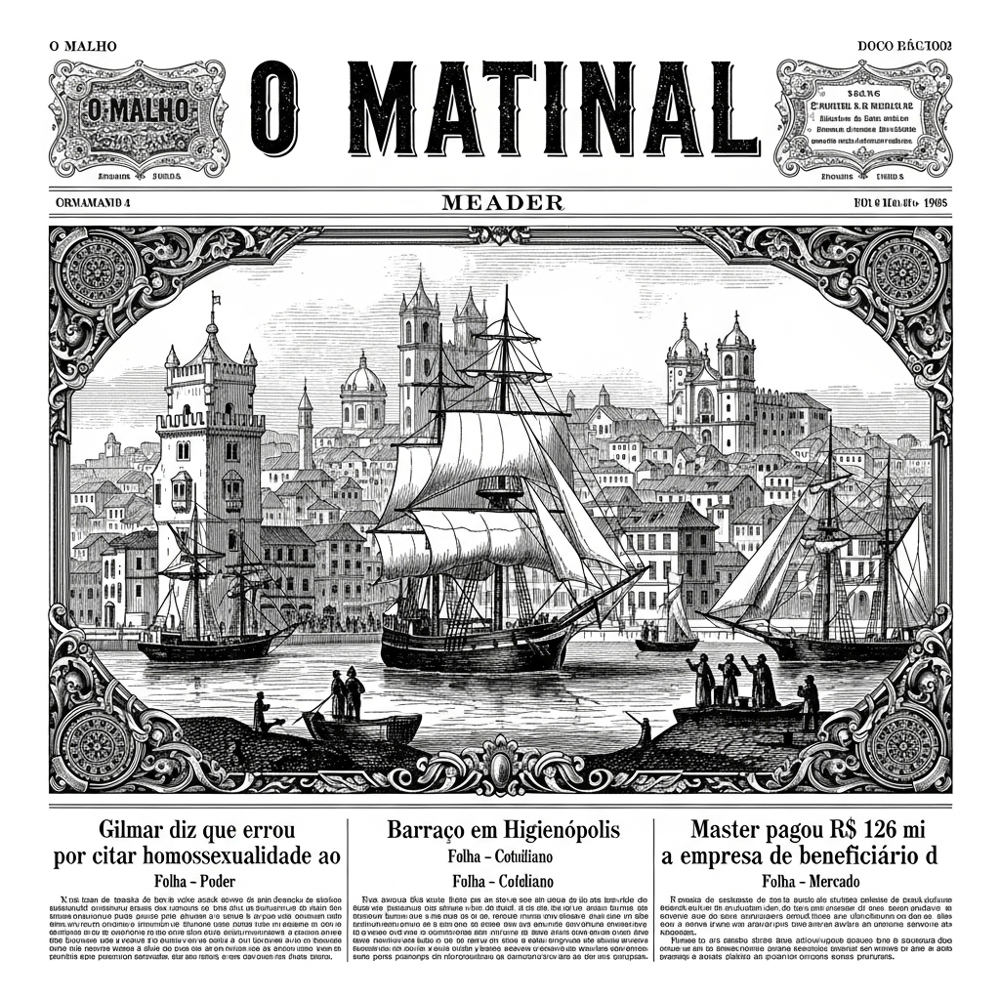
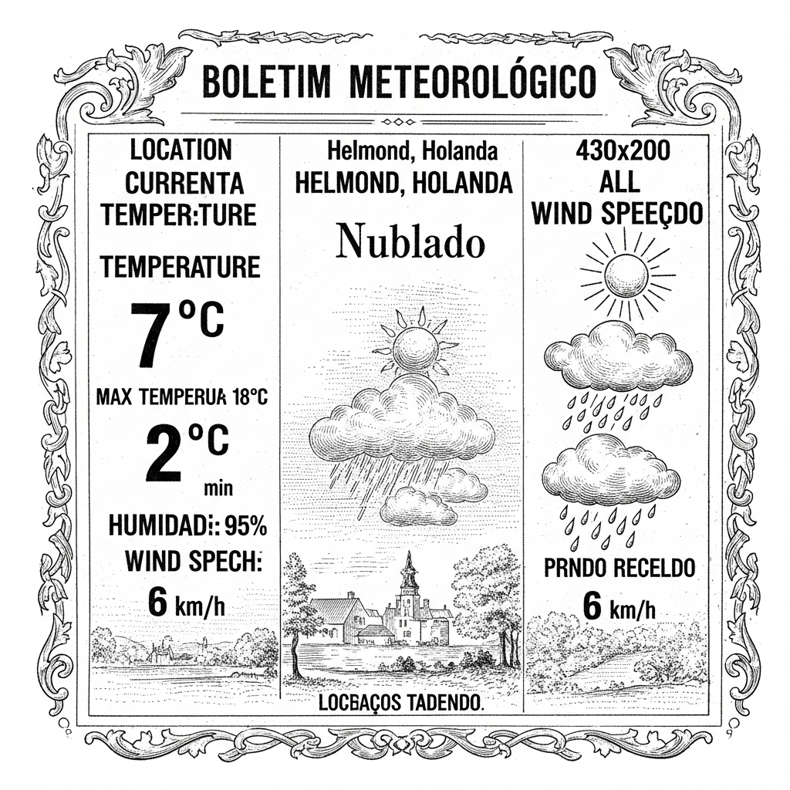

  

  

    
  

  
Anime & Manga

  

  

    
20th Anniversary Sgt. Frog Film's Trailer Unveils More Cast, Theme Song

    
ANN - Anime News

    
    
**A Vinda Triunfal de "Sgt. Frog": Novidades Cinematográficas que Encantam a Nação!**  Prezados leitores e diletos amantes das artes, é com sumo prazer e inegável entusiasmo que trazemos à baila as mais recentes e jubilosas novas acerca da aguardada película que celebrará o vigésimo aniversário de nosso querido e extravagante "Sgt. Frog". O trailer, recém-apresentado ao grande público, descerra um véu de surpresas que promete cativar corações e mentes, elevando as expectativas a patamares nunca dantes alcançados.  Dentre as revelações que mais nos aprazem, destaca-se a participação de um jovem de notável talento, o ídolo Jesse, oriundo do aclamado grupo SixTones. Sua voz, já conhecida por sua singular melodia e expressividade, dará vida aos personagens Aruru e Deruru, prometendo interpretações que, sem dúvida, ficarão gravadas na memória dos espectadores. É, deveras, um acréscimo de peso ao elenco, que enriquece sobremaneira a constelação de estrelas que brilhará nesta produção.  Ademais, a melodia que embalará as aventuras e desventuras de nossos anfíbios favoritos já tem nome e voz. A exímia artista ano, cuja graça e talento são universalmente reconhecidos, brindará o público com a canção tema intitulada "Kashippanashi Destiny". Certamente, esta composição, entoada com a maestria que lhe é peculiar, será o hino que acompanhará as cenas mais memoráveis e os momentos de maior emoção, reverberando nos salões de projeção e nos corações de todos.  É patente, portanto, que esta celebração cinematográfica de "Sgt. Frog" não poupa esforços para brindar seu fiel público com uma obra de arte digna de seu legado. As escolhas de elenco e a seleção musical evidenciam um cuidado minucioso e um esmero que, sem dúvida, resultarão em um espetáculo inesquecível. Aguardemos, pois, com a mais pura expectativa, a estreia desta joia que, temos certeza, abrilhantará os anais da sétima arte.

    <a href="https://www.animenewsnetwork.com/news/2026-04-23/20th-anniversary-sgt-frog-film-trailer-unveils-more-cast-theme-song/.236741" class="article-link">Leia na fonte →</a>
  

  

    
Original Anime Movie 'The Ribbon Hero' Announced for August 2026

    
MyAnimeList News

    
    
**A Glória do Japão e a Visão de Tezuka-sensei: Uma Novidade Cinematográfica que Encanta!**  Caros leitores e prezados admiradores das belas-artes e das mais recentes conquistas da engenharia cinematográfica, preparem os vá-se-dizer para uma notícia que, estamos certos, fará vibrar os corações mais exigentes! Chega-nos do longínquo e fascinante Império do Sol Nascente, por intermédio da afamada plataforma Netflix Japão, um anúncio que promete revolucionar os nossos momentos de lazer e deleite estético.  Foi com a mais fina e polida deferência que a referida empresa revelou ao mundo a vindoura produção de um filme de animação original, cujo título já nos seduz: "O Herói da Fita" – *The Ribbon Hero*, para aqueles que apreciam a sonoridade anglicana. E que produção, meus amigos! Trata-se de uma obra que tem suas raízes fincadas na genialidade de um dos maiores vultos da arte sequencial japonesa, o insigne Osamu Tezuka-sensei, criador da inesquecível saga "Ribbon no Kishi".  Com efeito, esta película, que se anuncia como um verdadeiro primor de técnica e sensibilidade, terá sua estreia mundial em agosto do ano de Nosso Senhor de 2026, com exclusividade na já mencionada Netflix. E para assegurar o brilhantismo que se espera de tal empreitada, um corpo de talentosos artistas e técnicos foi cuidadosamente selecionado.  À frente da direção, teremos o senhor Yuuki Igarashi, nome já reconhecido por sua participação em "Star Wars: Visions", garantindo uma visão moderna e, sem dúvida, cativante. Os desenhos originais dos personagens, que prometem encantar pela sua delicadeza e expressividade, são fruto do talento da senhora Kei Mochizuki, com a valiosa colaboração da senhora Mai Yoneyama, de "Kiznaiver". A animação dos personagens ficará a cargo do senhor Issei Arakaki, de "Vlad Love", e a direção de arte, um pilar fundamental para a imersão na narrativa, será conduzida pelo senhor Cedric Herol.  Um vislumbre, um mero relance do que nos aguarda, já nos foi concedido através de uma imagem de divulgação, um "teaser visual" que, por si só, já nos transporta para um universo de fantasia e heroísmo. É, sem dúvida, um convite irrecusável à aventura e à contemplação de uma arte que, a cada dia, se aprimora e nos surpreende.  Assim, aguardemos, com a mais genuína e cortês expectativa, a chegada de "O Herói da Fita", uma joia que certamente enriquecerá o patrimônio cultural e cinematográfico, reafirmando o engenho e a destreza dos artistas nipônicos. Que este empreendimento seja coroado de êxito e nos proporcione momentos de inesquecível deleite!

    <a href="https://myanimelist.net/news/74169150?_location=rss" class="article-link">Leia na fonte →</a>
  

  
Brasil

  

  

    
Gilmar diz que errou por citar homossexualidade ao falar de críticas de Zema

    
Folha - Poder

    
    
**Um Cavalheiro Erro e a Reparadora Palavra!**  Prezados leitores e diletas leitoras, é com a deferência que nos é peculiar que vos trazemos hoje uma notícia que, embora breve, ilustra a nobreza d'alma e o espírito cavalheiresco que ainda pulsam em nossa pátria.  Na última quinta-feira, dia 23 do corrente mês, o preclaro Ministro do Supremo Tribunal Federal, Sua Excelência o Dr. Gilmar Mendes, homem de notória erudição e figura proeminente em nossa vida jurídica, teve a magnanimidade de vir a público. Com a candura que adorna os grandes espíritos, o Ministro confessou ter cometido um lapso verbal.  Em meio a uma discussão, como tantas que animam os salões de nossa política, onde se debatiam as críticas proferidas pelo ilustre pré-candidato à Presidência, o Sr. Romeu Zema, à respeitável corte de justiça, o Dr. Gilmar Mendes, em ímpeto talvez de retórica, fez menção à homossexualidade.  Ora, meus caros, é da natureza humana, mesmo dos mais sábios, incorrer em deslizes. Mas a grandeza reside não em nunca errar, e sim em ter a hombridade de reconhecer o equívoco e, com a altivez dos justos, retratar-se. E foi exatamente isso que fez o Ministro Gilmar Mendes. Com a delicadeza de um fidalgo e a clareza de um cristal, pediu sinceras desculpas, demonstrando que a humildade é, deveras, a mais bela das virtudes.  Este gesto, por sua singeleza e retidão, ecoa como um brado de civilidade, lembrando-nos que o respeito e a distinção devem sempre pautar as relações entre os homens, mesmo nas mais acaloradas contendas. Que este exemplo sirva de farol para todos nós, cidadãos de bem, em nosso cotidiano.

    <a href="https://redir.folha.com.br/redir/online/poder/rss091/*https://www1.folha.uol.com.br/poder/2026/04/gilmar-diz-que-errou-por-citar-homossexualidade-ao-falar-de-criticas-de-zema.shtml" class="article-link">Leia na fonte →</a>
  

  

    
Barraco em Higienópolis

    
Folha - Cotidiano

    
    
Prezados leitores,  Com a devida vênia e o requinte que nos é peculiar, permitam-me tecer algumas considerações sobre um episódio ocorrido nas abastadas imediações de Higienópolis, a nos demonstrar que as paixões humanas, por vezes, extravasam os limites da mais esmerada compostura.  Ontem, ao cair da noite, enquanto a brisa noturna acariciava as varandas de nossos sobrados, fui agraciado com uma cena deveras curiosa, desdobrando-se no edifício vizinho ao meu. Um distinto casal, que ali reside, entregava-se aos preparativos da ceia, à beira da varanda, com a diligência que se espera de anfitriões zelosos.  Ora, meus caros, enquanto os serviçais, ou talvez os próprios fidalgos, em um vaivém incessante, carregavam com esmero os delicados *sousplats*, os pratos da afamada Vista Alegre, de inestimável valor e beleza, e as travessas ovais de cerâmica artesanal, cada peça um testemunho do bom gosto e da opulência, eis que a harmonia da noite foi sutilmente rompida.  Entre uma peça e outra, entre um movimento e outro, fragmentos de uma discussão, como estilhaços de porcelana fina, chegavam aos meus ouvidos. Não se tratava, por certo, de um brado destemperado, mas sim de um entrechoque de vozes, um tanto quanto alteradas, que, sem o alarde de um escândalo, entregavam ao observador atento os pormenores de um desentendimento conjugal.  Ah, as vicissitudes da vida a dois, mesmo sob o manto da opulência e da mais fina louça! Fica-nos a lição de que o amor, por mais que se esforce em adornar-se com requintes e luxos, jamais estará imune aos pequenos — ou grandes — reveses da convivência.  Que esta singela observação sirva de pauta para as reflexões dos nossos prezados leitores.  Com as mais atenciosas saudações,  Um Cronista Observador (23 de abril de 1902)

    <a href="https://redir.folha.com.br/redir/online/cotidiano/rss091/*https://www1.folha.uol.com.br/colunas/tatibernardi/2026/04/barraco-em-higienopolis.shtml" class="article-link">Leia na fonte →</a>
  

  

    
Master pagou R$ 126 mi a empresa de beneficiário de auxílio emergencial réu por estelionato

    
Folha - Mercado

    
    
**Um Enigma Pecuniário no Coração Carioca**  Caros e ilustres leitores de "O Malho", permitam-me trazer à vossa distinta atenção um acontecimento que, por sua peculiaridade, merece ser minuciosamente esquadrinhado. No vibrante centro do Rio de Janeiro, palco de tantos dramas e comédias, desenrola-se uma trama financeira que, confesso, tem deixado alguns cavalheiros de semblante austero a coçar a barba com perplexidade.  Conta-se, em sussurros que ecoam pelos corredores dos estabelecimentos mais respeitáveis, que uma empresa de nome, até então, pouco familiar aos anais do grande comércio, a "Mídias Promotora LTDA.", tem sido agraciada com uma fortuna considerável. Nada menos que a impressionante soma de cento e vinte e seis milhões e seiscentos mil réis foi, ao que tudo indica, desembolsada pelo preclaro Banco Master, sob a justificativa de "pagamentos por prestação de serviços". Uma cifra que, convenhamos, faria corar de inveja até mesmo os mais abastados barões do café!  O que, entretanto, confere um tom de inusitado a esta narrativa é a figura do sócio-administrador da referida empresa, o senhor Gilson Bahia Vasconcelos. Este cavalheiro, pasmem os senhores, figura como beneficiário do auxílio emergencial concedido por nosso benemérito governo durante os tempos de pandemia. Uma situação que, por si só, já seria digna de nota, não fosse o fato de que o mesmo senhor encontra-se, ainda por cima, sob a acusação de estelionato.  Ora, meus caros, é imperioso que nos detenhamos por um instante a meditar sobre tal conjuntura. Como conciliar a recepção de tamanha quantia de um banco de renome com a necessidade de um auxílio governamental, e, ademais, com uma acusação de tão grave natureza? Seria esta uma demonstração da astúcia de uns, da ingenuidade de outros, ou um complexo emaranhado de circunstâncias que desafia a compreensão imediata?  O "O Malho", sempre zeloso em trazer à luz os fatos que interessam à boa ordem e à probidade, continuará a acompanhar com redobrada atenção os desdobramentos deste curioso caso. Que a verdade, como sempre, prevaleça e ilumine os recônditos mais obscuros desta intrincada questão pecuniária.

    <a href="https://redir.folha.com.br/redir/online/mercado/rss091/*https://www1.folha.uol.com.br/mercado/2026/04/master-pagou-r-126-mi-a-empresa-de-beneficiario-de-auxilio-emergencial-reu-por-estelionato.shtml" class="article-link">Leia na fonte →</a>
  

  
Cultura & História

  

  

    
Nova temporada de Treta é cínica, intensa e provocadora

    
Folha - Ilustrada

    
    
**O Malho – Notícias de Ultramar**  **Uma Nova Era de "Treta": Cinismo, Paixão e Reflexão na Tela de Prata**  Prezados leitores e prezadas leitoras,  É com o mais fino senso de observação que nos debruçamos sobre os ventos que sopram do além-mar, trazendo-nos notícias do universo das projeções luminosas, que tanto encantam e, por vezes, inquietam as almas pensantes de nossa época. Chega-nos, pois, a grata nova da estreia da segunda temporada de "Treta", obra do engenho do ilustre Lee Sung Jin, que a Netflix, com sua moderna magia, já apresenta aos olhos curiosos desde o dia dezesseis do corrente mês.  Permitam-me, pois, uma breve digressão sobre a natureza humana, tão rica em suas nuances e, por vezes, tão contraditória em suas manifestações. É sabido que o cinismo, essa peculiar inclinação da alma que tanto desprezamos nos entrechoques da vida real, adquire, nas lendas e nas ficções, um fascínio quase irresistível. Não é esta, porventura, uma revelação da complexidade de nosso espírito?  Pois bem, caros confrades e comadres, é precisamente este cinismo – acompanhado de seus irmãos siameses, o egoísmo, a ambição desmedida e a mesquinhez humana – que serve de bússola moral e de norte para os enredos desta nova leva de episódios de "Treta". A série, que já em sua primeira fase soube cativar a atenção dos mais distintos espectadores, promete agora mergulhar ainda mais fundo nas profundezas da alma humana, explorando com uma intensidade notável as facetas mais obscuras e, paradoxalmente, as mais reveladoras de nosso caráter.  Em suma, aguarda-nos uma experiência que, se por um lado, pode chocar os espíritos mais sensíveis com sua crueza e provocação, por outro, certamente proporcionará aos mais perspicazes uma rica oportunidade para a reflexão sobre os meandros da condição humana. Um verdadeiro banquete para a mente, servido com a elegância e a perspicácia que os tempos modernos exigem de suas narrativas.  Que os céus nos permitam, pois, desfrutar de tal espetáculo com a devida sabedoria e discernimento.

    <a href="https://redir.folha.com.br/redir/online/ilustrada/rss091/*https://www1.folha.uol.com.br/colunas/lucianacoelho/2026/04/nova-temporada-de-treta-e-cinica-intensa-e-provocadora.shtml" class="article-link">Leia na fonte →</a>
  

  
Games

  

  

    
Exclusivity, Affordability, Third-Party Partnerships in Focus as New Xbox Leadership Vows to 'Fix the Fundamentals'

    
IGN

    
    
**O Futuro Brilhante da Xbox: Uma Nova Era de Encantamento para os Amantes dos Jogos!**  Prezados leitores e diletos entusiastas do progresso e do entretenimento, é com um misto de galhardia e esperança que O Malho traz-lhes, em primeiríssima mão, as novidades que emanam dos salões da célebre casa Xbox! Em recente e notável missiva, endereçada aos seus valorosos colaboradores e, posteriormente, partilhada com o grande público através do seu distinto periódico eletrónico, o mui digno Senhor Matt Booty, agora empossado como CEO e Diretor-Chefe de Conteúdo da Xbox, delineou com esmero os novos rumos e os grandiosos propósitos que guiarão esta notável empresa.  Com a perspicácia que lhe é peculiar, o Senhor Booty, reconhecendo com a mais pura humildade o "descontentamento" que porventura pairava entre os seus fiéis aficionados – ah, a sensibilidade de um verdadeiro líder! –, compromete-se a "sanar os alicerces", a reerguer os pilares da satisfação e do deleite. Que nobre intento!  Entre as suas mais prementes prioridades, e aqui reside o cerne de nossa empolgação, destaca-se uma reavaliação criteriosa da exclusividade dos seus títulos. Imaginem, caros leitores, a possibilidade de um universo mais vasto de jogos, acessível a um número ainda maior de lares! É a democracia do divertimento a florescer!  Adicionalmente, um foco incisivo na "acessibilidade" dos seus produtos é prometido. Que notícia alvissareira para as famílias brasileiras, que poderão, sem grande sacrifício, proporcionar momentos de alegria e confraternização através dos jogos eletrónicos. É o progresso a serviço do bem-estar social, uma verdadeira ode à modernidade e à inclusão!  Por fim, mas não menos importante, o Senhor Booty ambiciona aprimorar e expandir as parcerias com terceiros, tecendo uma intrincada e profícua rede de colaboração que, sem dúvida, enriquecerá o acervo de experiências disponíveis. É a união de forças em prol de um objetivo comum: a felicidade dos jogadores!  Assim, meus caros, com estas promessas de renovação e de um futuro ainda mais brilhante, a Xbox, sob a batuta do ilustre Matt Booty, prepara-se para escrever um novo e glorioso capítulo na história do entretenimento digital. Que os céus abençoem tal empreitada e que os nossos jovens e adultos desfrutem plenamente destas inovações! Acompanhemos, com a curiosidade que nos é peculiar, os desdobramentos desta fascinante jornada.

    <a href="https://www.ign.com/articles/exclusivity-affordability-third-party-partnerships-in-focus-as-new-xbox-leadership-vows-to-fix-the-fundamentals" class="article-link">Leia na fonte →</a>
  

  

    
A Game Pass ‘Starter Edition’ Bringing Stardew Valley And Fallout 4 To Discord Nitro Just Leaked

    
Kotaku

    
    
**UM BOATO PROMISSOR NO MUNDO DIGITAL: JOGOS SE JUNTAM AO "DISCORD NITRO"**  Meus caros leitores e distinto público que acompanha as novidades do nosso tempo, é com um misto de curiosidade e entusiasmo que lhes trago um sussurro que ecoa pelos recantos mais modernos da comunicação eletrônica. Dizem, e a notícia já se espalha como brisa perfumada em manhã de domingo, que uma espécie de "Edição Inicial" do afamado "Game Pass" estaria prestes a brindar os assinantes do "Discord Nitro" com um presente deveras agradável.  Imagine-se, prezado leitor, a desfrutar de momentos de lazer e deleite com títulos que já conquistaram corações por este mundo afora. Fala-se, com certa insistência, na inclusão do bucólico e encantador "Stardew Valley", onde se pode cultivar a terra e viver as alegrias do campo, e também do empolgante "Fallout 4", que promete aventuras em cenários de um futuro distante e intrigante.  Parece que a plataforma de conversação, que já nos serve tão bem para conectar amigos e partilhar ideias, pretende, com esta iniciativa, oferecer aos seus assinantes um acesso privilegiado a alguns destes divertimentos eletrônicos, sem custos adicionais. Seria, sem dúvida, um acréscimo de valor para aqueles que já apreciam os benefícios do "Discord Nitro".  Aguardemos, pois, a confirmação oficial destes rumores que, se concretizados, trarão mais um motivo para celebrarmos os avanços e as facilidades que a tecnologia nos oferece neste alvorecer do século. Que seja para o bem e para o entretenimento de todos!

    <a href="https://kotaku.com/xbox-game-pass-discord-nitro-stardew-valley-fallout-4-2000690262" class="article-link">Leia na fonte →</a>
  

  
Holanda & Brabant

  

  

    
House of the Mosque: A Dutch classic for a reason

    
DutchNews

    
    
**UM TESOURO LITERÁRIO DOS PAÍSES-BAIXOS: A "CASA DA MESQUITA"**  Caros leitores e distintas senhoras, é com o maior prazer e a mais sincera deferência que vos apresentamos, nesta auspiciosa folha, uma joia da literatura estrangeira que, por certo, cativará vossos espíritos e enriquecerá vossas mentes. Afastando-nos um tanto das habituais crônicas sociais e dos acontecimentos de nosso amado Brasil, permitimo-nos hoje divagar sobre as terras distantes e, quiçá, sobre as obras que ali florescem.  Não é incomum, para aqueles que se debruçam sobre as letras dos Países-Baixos, a impressão de que suas grandes narrativas se prendem, quase que exclusivamente, aos sombrios e heroicos episódios da Segunda Guerra Mundial, ou, porventura, a outros conflitos que marcaram a história daquela nação. Contudo, permiti-nos desmistificar tal percepção, pois existe, em meio a essa rica tapeçaria de histórias, um clássico que transcende tais fronteiras temporais e temáticas, afirmando-se como um pilar da cultura neerlandesa por razões que a própria obra se encarrega de revelar.  Referimo-nos, com a devida vénia, à magnífica obra intitulada "A Casa da Mesquita" (Het huis van de moskee), um romance que, embora não se situe nos palcos de guerra, possui uma profundidade e uma beleza que o elevam ao patamar dos grandes clássicos. É um livro que, com a delicadeza de um arabesco e a força de um cedro milenar, transporta o leitor para um universo de ricas tradições, de conflitos internos e de uma humanidade que se revela em suas mais diversas facetas.  A sua essência reside na habilidade ímpar de seu autor em tecer uma narrativa que, embora ambientada em um contexto específico, toca em temas universais: a família, a fé, a modernidade em choque com a tradição, o amor e a perda. Não se trata de uma simples história, mas de um painel vívido e detalhado da alma humana em suas complexas relações com o mundo que a cerca.  Assim, prezados leitores, se vosso espírito anseia por uma leitura que vos transporte para além dos horizontes conhecidos, que vos faça refletir sobre a beleza e a fragilidade da existência, e que vos presenteie com a riqueza de uma cultura distinta, então "A Casa da Mesquita" é, sem sombra de dúvida, uma obra que merece vossa mais atenta consideração. É a prova cabal de que a literatura clássica, em qualquer latitude, possui a virtude de nos enriquecer e de nos fazer ver o mundo com novos olhos, confirmando a sua perene e inegável importância.

    <a href="https://www.dutchnews.nl/2026/04/house-of-the-mosque-a-dutch-classic-for-a-reason/" class="article-link">Leia na fonte →</a>
  

  

    
'Angstcultuur bij opleiding verzekeringsartsen UWV in Amsterdam'

    
NOS.nl

    
    
**O Malho – Notícias do Velho Mundo**  **Um Lamento de Além-Mar: A Cultura do Temor na Formação de Doutores na Holanda**  Prezados leitores de "O Malho", é com certo pesar que trazemos à luz de vossas mentes uma notícia que nos chega das plagas holandesas, mais precisamente da mui respeitável instituição UWV, em Amsterdã. Conforme nos relatam os bons colegas do "EenVandaag" e do "AD", parece haver um ambiente de notável inquietação entre os jovens doutores que ali buscam especializar-se em medicina de seguros.  Contam-nos os informantes, com a voz embargada pelo receio de represálias, que uma verdadeira "cultura de temor" paira sobre os corredores daquele estabelecimento. A pressão de trabalho, meus caros, é descrita como excessiva, avassaladora, a ponto de se ouvirem, com lamentável frequência, os prantos e os soluços de colegas a desabafarem suas angústias. Um dos nossos interlocutores, um mestre da própria instituição, revelou-nos a existência de um "regime" e de um "médico-chefe" que, lamentavelmente, não se coíbe de elevar a voz, criando um clima de intimidação que muito aflige os aprendizes.  A ânsia pela "produção", pelo cumprimento de metas, parece sobrepor-se à serenidade necessária ao aprendizado, levando os jovens profissionais a sentirem-se inseguros e a perderem o prazer em sua nobre missão. "Precisamos sobreviver", confessou um dos doutores em formação, denotando a gravidade da situação.  Não se trata de um caso isolado, caros leitores. As queixas, que a princípio pareciam restritas à capital holandesa, estendem-se, ao que tudo indica, a outras localidades onde o UWV mantém suas operações. A Novag, a respeitável associação dos doutores da instituição, já se manifestou, expressando profunda preocupação com o "abuso de poder" que parece permear o ambiente.  É sabido que o UWV tem a delicada incumbência de avaliar a capacidade laboral de indivíduos enfermos, decidindo sobre o benefício WIA. E, por ironia do destino, a própria instituição padece de uma notória escassez de médicos. Para suprir tal carência, os jovens doutores em formação são empregados, assumindo, na prática, metade das atribuições dos médicos formados.  Diante de tais sinais de desassossego, as autoridades competentes, em particular a RGS, responsável pela supervisão das formações médicas, já havia imposto uma vigilância mais atenta. Agora, em face destas novas e preocupantes revelações, um novo e rigoroso inquérito será instaurado, não apenas em Amsterdã, mas em todas as sedes do UWV.  O desfecho, meus caros, pode ser grave. Em última instância, o UWV poderá perder a prerrogativa de formar novos médicos de seguros, o que, por sua vez, agravaria a já crítica situação das listas de espera.  Em resposta aos jornalistas, a direção do UWV reconheceu a gravidade da alta pressão de trabalho, admitindo que "demasiadas pessoas esperam demasiado tempo por uma avaliação que lhes é devida", causando incerteza a dezenas de milhares e aumentando o fardo sobre os seus laboriosos funcionários.  O Ministro Vijlbrief, da pasta de Assuntos Sociais e Emprego, afirmou levar a sério os relatos de "cultura de temor" e de "pressão de trabalho". O digníssimo Ministro assegurou que o UWV investigará o assunto com a devida profundidade, e já incumbiu o conselho de administração de elaborar um plano para aprimorar a cultura organizacional.  Que os céus iluminem o caminho dos jovens doutores e que a justiça prevaleça, para que a medicina, arte tão nobre e humanitária, não seja jamais maculada por temores e pressões indevidas.

    <a href="https://nos.nl/l/2611790" class="article-link">Leia na fonte →</a>
  

  
Mundo

  

  

    
Sheinbaum deu aula de respeito ao México em cúpula da esquerda

    
Folha - Mundo

    
    
**Uma Lição de Urbanidade e Progresso em Terras Catalãs**  Caros leitores e prezadas leitoras deste venerável periódico, que com tanto esmero vos traz as mais relevantes novidades do orbe, permitam-me hoje discorrer sobre um acontecimento deveras notável, ocorrido em terras europeias, que nos convida à reflexão sobre a grandeza da diplomacia e a solidez dos ideais democráticos. É, de fato, curioso, e quiçá um tanto melancólico, observar quando o próprio campo democrático, em sua intrínseca bondade, inclina-se à autocrítica e, por vezes, à dúvida. Em tempos tão vertiginosos e plenos de transformações, como os que ora vivemos, houve quem, com um certo ar de ironia, ousou questionar a pertinência de um encontro de suma importância.  Refiro-me, prezados, ao congraçamento que teve lugar no passado sábado, dia 18 do corrente mês, na esplendorosa cidade de Barcelona, joia da Catalunha. Um evento de tal envergadura, que contou com o patrocínio e a gentil acolhida do ilustre primeiro-ministro espanhol, o senhor Pedro Sánchez, figura proeminente do partido socialista, cujas ações denotam um profundo apreço pelos laços de cooperação internacional.  A magnitude deste encontro, meus caros, não pode ser subestimada. Imaginem, por um instante, a cena: um seleto grupo de líderes, representando nada menos que vinte e cinco nações distintas, reunidos sob o mesmo teto, com o propósito de deliberar sobre os caminhos do progresso e da justiça social. E, para abrilhantar ainda mais a ocasião, tivemos a honra de contar com a presença de nosso estimado Presidente, o senhor Lula, cuja sabedoria e experiência são amplamente reconhecidas em todos os quadrantes do globo.  Conforme nos chega a boa-nova, foi neste palco de grandezas que a eminente senhora Sheinbaum, com sua habitual perspicácia e elegância, brindou os presentes com uma verdadeira aula de respeito e deferência para com a nação mexicana. Um gesto que, sem dúvida, ecoa como um exemplo de como as relações entre os povos devem ser pautadas pela altivez e pela consideração mútua.  Em suma, este memorável encontro em Barcelona, longe de ser um mero ajuntamento de figuras políticas, revelou-se um farol de esperança, um testemunho vibrante da capacidade humana de construir pontes, de dialogar e de forjar um futuro mais promissor para todos. Que tal exemplo de civilidade e cooperação inspire a todos nós a cultivar, em nosso quotidiano, a mesma galhardia e o mesmo espírito de união que tão bem foram demonstrados em terras catalãs.

    <a href="https://redir.folha.com.br/redir/online/mundo/rss091/*https://www1.folha.uol.com.br/colunas/laura-greenhalgh/2026/04/sheinbaum-deu-aula-de-respeito-ao-mexico-em-cupula-da-esquerda.shtml" class="article-link">Leia na fonte →</a>
  

  
Tecnologia & IA

  

  

    
Sam's Club Promo Codes: 60% Off for April 2026

    
WIRED

    
    
**O MALHO**  **Edição Matinal – Abril de 1902**  **Notícias de Ultramar: Uma Oportunidade Ímpar para os Nossos Diletos Leitores!**  Meus caros e prezados leitores, com a devida vênia e o mais profundo respeito que Vossa Excelência merece, apresentamo-vos, em primeiríssima mão, uma notícia que, estamos certos, fará vibrar os corações mais frugais e os espíritos mais perspicazes de nossa distinta sociedade. Chegam-nos, através dos mais fidedignos canais transatlânticos, informações sobre uma venturosa ocasião que se descortina nos distantes entrepostos comerciais do chamado "Sam's Club", lá pelas plagas do Norte.  Imaginem, por obséquio, uma chance de ouro para abastecer os vossos lares com a mais fina provisão, desde os víveres indispensáveis à subsistência diária até os mais modernos apetrechos que a eletricidade nos proporciona, passando, é claro, pelos artigos de toucador e higiene que tanto prezamos. Pois bem, este estabelecimento, decerto de grande vulto e reputação, oferece, para o mês de abril do vindouro ano de 1926 (sim, meus caros, a notícia nos chega com a devida antecedência para o vosso planejamento!), um desconto verdadeiramente notável.  Fala-se, com ares de absoluta veracidade, em uma redução de preços que atinge a assombrosa cifra de 60% sobre o valor original das mercadorias! Sessenta por cento, meus amigos! Tal generosidade, convenhamos, raramente se observa em nossos mercados. Para usufruir de tamanha benesse, bastará apresentar um "código promocional" devidamente verificado ou, para os que já possuem o privilégio, um "desconto de filiação" a este clube.  Assim, meus diletos, convidamo-los a ponderar sobre esta valiosa oportunidade. Queira Deus que esta informação, trazida com o mais puro intento de servir aos nossos leitores, lhes seja de grande utilidade e lhes proporcione momentos de inegável economia e satisfação. Que vossos lares sejam sempre fartos e vossas finanças, prósperas.

    <a href="https://www.wired.com/story/sams-club-coupon/" class="article-link">Leia na fonte →</a>
  

  

    
Here's What's Coming in the 2026 Apple TV

    
MacRumors

    
    
**O Porvir da "Caixa Mágica" da Apple: Novidades para 2026**  Caríssimos leitores, ávidos por desvendar os mistérios do futuro tecnológico, é com o maior prazer que vos trazemos as últimas novas sobre o tão aguardado aparelho da Apple, a famosa "Apple TV"! Desde o ano da graça de 2022, a pequena caixa que nos transporta ao reino do entretenimento não recebe um sopro de renovação, e a expectativa, meus amigos, é tamanha que mal cabe nos corações dos mais entusiastas!  Pois bem, preparem-se para uma espera um tanto mais prolongada, pois os senhores da Apple, com sua habitual prudência, decidiram reter o lançamento da nova versão até que a sua assistente virtual, a querida Siri, esteja dotada de uma inteligência ainda mais arguta, o que, segundo os vaticínios, ocorrerá apenas no outono vindouro.  Quanto à sua indumentária, oh, não esperem grandes revoluções! A "Apple TV" de 2026 conservará o seu formato peculiar, uma espécie de quadrado de cantos arredondados, e manterá a sua elegante roupagem de plástico negro. Será, por assim dizer, indistinguível do modelo atual, mantendo as suas dimensões e o seu design já familiar. A beleza, como se vê, reside na essência, e não na mera aparência.  Mas onde, então, reside a grande novidade, perguntareis? Ah, meus nobres, a verdadeira transformação encontra-se no seu âmago! A "Apple TV 4K" será agraciada com um novo e potentíssimo chip da série A, possivelmente o A17 Pro, já visto nos ilustres iPhones 15 Pro. Em comparação com o A15 Bionic do modelo atual, este novo "cérebro" promete um salto quântico em velocidade e eficiência, um motivo mais do que justo para adiar a vossa aquisição do modelo presente. Construído com a mais avançada tecnologia de 3 nanômetros, o A17 Pro oferecerá gráficos de uma qualidade ímpar, dignos das mais belas pinturas! E, notem bem, é um dos poucos chips a suportar a tão falada "Apple Intelligence", a inteligência artificial que promete maravilhas!  E por falar em inteligência, a Siri, essa incansável companheira, é a grande responsável pelo atraso. A Apple deseja que a nova "TV" chegue ao mercado já com a versão mais esperta da Siri, que ainda se encontra em fase de aprimoramento. Segundo os rumores que circulam pelos corredores da tecnologia, a "Apple TV" está intrinsecamente ligada a "novas funcionalidades de inteligência artificial" que foram postergadas para o iOS 27, previsto para setembro de 2026. A paciência, meus caros, será uma virtude recompensada!  No que concerne à conectividade, a "Apple TV" poderá vir equipada com o chip de rede N1 da Apple, oferecendo suporte ao novíssimo Wi-Fi 7, que opera na banda de 6GHz. Isto significa uma ligação mais rápida e menos congestionada, ideal para as vossas sessões de cinema em casa! O Bluetooth 6 também se fará presente, permitindo a conexão de comandos e auriculares com a maior facilidade. E não esqueçamos do Thread, que continuará a fazer da "Apple TV" um centro de comando para os vossos dispositivos inteligentes.  E o preço, essa questão que tanto nos aflige? Há quem sussurre sobre uma possível redução, ou talvez a oferta de dois modelos: um mais sofisticado e outro mais acessível. Seja como for, a Apple parece considerar a possibilidade de tornar a sua "caixa mágica" ainda mais democrática.  Assim, meus caros, se a vossa alma anseia pela mais moderna tecnologia e pela mais inteligente das assistentes virtuais, o conselho é um só: aguardai! A nova "Apple TV" e a sua aprimorada Siri, ligadas ao iOS 27, só deverão fazer a sua grandiosa aparição em setembro de 2026, no mínimo. A espera será longa, mas, certamente, valerá a pena cada instante.

    <a href="https://www.macrumors.com/2026/04/23/apple-tv-4k-2026-rumors/" class="article-link">Leia na fonte →</a>
  

  

    
Casa Branca acusa China de roubo de tecnologia de IA em escala industrial

    
Folha - Tec

    
    
**NOTÍCIAS DO MUNDO CIVILIZADO**  **A QUESTÃO DA PROPRIEDADE INTELECTUAL EM TEMPOS MODERNOS: UM ALERTA DA CASA BRANCA**  Meus caros e distintos leitores, é com a devida gravidade que lhes trago à luz uma notícia de suma importância, vinda diretamente dos salões da respeitável Casa Branca, em terras americanas. Na tarde do dia 23 de abril do corrente ano de 1902 (que os céus nos permitam ver o alvorecer de muitos outros com a mesma clareza), por volta das dezessete horas e vinte minutos, uma declaração de peso ecoou pelos corredores do poder.  O governo dos Estados Unidos da América, através de seus probos representantes, veio a público expressar uma profunda preocupação. A acusação, apresentada com a seriedade que o assunto impõe, recai sobre a nação chinesa. Alega-se, com notável veemência, que a China estaria a perpetrar um furto de propriedade intelectual em uma escala verdadeiramente industrial.  O alvo deste, digamos, "empréstimo indesejado" não são meros segredos de fabricação de bugigangas ou futilidades. Não, meus caros! Trata-se de algo muito mais etéreo e, ao mesmo tempo, de uma importância capital para o futuro da humanidade: a tecnologia de Inteligência Artificial. Os laboratórios americanos, berços de tantas invenções e descobertas que tanto contribuem para o progresso de nossa civilização, estariam sendo, por assim dizer, "visitados" por mãos alheias que se apoderam de seus valiosos frutos.  É um cenário que nos convida à reflexão. Em um mundo onde a inovação é a bússola que aponta para o amanhã, a salvaguarda das ideias e do engenho humano torna-se premente. A Casa Branca, ao levantar tal bandeira, alerta-nos para a necessidade de proteger o intelecto e o labor daqueles que dedicam suas vidas ao avanço do conhecimento. Que este fato sirva de mote para que as nações, em sua busca por progresso, jamais esqueçam os princípios da honradez e do respeito mútuo. A história, decerto, registrará este episódio com a atenção que ele merece.

    <a href="https://redir.folha.com.br/redir/online/tec/rss091/*https://www1.folha.uol.com.br/tec/2026/04/casa-branca-acusa-china-de-roubo-de-tecnologia-de-ia-em-escala-industrial.shtml" class="article-link">Leia na fonte →</a>
  

  
Piadas & Humor

  

  

  

    <strong>HUMOR MILITAR: Entre a soldadesca brasileira que participava da Guerra do Paraguai, era hábito, como em todos os exércitos, e em todas as eras; inventar pilhérias e atribuí-las a certos oficiais. A principal vítima dessas gaiatices era um velho brigadeiro, tão conhecido pela bravura como pela ignorância. Dele se contava que, ditando ao secretário a parte relativa a um combate, dissera: “Não se esqueça de escrever que o inimigo fugiu tomado de terror pândego!” A conversa deste brigadeiro era uma série de batatadas, como se dizia então no Exército. De uma formosa rapariga por quem um oficial fazia grandes sacrifícios, referia: “Aquela rapariga sustenta um luxo asinático”, asiático, queria exprimir o bom homem. Casa aritmeticamente fechada, casa de genealogias verdes, eram coisas que lhe atribuíam entre muitas outras. Por exemplo, relatavam que uma vez fizera com ar pesaroso a seguinte observação, ao contemplar enormes rolos de fio telegráfico, deixados numa estação pelos paraguaios: — Que pena não nos poder servir tudo isto! — Mas por que, General? — Ora e que palerma! Não passariam senão palavras em guarani!</strong>
  

  

    <strong>EXPLICAÇÃO DA BÍBLIA: Um frade disputava acaloradamente com um militar, porque este dizia que a terra girava em roda do sol. — O senhor não se lembra, — dizia o enfurecido monge – que Josué fez parar o sol? — Por essa mesma razão lhe digo, — respondeu mui gravemente o militar – que desde essa ocasião ficou imóvel!</strong>
  

  

    <strong>A PACIÊNCIA DO CAPELÃO: Na época da Guerra do Paraguai, um capelão após rezar uma missa para as tropas brasileiras, onde proferira uma homilia em que fizera certa citação histórica, juntou-se à roda dos oficiais para conversar. Um oficial implicante, que, aliás, vivia a atormentá-lo com remoques insolentes, o questionou: — Padre, como é isto? Se em França nunca houve D. Manuel I, como é que o senhor descobriu este D. Manuel III?. Apesar de já a ira lhe subir às faces, anda contemporizou o frade: — Ora esta! Pouco importa a questão do nome do rei, o que vale é a filosofia, a essência do caso! Se não era D. Manuel, seria D. Antônio ou D. José&#8230; — Também nunca os houve em França – redargüiu o pouco amável oficial. Aí perdeu o bom padre as estribeiras, e respondeu-lhe com veemência: — Olhe, quer saber de uma coisa? Se não era D. Manuel, D. Antônio ou D. José, seria D&#8230; Vá Plantar Batatas ou D&#8230; Vá Para o Diabo que o Carregue!</strong>
  

  

    <strong>DOIS ANIMAIS: Em uma função pública estava um mancebo, mui tímido, sentado atrás de uma senhora, de quem gostava muito, e que não reparava nele. Desejoso de travar conversação, aproveitou a circunstância de ver uma mosca pousada na manta da sua formosa vizinha, e disse-lhe: — Minha senhora, advirto-lhe que tem um animal atrás de si. — Ai me Deus! – respondeu a senhora, muito assustada – não sabia que o sr. estava aí.</strong>
  

  

    <strong>INQUÉRITO: O tropeiro apeia-se à porta de um armazém e pede a um pequeno para lhe segurar o cavalo. — Não morde? – perguntou o pequeno. — E não são precisos dois para o segurar? — Nesse caso, segure-o você, que tem idade para isso.</strong>
  

