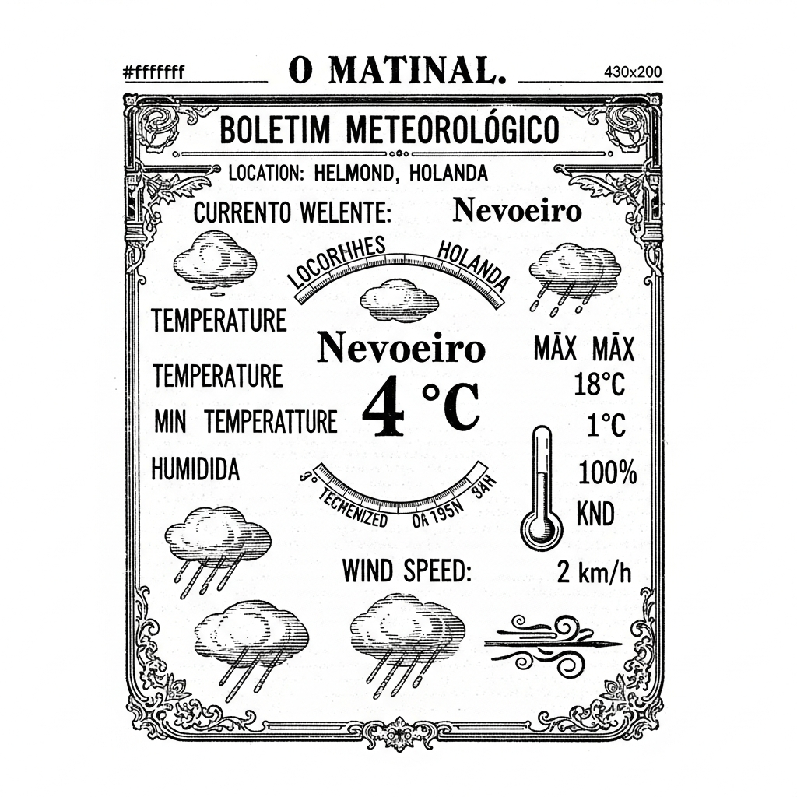

  

  

    
  

  
Anime & Manga

  

  

    
North American Anime, Manga Releases, April 19-25

    
ANN - Anime News

    
    
**NOVIDADES DO ULTRAMAR**  **Chegam às Terras Americanas As Mais Recentes Obras de Fantasia Japonesa**  Meus caros e prezados leitores, com a gentileza que nos é peculiar, vimos por meio destas linhas trazer-lhes as mais saborosas e aguardadas notícias do mundo das artes e do entretenimento, vindas diretamente das longínquas e fascinantes terras do Sol Nascente, e que agora aportam nas Américas setentrionais. É com um misto de curiosidade e deleite que observamos a contínua expansão dessas peculiares narrativas, que tanto encantam os espíritos jovens e os corações ávidos por aventuras.  Nesta semana que se estende do dia dezenove ao vinte e cinco de abril, os amantes da animação japonesa, ou "animes", como são carinhosamente chamados, terão o privilégio de deleitar-se com a chegada de duas obras de notável distinção. A primeira delas, intitulada "Shangri-La Frontier", promete transportar o espectador a mundos de fantasia e heroísmo, com enredos que desafiam a imaginação e personagens de vibrante personalidade. Acompanhando-a, teremos também "Tada Never Falls in Love", uma doce e comovente história que certamente tocará os corações mais sensíveis, abordando os intricados caminhos do afeto e das emoções humanas com a delicadeza que o tema exige.  Mas as boas novas não param por aí, meus amigos! Para os apreciadores das histórias em quadrinhos japonesas, os "mangás", chegam igualmente duas publicações de grande mérito e apelo. A primeira, de título intrigante e um tanto quanto audacioso, é "KILLING ME / KILLING YOU", que promete prender a atenção do leitor com seus mistérios e reviravoltas, desafiando a mente a desvendar seus segredos. E para completar este rol de novidades, teremos "Bug Ego", uma obra que, sem dúvida, instigará a reflexão e proporcionará momentos de puro deleite intelectual, com a maestria narrativa que caracteriza as melhores produções do gênero.  Assim, prezados leitores, é com a certeza de que estas obras trarão momentos de grata distração e enriquecimento cultural que nos despedimos, aguardando ansiosamente os comentários e impressões que tão gentilmente nos farão chegar. Que a arte, em suas múltiplas manifestações, continue a iluminar nossos dias e a expandir nossos horizontes.

    <a href="https://www.animenewsnetwork.com/news/2026-04-24/north-american-anime-manga-releases-april-19-25/.236602" class="article-link">Leia na fonte →</a>
  

  

    
Original Anime Movie 'The Ribbon Hero' Announced for August 2026

    
MyAnimeList News

    
    
**A Nobre Revelação da Sétima Arte: "A Heroína da Fita" Chega aos Lares em Breve!**  Prezados leitores e diletos apreciadores das belas-artes, é com indizível regozijo que o vosso fiel "O Malho" traz à luz uma notícia que, sem dúvida, despertará grande entusiasmo nos corações tupiniquins e além-mar. A Netflix Japão, em um gesto de louvável empreendedorismo e sensibilidade artística, anunciou, em recente quinta-feira, a vindoura produção de uma película animada original, batizada com o poético e vibrante título de "A Heroína da Fita".  Esta obra de arte, que promete encantar a todos com sua narrativa e primor visual, é inspirada na célebre e cativante manga "Ribbon no Kishi", do genial e inesquecível Osamu Tezuka, cujo talento já é por demais conhecido e admirado em terras nipônicas e em todo o orbe civilizado.  A estreia mundial desta joia cinematográfica está marcada para agosto do venturoso ano de 2026, e terá o privilégio de ser exibida com exclusividade na renomada plataforma Netflix, um verdadeiro portal de entretenimento que tem levado a cultura e a arte aos mais distantes recantos.  Os nomes que compõem a equipe de notáveis artífices desta produção são, por si só, uma garantia de excelência. A direção ficará a cargo do talentoso Yuuki Igarashi, cuja maestria já pôde ser admirada em "Star Wars: Visions". O desenho original dos personagens, de vital importância para a alma da obra, será concebido por Kei Mochizuki, com a valiosa colaboração de Mai Yoneyama, que já nos brindou com seu trabalho em "Kiznaiver". A animação dos personagens, que lhes dará vida e movimento, será obra de Issei Arakaki, conhecido por seu esmero em "Vlad Love". A direção de arte, que moldará os cenários e a atmosfera visual, estará nas mãos do distinto Cedric Herol.  Assim, meus caros, aguardemos com serena expectativa e grande curiosidade a chegada de "A Heroína da Fita", uma obra que, temos certeza, virá enriquecer o patrimônio cultural e proporcionar momentos de puro deleite e inspiração aos seus espectadores. Que esta nova empreitada da sétima arte seja mais um brilhante testemunho da capacidade humana de sonhar e de materializar a beleza através da arte.

    <a href="https://myanimelist.net/news/74169150?_location=rss" class="article-link">Leia na fonte →</a>
  

  
Brasil

  

  

    
STF se vê na mira de candidatos, e reação de ministros gera nova divisão interna

    
Folha - Poder

    
    
**O Supremo Tribunal na Berlinda: Uma Delicada Questão em Tempos Vindouros**  Ah, prezados leitores, que a Providência nos abençoe com um instante de vossa preciosa atenção para discorrer sobre um assunto que tem agitado os mais elevados círculos de nossa Pátria, e que, com a vivacidade de um raio, tem-se projetado sobre as mentes mais lúcidas de nosso Tribunal Supremo. Permitam-me, pois, com a delicadeza que o tema impõe, narrar-lhes os recentes ventos que sopram sobre os augustos salões onde a Justiça, em sua mais pura essência, deveria reinar inabalável.  Consta-nos, e a notícia corre como a brisa fresca de um entardecer de verão, que os eminentes Ministros do Supremo Tribunal Federal, em suas doutas reflexões, chegaram a uma unânime e cristalina conclusão: as críticas que se dirigem à atuação de nossa mais alta corte de Justiça, antes sussurros aqui e acolá, transformaram-se agora em tema central, em pauta inadiável, nas eloquentes preleções dos futuros candidatos da direita para as eleições de 2026. É como se um novo alvorecer político se anunciasse, trazendo consigo não apenas promessas, mas também, e com certa veemência, questionamentos sobre o papel e a conduta de nossos venerandos magistrados.  Entretanto, meus caros, é justamente neste ponto que a unidade de pensamento, tão louvável, dá lugar a uma interessante e, quiçá, compreensível, divisão de opiniões. Nossos preclaros Ministros, embora concordem sobre a existência do desafio, divergem, com a elegância que lhes é peculiar, sobre qual seria a melhor e mais prudente rota a seguir para atravessar o turbulento mar da campanha eleitoral. Há quem defenda uma postura mais altiva, outros, talvez, uma mais conciliatória. O objetivo, contudo, é um só: evitar que o desgaste, já notório, de nossa veneranda instituição se agrave, transformando-se em chaga aberta no corpo de nossa jovem República.  É, pois, um cenário de delicada tessitura, onde a sabedoria e a prudência devem ser as bússolas a guiar as decisões. Que a serenidade dos sábios e a clareza dos justos iluminem os caminhos de nossos Ministros, para que a Justiça, em sua plenitude, continue a ser o farol de nossa Nação, inatingível pelas paixões passageiras da política. Que assim seja, e que Deus, em sua infinita bondade, nos conceda a paz e a concórdia.

    <a href="https://redir.folha.com.br/redir/online/poder/rss091/*https://www1.folha.uol.com.br/poder/2026/04/stf-se-ve-na-mira-de-candidatos-e-reacao-de-ministros-gera-nova-divisao-interna.shtml" class="article-link">Leia na fonte →</a>
  

  

    
Fala de Frei Gilson sobre papel da mulher gera crítica da senadora Soraya Thronicke: 'Falso profeta'

    
Folha - Cotidiano

    
    
**O Eco das Palavras e a Senhora Senadora: Uma Questão de Gênero e Fé em Nossos Dias**  Prezados leitores de "O Malho", é com a devida deferência que lhes trazemos à colação um recente e buliçoso entrevero que tem agitado os salões e as consciências de nossa distinta sociedade brasileira. Pois bem, a questão, meus caros, versa sobre as ponderações proferidas pelo Reverendíssimo Frei Gilson acerca do papel que a mulher, essa criatura de tão sublime formosura e inexcedível valor, desempenha em nosso tecido social.  As palavras do virtuoso frade, que, sem dúvida, ecoam de um púlpito de devoção, suscitaram, como era de se esperar, um fervoroso debate. A discussão, que já se mostrava latente, reacendeu-se com a vivacidade de uma fogueira em noite de São João, tocando na delicada fronteira entre a sacrossanta liberdade de credo e aquilo que, porventura, poderia ser interpretado como manifestações de preconceito, tão alheias ao espírito de nossa gente.  Eis que, neste palco de ideias e paixões, surge a ilustre Senadora Soraya Thronicke, figura de notável projeção em nossos círculos políticos, a qual, com a veemência própria de quem defende seus ideais, não hesitou em tecer críticas públicas às considerações do religioso. A Senadora, em um pronunciamento que reverberou por todo o país, classificou a fala do Frei Gilson como "misógina", termo que, por si só, carrega o peso de uma grave acusação.  A nobre parlamentar, em sua contundente manifestação, chegou a alcunhar o frade de "falso profeta", epíteto que, sem dúvida, adiciona uma camada de dramaticidade a este já complexo enredo. A controvérsia, caros leitores, demonstra a vitalidade de nossa nação em debater temas de tamanha relevância, onde a voz da fé se encontra com a voz da razão e dos direitos civis.  Assim, aguardamos os próximos capítulos desta interessante querela, que, sem sombra de dúvida, continuará a nos prover de matéria para reflexão e, quem sabe, para o aprimoramento de nossa compreensão sobre os múltiplos papéis e a inestimável dignidade da mulher em nossa amada Pátria. Que a luz da sabedoria ilumine os corações e as mentes de todos os envolvidos.

    <a href="https://redir.folha.com.br/redir/online/cotidiano/rss091/*https://www1.folha.uol.com.br/cotidiano/2026/04/fala-de-frei-gilson-sobre-papel-da-mulher-gera-critica-da-senadora-soraya-thronicke-falso-profeta.shtml" class="article-link">Leia na fonte →</a>
  

  

    
Fachin suspende decisão que barrava uso de imóveis para salvar BRB

    
Folha - Mercado

    
    
**A Notável Intervenção do Ilustre Ministro Fachin em Prol do BRB: Um Alento para a Capital da República**  Prezados leitores e diletos amigos do progresso pátrio,  É com a devida solenidade e o respeito que nos é peculiar que trazemos à luz um acontecimento de notável relevância para os destinos financeiros de nossa querida Capital da República. Na última sexta-feira, dia 24 do corrente mês, os corredores do Supremo Tribunal Federal foram palco de uma decisão que, sem sombra de dúvida, trará um alento considerável ao Banco de Brasília, a quem carinhosamente nos referimos como BRB.  O ilustre e eminente Presidente daquela excelsa Corte, o Senhor Ministro Edson Fachin, de notória sabedoria e arguta perspicácia jurídica, houve por bem suspender a deliberação proferida pela Justiça do Distrito Federal. Esta, por sua vez, impedia o uso de valiosos imóveis pertencentes ao erário público, bens que seriam de suma importância para a capitalização do mencionado banco.  Como é de conhecimento de muitos, o BRB encontrava-se em uma situação delicada, decorrente de um vultoso rombo financeiro. Este, infelizmente, adveio da aquisição de carteiras consideradas fraudulentas, oriundas do Banco Master, instituição ligada ao senhor Daniel Vorcaro. Tal operação, de contornos deveras complexos e lamentáveis, gerou um desfalque na casa dos bilhões, que exigia uma pronta e eficaz solução.  A intervenção do digníssimo Ministro Fachin, portanto, surge como um raio de esperança em meio à turbulência. Ao suspender a decisão que obstaculizava o emprego dos bens imóveis, Sua Excelência abriu um caminho promissor para que o BRB possa reerguer-se, consolidando sua estrutura e garantindo a estabilidade financeira tão necessária para o desenvolvimento de Brasília.  Esta medida, que ressoa como um hino à prudência e à visão de Estado, demonstra a preocupação das mais altas esferas de nossa justiça em salvaguardar as instituições que servem ao povo brasileiro. É, sem dúvida, um passo fundamental para que o Banco de Brasília possa, em breve, retomar seu pleno vigor, cumprindo sua missão com a confiança e a solidez que dele se espera.  Aguardemos, pois, com otimismo e a certeza de que a probidade e a inteligência continuarão a guiar os rumos de nossa nação.  *O Malho*, sempre atento aos grandes acontecimentos que moldam o futuro do Brasil.

    <a href="https://redir.folha.com.br/redir/online/mercado/rss091/*https://www1.folha.uol.com.br/mercado/2026/04/fachin-suspende-decisao-que-barrava-uso-de-imoveis-para-salvar-brb.shtml" class="article-link">Leia na fonte →</a>
  

  
Cultura & História

  

  

    
Morre Fabiano Thomas Vannucci, que foi ator mirim da Globo, aos 53 anos

    
Folha - Ilustrada

    
    
PREZADOS LEITORES DE "O MALHO",  Com o coração compungido e a alma em luto, cumpre-nos o doloroso dever de noticiar o passamento de um talentoso filho de nossa terra, o distinto senhor Fabiano Thomas Vannucci, que nos deixou aos 53 anos de idade, vítima de um súbito infarto, na formosa cidade do Rio de Janeiro.  O infortúnio, ocorrido nesta quinta-feira que finda, foi-nos comunicado pela insigne atriz Izabella Bicalho, sua ex-esposa, que com a dignidade que lhe é peculiar, veio a público, através das modernas redes sociais, partilhar a causa deste irreparável desenlace.  Recordamo-nos com saudade do tempo em que o pequeno Fabiano, ainda em tenra idade, encantava os lares brasileiros com sua arte, brilhou nos palcos da televisão, na afamada emissora "Globo", revelando desde cedo o lampejo de um futuro promissor nas artes cênicas e cinematográficas. Sua trajetória, marcada pelo esmero e pela dedicação, culminou na direção de obras que, sem dúvida, enriqueceram o panorama cultural de nossa nação.  A notícia de sua partida, tão inesperada e precoce, deixa-nos a todos num estado de profunda consternação. Que a sua memória seja honrada e que o seu legado artístico perdure, inspirando as futuras gerações. Que a família enlutada encontre consolo e serenidade neste momento de dor, e que a alma do nosso querido Fabiano Thomas Vannucci descanse em paz, na glória eterna.  Com o mais profundo pesar,  A Redação de "O Malho".

    <a href="https://redir.folha.com.br/redir/online/ilustrada/rss091/*https://www1.folha.uol.com.br/ilustrada/2026/04/morre-fabiano-thomas-vannucci-que-foi-ator-mirim-da-globo-aos-53-anos.shtml" class="article-link">Leia na fonte →</a>
  

  
Games

  

  

    
Score $250 Off the ECOVACS DEEBOT X12 OmniCyclone Robot Vacuum and Mop for a Limited Time

    
IGN

    
    
Prezados Leitores e Estimadas Leitoras,  Com a Primavera a desabrochar em todo o seu esplendor, e as senhoras de bem já a cogitar as benesses da limpeza e da ordem em seus lares, é com indizível prazer que este periódico, sempre zeloso do conforto e da modernidade, traz à vossa distinta atenção uma novidade que promete revolucionar os afazeres domésticos. Imaginem, por um instante, a facilidade de manter o solar impecável, sem o menor esforço, e com uma economia notável!  Pois bem, caros amigos, a Casa Ecovacs, em um gesto de grandíssima generosidade e perspicácia, apresenta o seu mais recente prodígio da engenharia: o afamado robô aspirador e esfregão, batizado de Deebot X12 OmniCyclone. Uma verdadeira maravilha da técnica, que, por tempo deveras limitado, poderá adornar vossos salões com um abatimento de duzentos e cinquenta contos de réis! Uma pechincha, por assim dizer, que não se deve, de modo algum, deixar escapar.  Este engenho mecânico, meus caros, não é um mero aparelho; é um distinto auxiliar. Dotado de uma tecnologia de esfregamento deveras inovadora, que deixa os pisos a brilhar como espelhos, e uma potência de sucção que faria inveja aos mais robustos equipamentos, ele se encarrega da poeira e das impurezas com uma galhardia impressionante. Mas as suas virtudes não se findam por aí! A sua base de manutenção, autônoma e inteligente, assegura que o aparelho esteja sempre pronto para o serviço, sem que as mãos delicadas das donas de casa precisem intervir constantemente.  É, portanto, uma oportunidade sem par para as famílias que prezam pela higiene, pela praticidade e, sobretudo, pelo tempo precioso que pode ser dedicado a atividades mais elevadas, como a leitura, a música ou a boa e velha conversação. Que as senhoras de fina estirpe aproveitem esta benesse e confiram ao seu lar o toque de modernidade e elegância que o Deebot X12 OmniCyclone promete e, sem sombra de dúvida, entrega. Afinal, a Primavera convida à renovação, e que renovação mais aprazível do que a do próprio lar?

    <a href="https://www.ign.com/articles/score-250-off-the-ecovacs-deebot-x12-omnicyclone-robot-vacuum-and-mop-for-a-limited-time" class="article-link">Leia na fonte →</a>
  

  

    
12 Months And Dozens Of Awards Later You Now Have No Excuse Not To Play Clair Obscur, Which Is On Sale

    
Kotaku

    
    
**NOTICIÁRIO DA SEMANA**  **Uma Oportunidade Áurea para os Apreciadores de Belas Narrativas Digitais!**  Meus caros leitores e prezadas leitoras, é com sumo prazer que lhes trazemos, nesta formosa manhã, uma notícia que certamente fará vibrar as almas mais sensíveis e os espíritos mais aventureiros. Aqueles que, porventura, ainda não tiveram o ensejo de se deleitar com as maravilhas do afamado jogo eletrônico "Clair Obscur", ora têm diante de si uma justificativa irrefutável para mergulhar neste universo de fantasia e estratégia.  Passados doze meses desde o seu glorioso lançamento, e agraciado com uma miríade de láureas e reconhecimentos que atestam a sua excelência, este primoroso Role-Playing Game, concebido com esmero pela distinta Sandfall Interactive, celebra o seu primeiro aniversário. E, para gáudio dos seus fiéis admiradores e para sedução dos novos, a casa produtora resolveu presentear o público com uma notável redução em seu preço.  Sim, meus bons amigos, este é o momento propício para adquirir esta joia digital, que tem encantado corações e mentes por todo o orbe. As dezenas de prêmios conquistados ao longo deste ano não são meras formalidades, mas sim um testemunho eloquente da riqueza de sua trama, da profundidade de seus personagens e da beleza estonteante de seus cenários. É uma obra que transcende o mero entretenimento, elevando-se à categoria de arte.  Assim, não há mais desculpa que se sustente diante de tal convite. Deixem-se levar pelos encantos de "Clair Obscur", e permitam que a vossa imaginação seja transportada para reinos distantes, onde a bravura e a inteligência são as moedas de maior valor. Uma experiência inesquecível aguarda por vossas senhorias, agora ao alcance de todos os bolsos, em celebração a um ano de triunfos e de incontáveis horas de deleite. Que tal oportunidade não se perca no éter do esquecimento!

    <a href="https://kotaku.com/clair-obscur-expedition-33-sale-steam-anniversary-update-2000690558" class="article-link">Leia na fonte →</a>
  

  
Holanda & Brabant

  

  

    
Drag queen, MH17 campaigner awarded king’s birthday honours

    
DutchNews

    
    
**O Malho – Notícias da Corte e do Mundo**  **Distinções Reais: Honras e Reconhecimento a Cavalheiros e Damas de Valor**  Prezados leitores e prezadas leitoras, é com o mais profundo respeito e a devida reverência que trazemos à vossa estima a notícia que ecoa pelos salões da mais alta sociedade e pelos recantos onde a virtude e o mérito são devidamente celebrados. Chegam-nos, através dos fios invisíveis que ligam as nações e os corações, as novas de que Sua Majestade, o Soberano, em seu augusto aniversário, houve por bem agraciar com honrarias e distinções um número considerável de almas probas e dedicadas.  Nada menos que três mil, seiscentas e trinta e três personalidades, de distintos ofícios e notáveis feitos, foram escolhidas para receber tais galardões, em reconhecimento aos seus serviços prestimosos à comunidade e à Pátria. Entre os agraciados, e com especial destaque, encontramos a figura do ilustre criador da afamada "Dolly Bellefleur", uma personagem que, com seu brilho peculiar e sua arte exuberante, tem encantado plateias e arrancado sorrisos por onde passa. É de se notar que a arte, em suas diversas manifestações, é um pilar da civilização, e aqueles que a cultivam com esmero e originalidade merecem, sem dúvida, o reconhecimento dos céus e dos homens.  Ademais, entre os laureados, figura também um dedicado e incansável militante pela memória e pela justiça, que tem se devotado com fervor à causa do trágico evento envolvendo o voo MH17. Sua perseverança na busca da verdade e seu empenho em honrar as vítimas são exemplos luminosos de altruísmo e de amor ao próximo, qualidades que enobrecem o espírito humano e servem de farol para as gerações vindouras.  É deveras consolador observar que, mesmo em tempos de tantas vicissitudes e transformações, a tradição de honrar aqueles que se destacam por suas ações beneméritas permanece viva e pujante. Que estas distinções sirvam de inspiração a todos para que, em seus respectivos campos de atuação, busquem sempre a excelência e o bem comum, contribuindo assim para o progresso moral e material de nossa sociedade. Que a bondade e a retidão sejam sempre as bússolas a guiar os passos dos homens de bem.

    <a href="https://www.dutchnews.nl/2026/04/drag-queen-mh17-campaigner-awarded-kings-birthday-honours/" class="article-link">Leia na fonte →</a>
  

  

    
Minutenwijzer klok Domtoren teruggehangen na valpartij

    
NOS.nl

    
    
Prezados leitores de "O Malho",  Com a altivez que nos é peculiar, e a gentileza que lhes é devida, apraz-nos anunciar uma notícia que certamente fará os corações mais pontuais exultarem de alegria! Após meses de uma inexplicável ausência, o venerável Domtoren, em Utrecht, na distante e culta Holanda, volta a ostentar em todas as suas faces a exatidão do tempo que a Deus pertence e ao homem urge.  Recordar-se-ão Vossas Senhorias do infortúnio que, em janeiro último, acometeu o majestoso relógio: o ponteiro dos minutos, qual um pássaro ferido, desprendeu-se de seu posto na face ocidental da torre, caindo com um estrondo que, felizmente, não feriu alma alguma, pois a Divina Providência o fez repousar num andar inferior. Contudo, a peça, de setenta quilos e dois metros de comprimento, feita de nobre cobre avermelhado, sofreu contusões, ficando, para desassossego dos mais meticulosos, um tanto "amassada", como nos informou o diligente reparador.  Pois bem! Ontem, com um labor digno de aplausos e admiração, esta insigne peça foi readmitida ao seu lugar de honra. Imaginarão Vossas Senhorias o quão hercúlea foi a tarefa de içar tal peso, a cinquenta e cinco metros de altura, através das estreitas escadarias da torre! Uma vez lá em cima, com esmero e perícia, foi o ponteiro afixado ao mostrador. Após despir-se do invólucro protetor, deu um giro experimental, qual bailarino gracioso, para assegurar-se de que não haveria atritos com seu irmão, o ponteiro das horas.  A causa do infortúnio, embora investigada com minúcia, permanece envolta em certo mistério. A municipalidade, todavia, inclina-se a crer que a porca que prendia o ponteiro ao eixo não estava devidamente segura, e esta, por seu turno, desapareceu, qual fantasma em noite de nevoeiro. O zeloso reparador, para que tal desventura jamais se repita, não apenas apertou as porcas de todos os ponteiros com vigor renovado, mas também as transfixou com um parafuso, garantindo, com esta medida de prudência, que a precisão do tempo jamais será novamente comprometida em nenhuma das quatro faces do Domtoren.  Assim, meus caros, Utrecht celebra o retorno da sua voz do tempo, e nós, de "O Malho", nos congratulamos por partilhar convosco este belo exemplo de reparação e zelo. Que a pontualidade, como a luz do sol, continue a guiar os nossos dias!  Atenciosamente, A Redação de "O Malho".

    <a href="https://nos.nl/l/2611895" class="article-link">Leia na fonte →</a>
  

  
Mundo

  

  

    
Homenageado pela China, Brasil segue dependente em tecnologia espacial

    
Folha - Mundo

    
    
**O Brasil, Honrado pela China, e os Desafios do Firmamento**  Prezados e ilustres leitores de "O Malho", permitam-nos, com a devida vênia e o mais profundo respeito, trazer à vossa distinta atenção um acontecimento de notável envergadura, que nos chega dos distantes e fascinantes domínios do Império do Meio. Na passada quinta-feira, dia 25 do corrente, a opulenta cidade de Chengdu, joia da China milenar, vestiu-se de gala para receber, com a pompa e a circunstância que lhe são peculiares, as delegações de vinte e seis nações, todas elas reunidas para celebrar o Dia do Espaço Chinês.  Foi, sem sombra de dúvida, um espetáculo de rara beleza e de inegável progresso, onde Pequim, com a altivez de quem desvela os véus do futuro, exibiu pela primeira vez à admiração do mundo amostras do solo lunar, colhidas tanto da face visível quanto daquela que se oculta aos nossos olhos, num feito que decerto fará corar de inveja os mais audazes sonhadores.  E neste cenário de grandiosidade e de avanços prodigiosos, coube à nossa amada Pátria, o Brasil, a honra sublime de ser agraciado com o distinto posto de convidado de honra. Uma deferência, sem dúvida, que nos enche de orgulho e que atesta a estima e a consideração que a nação chinesa nutre por nós. Contudo, caros leitores, não podemos deixar de refletir, com a seriedade que o momento exige, sobre a paradoxal situação em que nos encontramos. Enquanto somos honrados no palco internacional, a verdade é que, no tocante às intrincadas e complexas tecnologias espaciais, o Brasil ainda se vê, infelizmente, numa posição de dependência.  Que este honroso convite, portanto, sirva não apenas como motivo de júbilo, mas também como um gentil, porém firme, lembrete da necessidade imperiosa de investirmos com denodo e perspicácia no desenvolvimento de nossa própria capacidade de exploração e conquista do firmamento. Que os céus, tão generosos em nos presentear com esta distinção, nos inspirem a alçar voos próprios, com a altivez e a autonomia que convêm a uma nação de nosso porte e de nosso destino.

    <a href="https://redir.folha.com.br/redir/online/mundo/rss091/*https://www1.folha.uol.com.br/colunas/igor-patrick/2026/04/homenageado-pela-china-brasil-segue-dependente-em-tecnologia-espacial.shtml" class="article-link">Leia na fonte →</a>
  

  
Tecnologia & IA

  

  

    
Altra Promo Codes: Get 20% Off Plus Free Shipping

    
WIRED

    
    
Prezados Leitores e Estimadas Leitoras,  Com a benção do novo século e a graça da modernidade que nos abraça, permitam-me, com a devida vénia e o mais profundo respeito, trazer-lhes uma nova de inestimável valia, sobretudo para aqueles que prezam a saúde do corpo e o vigor do espírito através da nobre prática da corrida.  Nestas páginas, que se esforçam por iluminar os dias e aprazar os corações, anunciamos com júbilo as vantajosas condições que a afamada marca "Altra" oferece aos seus distintos clientes. É com grande satisfação que informamos sobre a possibilidade de adornar os seus pés com o calçado mais apropriado e confortável, sem que para tal seja necessário um sacrifício desmedido da sua bolsa.  Imaginem, por obséquio, poder usufruir de um desconto de 20% em modelos selecionados, um verdadeiro mimo para os apreciadores da excelência. Mas não se finda aqui a benevolência! Para os que se aventuram pela primeira vez no universo "Altra", um desconto adicional de 10% aguarda a sua primeira encomenda, bastando para tal que se dignem a registar. Uma oportunidade que, creio, não se deve deixar escapar.  E para coroar estas ofertas, que mais parecem vindas de um conto de fadas, a "Altra" tem a delicadeza de oferecer a remessa gratuita de todas as suas compras, uma gentileza que dispensa comentários e que demonstra o apreço da casa pelos seus fiéis clientes.  Não podemos deixar de mencionar, com o devido destaque, que há ainda a possibilidade de economizar até 50% em estilos de venda, uma verdadeira pechincha para os perspicazes e os que sabem reconhecer uma boa oportunidade.  Que estas novas sirvam para inspirar a todos a manterem-se ativos e a desfrutarem dos prazeres da vida, calçando sempre o que de melhor existe, e que a prosperidade continue a sorrir aos corações generosos.  Com os meus mais cordiais cumprimentos e a esperança de sempre os encontrar por aqui,  O Vosso Cronista.

    <a href="https://www.wired.com/story/altra-promo-code/" class="article-link">Leia na fonte →</a>
  

  

    
Ads Are Coming to Apple Maps This Summer: Here's What to Expect

    
MacRumors

    
    
Prezados leitores de "O Malho",  Com a devida vênia e o respeito que lhes é peculiar, permitam-me trazer à baila uma novidade que, ao que tudo indica, aportará em breve em nossos modernos aparelhos, os veneráveis "iPhones" e "iPads". Refiro-me, caros amigos, à iminente chegada da publicidade aos mapas eletrônicos da afamada companhia Apple, uma inovação que se anuncia para o vindouro estio do hemisfério norte.  Conforme as últimas informações, que já se fazem notar nas versões de teste do sistema operacional, o "iOS 26.5", a Apple planeja introduzir anúncios publicitários na interface de busca de seu aplicativo de mapas. Quando Vossa Senhoria buscar por um destino, é provável que, entre os primeiros resultados, surjam reclames de estabelecimentos comerciais, dispostos a atrair a atenção do distinto usuário.  Adicionalmente, seremos agraciados com uma engenhosa funcionalidade, denominada "Lugares Sugeridos". Esta, com a perspicácia de um velho guia turístico, apresentará recomendações de locais a visitar, baseando-se nas tendências da região e nas recentes pesquisas de cada um. E sim, prezados, também nestes "Lugares Sugeridos" se farão presentes os anúncios, como em um baile de gala onde os convites são também um convite ao consumo.  Cumpre-nos informar, com certa melancolia, que não haverá, a princípio, a possibilidade de recusar tais inserções. À semelhança do que já ocorre na loja de aplicativos da Apple, os anúncios serão exibidos a todos os usuários, primeiramente nos Estados Unidos e no Canadá, com a possibilidade de se estenderem, futuramente, a outras plagas.  A empresa garante, com a habitual seriedade, que os anúncios serão claramente identificados com a palavra "Anúncio", para que não haja equívocos. O sistema funcionará por meio de lances, onde os comerciantes que mais investirem terão seus reclames exibidos em destaque.  No tocante à privacidade, uma preocupação tão cara aos nossos tempos, a Apple assevera que a localização e as interações com os anúncios não serão vinculadas à conta pessoal do usuário, nem os dados partilhados com terceiros. Uma promessa que nos alivia a alma, sem dúvida.  A previsão é que estas novidades cheguem com o solstício de verão, entre junho e setembro. Que a modernidade, com seus avanços e suas publicidades, continue a nos surpreender, e que Vossas Mercês estejam sempre a par de tais transformações, por intermédio de "O Malho"!

    <a href="https://www.macrumors.com/2026/04/24/apple-maps-ads-what-to-expect/" class="article-link">Leia na fonte →</a>
  

  

    
Justiça de São Paulo bloqueia site suspeito de fraudar plays em streamings

    
Folha - Tec

    
    
**Um Golpe Baixo Contra a Probidade Digital: A Justiça Paulistana Intervém com Vigor**  Prezados leitores de O Malho, é com o coração pesaroso, mas a mente atenta à probidade que vos trazemos uma notícia de suma importância para a moralidade de nossos tempos digitais. Na sempre vigilante São Paulo, baluarte da ordem e do progresso, a veneranda Justiça, através de sua ilustre 12ª Vara Cível, desferiu um golpe certeiro contra as sombras que buscam macular a lisura das interações em nosso incipiente universo virtual.  Imaginem Vossas Senhorias que, no intrincado tecido das redes e transmissões por fluxo, onde a arte e o entretenimento buscam seu merecido reconhecimento, surgiu uma entidade de duvidosa reputação, batizada com o pretensioso nome de "Boom de Seguidores". Ora, que nome mais sugestivo para as artimanhas que ali se urdiam! Este sítio eletrônico, qual mercador de ilusões, era suspeito de inflar, de maneira artificial e desonesta, o número de reproduções de obras diversas, bem como de impulsionar, por meios escusos, as manifestações de apreço e os comentários em diversas plataformas sociais.  Não é, porventura, um atentado à boa fé de artistas e criadores, que com tanto esmero dedicam-se à sua arte, ver o mérito de seu trabalho obscurecido por números falaciosos? É um ultraje, diríamos nós, um verdadeiro engodo que mina a confiança e a transparência, pilares de uma sociedade justa e equânime.  Felizmente, a balança da Justiça, sempre atenta aos desvios de conduta, não tardou a agir. Com a sabedoria e a firmeza que lhe são peculiares, a magistratura paulistana proferiu uma sentença que, sem rodeios, determinou a suspensão do domínio deste "Boom de Seguidores". Um ato de bravura, sem dúvida, que serve de severa advertência àqueles que ousam trilhar os caminhos tortuosos da desonestidade no ciberespaço.  Assim, meus caros, vemos mais uma vez a lei a prevalecer, defendendo os valores da verdade e da honestidade, mesmo nos recantos mais modernos e tecnológicos de nossa existência. Que esta ação sirva de luz e de exemplo, garantindo que o progresso não seja maculado pela astúcia dos inescrupulosos. A Justiça, em sua nobre missão, permanece vigilante, zelando pela probidade de todos os nossos atos, virtuais ou não.

    <a href="https://redir.folha.com.br/redir/online/tec/rss091/*https://www1.folha.uol.com.br/ilustrada/2026/04/justica-de-sao-paulo-bloqueia-site-suspeito-de-fraudar-plays-em-streamings.shtml" class="article-link">Leia na fonte →</a>
  

  
Piadas & Humor

  

  

  

    <strong>DOIS ANIMAIS: Em uma função pública estava um mancebo, mui tímido, sentado atrás de uma senhora, de quem gostava muito, e que não reparava nele. Desejoso de travar conversação, aproveitou a circunstância de ver uma mosca pousada na manta da sua formosa vizinha, e disse-lhe: — Minha senhora, advirto-lhe que tem um animal atrás de si. — Ai me Deus! – respondeu a senhora, muito assustada – não sabia que o sr. estava aí.</strong>
  

  

    <strong>EXPLICAÇÃO DA BÍBLIA: Um frade disputava acaloradamente com um militar, porque este dizia que a terra girava em roda do sol. — O senhor não se lembra, — dizia o enfurecido monge – que Josué fez parar o sol? — Por essa mesma razão lhe digo, — respondeu mui gravemente o militar – que desde essa ocasião ficou imóvel!</strong>
  

  

    <strong>MOTIVO DE PREOCUPAÇÃO: Quando morreu o padre de uma paróquia, puseram um aviso à porta da igreja onde ele costumava rezar missa: “O nosso estimado Padre Fulano de Tal, partiu para encontra-se com Cristo, esta manhã às 10 horas.” Uma mão irreverente escreveu mais embaixo, a lápis: “Três horas da tarde. Ainda não voltou. Começamos a ficar inquietos.”</strong>
  

  

    <strong>HUMOR MILITAR: Entre a soldadesca brasileira que participava da Guerra do Paraguai, era hábito, como em todos os exércitos, e em todas as eras; inventar pilhérias e atribuí-las a certos oficiais. A principal vítima dessas gaiatices era um velho brigadeiro, tão conhecido pela bravura como pela ignorância. Dele se contava que, ditando ao secretário a parte relativa a um combate, dissera: “Não se esqueça de escrever que o inimigo fugiu tomado de terror pândego!” A conversa deste brigadeiro era uma série de batatadas, como se dizia então no Exército. De uma formosa rapariga por quem um oficial fazia grandes sacrifícios, referia: “Aquela rapariga sustenta um luxo asinático”, asiático, queria exprimir o bom homem. Casa aritmeticamente fechada, casa de genealogias verdes, eram coisas que lhe atribuíam entre muitas outras. Por exemplo, relatavam que uma vez fizera com ar pesaroso a seguinte observação, ao contemplar enormes rolos de fio telegráfico, deixados numa estação pelos paraguaios: — Que pena não nos poder servir tudo isto! — Mas por que, General? — Ora e que palerma! Não passariam senão palavras em guarani!</strong>
  

  

    <strong>A PACIÊNCIA DO CAPELÃO: Na época da Guerra do Paraguai, um capelão após rezar uma missa para as tropas brasileiras, onde proferira uma homilia em que fizera certa citação histórica, juntou-se à roda dos oficiais para conversar. Um oficial implicante, que, aliás, vivia a atormentá-lo com remoques insolentes, o questionou: — Padre, como é isto? Se em França nunca houve D. Manuel I, como é que o senhor descobriu este D. Manuel III?. Apesar de já a ira lhe subir às faces, anda contemporizou o frade: — Ora esta! Pouco importa a questão do nome do rei, o que vale é a filosofia, a essência do caso! Se não era D. Manuel, seria D. Antônio ou D. José&#8230; — Também nunca os houve em França – redargüiu o pouco amável oficial. Aí perdeu o bom padre as estribeiras, e respondeu-lhe com veemência: — Olhe, quer saber de uma coisa? Se não era D. Manuel, D. Antônio ou D. José, seria D&#8230; Vá Plantar Batatas ou D&#8230; Vá Para o Diabo que o Carregue!</strong>
  

