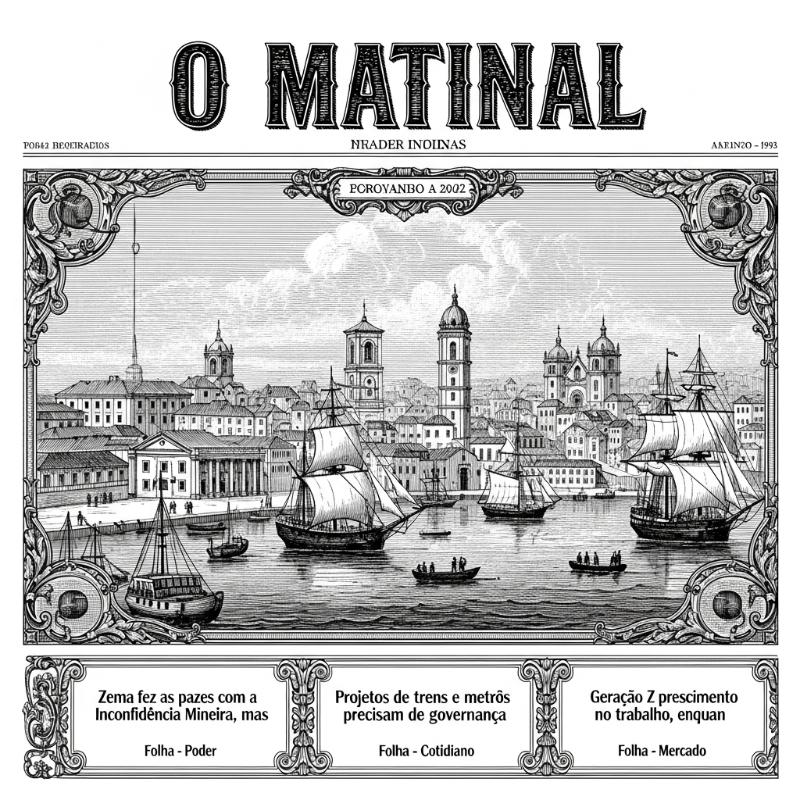
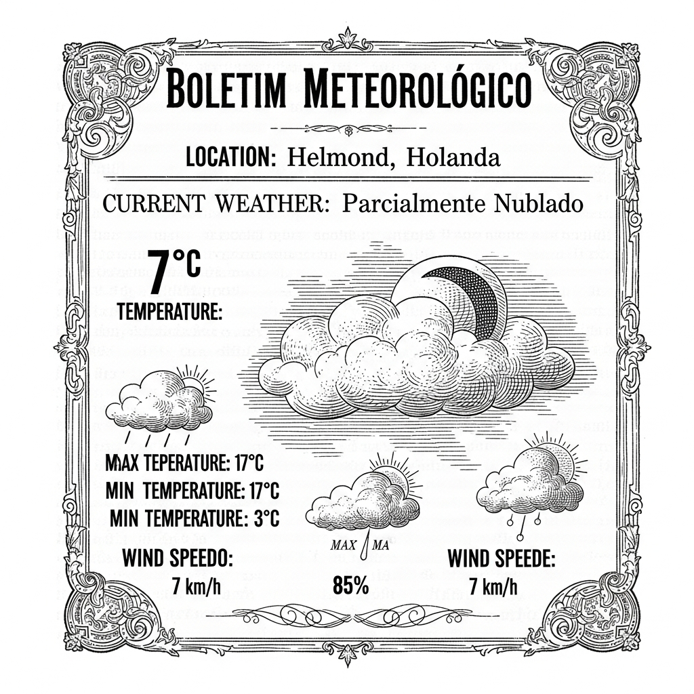

  

  

    
  

  
Anime & Manga

  

  

    
A Mark Against Thee Webtoon Confirmed for Live-Action Adaptation

    
ANN - Anime News

    
    
PREZADOS LEITORES DE "O MALHO",  É com o mais profundo respeito e a delicadeza de um *flâneur* que vos trazemos uma novidade que, cremos, haverá de despertar a curiosidade dos nossos distintos leitores. Circulam pelos salões mais elegantes e pelos gabinetes mais instruídos da nossa civilizada sociedade rumores que, agora, se confirmam com a solenidade de um decreto imperial. Trata-se da transposição para as telas, com a vivacidade e a emoção que só a arte pode proporcionar, de uma obra que tem cativado corações e mentes em formato de "webtoon".  Refiro-me, meus caros, à aclamada narrativa intitulada "A Mark Against Thee". Esta joia da moderna literatura ilustrada, que tem sido folheada com ardor pelos jovens e pelos espíritos mais vanguardistas, versa sobre um enredo de uma pungência que nos faz refletir sobre as intrincadas teias da justiça e do destino.  Imaginem, por obséquio, a seguinte situação, que é o cerne desta comovente história: um cavalheiro, após a impressionante cifra de dezessete anos de reclusão, vê-se finalmente livre das grades que o aprisionaram. Mas, e aqui reside a tragédia e o drama que tanto nos comovem, a sua condenação foi por um crime horrendo – um assassinato – que, em verdade, jamais cometeu. A injustiça, qual sombra densa, pairou sobre sua existência por quase duas décadas, roubando-lhe a juventude e a liberdade, bens tão preciosos à alma humana.  A notícia de que esta trama, tão rica em emoções e dilemas morais, será agora adaptada para uma "live-action" – expressão moderna para o que outrora chamaríamos de "espetáculo cinematográfico" ou "representação ao vivo" – é motivo de grande expectativa. Será, certamente, uma oportunidade ímpar para que o grande público possa mergulhar na profundidade deste relato, acompanhando de perto a saga deste homem que, inocente, carregou o fardo de uma culpa alheia.  Aguarda-se, pois, com a ansiedade de quem espera por um novo número de "O Malho", os detalhes desta produção. Que a arte, em sua mais nobre expressão, possa honrar a beleza e a dramaticidade desta história, perpetuando a reflexão sobre a verdade e a reparação.  Com os nossos mais cordiais cumprimentos e a esperança de que esta breve notícia lhes seja de agrado, despedimo-nos.  Vosso fiel "O Malho".

    <a href="https://www.animenewsnetwork.com/news/2026-04-26/a-mark-against-thee-webtoon-confirmed-for-live-action-adaptation/.236659" class="article-link">Leia na fonte →</a>
  

  

    
'Gaikotsu Kishi-sama, Tadaima Isekai e Odekakechuu II' Unveils Additional Cast, Ending Theme, First Promo

    
MyAnimeList News

    
    
Prezados leitores de "O Malho", permitam-me compartilhar convosco uma novidade que, creio, despertará o mais vivo interesse entre os aficionados pelas maravilhas do Oriente e suas estórias fantásticas.  Chegam-nos ventos frescos do Japão, trazendo consigo notícias acerca da aguardada segunda temporada da notável animação televisiva intitulada "Gaikotsu Kishi-sama, Tadaima Isekai e Odekakechuu", ou, para aqueles que preferem o vernáculo, "O Cavaleiro Esqueleto em Outro Mundo". No último sábado, o sítio oficial desta produção desvendou, com a devida pompa e circunstância, preciosas informações que, sem dúvida, farão palpitar os corações dos mais entusiastas.  Foi-nos revelado, com deleite, um elenco adicional de vozes que promete enriquecer ainda mais a trama. Para o personagem de Villiers Fim, teremos a honrosa participação do senhor Toshihiko Seki, cuja voz é já conhecida por emprestar seu talento a obras como "Kimetsu no Yaiba". O papel de Sasuke será encarnado pelo distinto Kensho Ono, aclamado por sua atuação em "Owari no Seraph". E para Tsubone, a grácil Hitomi Ueda, que já brilhou em "Nin...", nos brindará com sua arte.  Não menos importante, foi-nos apresentada a melodia que embalará o encerramento de cada episódio, uma peça musical que, sem dúvida, ficará gravada na memória de todos. Adicionalmente, um primeiro e empolgante "promo" foi divulgado, oferecendo um vislumbre das aventuras que estão por vir, acompanhado de uma imagem chave que ilustra a beleza e o mistério desta nova fase.  Esta segunda temporada, baseada na aclamada *light novel* de ação e fantasia do senhor Ennki Hakari, terá sua estreia agendada para o mês de julho do ano de 2026. As exibições ocorrerão nos canais Tokyo MX, BS11 e AT-X, garantindo que um vasto público possa deleitar-se com as peripécias de nosso cavaleiro esqueleto.  Assim, meus caros, aguardemos com serena expectativa a chegada desta nova leva de episódios, que certamente nos transportará para mundos distantes e repletos de magia, tal qual as páginas de um bom romance.

    <a href="https://myanimelist.net/news/74176086?_location=rss" class="article-link">Leia na fonte →</a>
  

  
Brasil

  

  

    
Zema fez as pazes com a Inconfidência Mineira, mas já a viu com outros olhos

    
Folha - Poder

    
    
**O Ilustre Zema e a Reconciliação Histórica com a Inconfidência Mineira: Um Epílogo que Ressoa pelos Séculos**  Prezados leitores, com a devida vênia e o requinte que a ocasião impõe, permitam-me trazer à baila um acontecimento que, qual brisa suave a acariciar os campos de Minas Gerais, acende a chama da reflexão em nossos corações patrióticos. Refiro-me, com o mais profundo respeito, à recente e notável reconciliação do preclaro ex-governador Romeu Zema com a memória altiva da Inconfidência Mineira.  Ah, caros confrades, quão volúveis são os ventos da opinião e quão mutáveis os olhares que lançamos sobre o passado! Houve tempo, sim, em que a Inconfidência, com seus ideais de liberdade a cintilar nas montanhas de Minas, talvez não encontrasse no ilustre Zema o mesmo ardor que hoje o impulsiona. Mas, como um bom vinho que amadurece e revela novas nuances, assim também a perspectiva do ex-mandatário parece ter-se aprimorado, conferindo à gesta inconfidente um novo e vibrante matiz.  Foi, pois, no dia em que se rememorava o trágico, mas glorioso, sacrifício de Tiradentes, mártir de nossa independência, que o digníssimo Zema, com a eloquência que lhe é peculiar, alçou sua voz. E que voz, meus caros! Qual trovão a ecoar pelas serranias, suas palavras, destemidas e carregadas de um fervor cívico admirável, arremeteram contra os "intocáveis" do Supremo Tribunal Federal.  Com uma coragem que nos faz recordar os bravos inconfidentes a desafiar a coroa portuguesa, o ex-governador proferiu sentenças que, decerto, farão corar os mais céticos. "Brasília", bradou ele, com a convicção de quem desvenda um arcano, "explora o Brasil como os portugueses o fizeram. (...) A luta dos inconfidentes não acabou!"  Ora, meus caros, que declaração mais lapidar e oportuna! Ao traçar um paralelo tão audaz entre o passado colonial e o presente republicano, o ilustre Zema não apenas homenageia a memória dos que derramaram seu sangue pela pátria, mas também nos convida a uma profunda introspecção. Estará a essência da luta inconfidente, a busca por uma nação livre de grilhões e explorações, ainda a ressoar em nossos dias?  É com um misto de admiração e profunda meditação que acompanhamos tais pronunciamentos. Que este notável epílogo, esta reconciliação de um líder com as raízes mais profundas de nossa história, sirva de inspiração para que todos nós, cidadãos deste vasto e promissor Brasil, jamais esqueçamos os ideais de liberdade e justiça que a Inconfidência Mineira, qual farol perene, nos legou. Que o espírito de Tiradentes, e de todos os que por ele lutaram, continue a guiar nossos passos rumo a um futuro mais justo e equitativo.

    <a href="https://redir.folha.com.br/redir/online/poder/rss091/*https://www1.folha.uol.com.br/colunas/eliogaspari/2026/04/zema-fez-as-pazes-com-a-inconfidencia-mineira-mas-ja-a-viu-com-outros-olhos.shtml" class="article-link">Leia na fonte →</a>
  

  

    
Projetos de trens e metrôs precisam de governança metropolitana, afirma executiva de associação

    
Folha - Cotidiano

    
    
**O Apelo Urgente da Razão para Nossas Metrópoles!**  Prezados e ilustres leitores de "O Malho",  Permitam-me, com a devida vênia e o mais profundo respeito, trazer à vossa distinta atenção um assunto de suma importância para o futuro próspero de nossas amadas cidades. Uma voz autorizada, vinda do seio de uma respeitável associação, elevou-se recentemente para iluminar um caminho que se afigura essencial para o desenvolvimento de nossa querida pátria.  Falamos, meus caros, da necessidade premente de uma governança metropolitana para os nossos tão almejados e indispensáveis projetos de trens e metrôs. Ah, que visão grandiosa, não é mesmo? Ver as nossas metrópoles conectadas por esses trilhos de progresso, transportando com eficiência e conforto os nossos valorosos cidadãos!  Contudo, a sábia executiva, com a perspicácia que lhe é peculiar, advertiu-nos de um ponto crucial: para que tais empreendimentos não se percam nas vicissitudes do tempo ou nas flutuações de interesses pessoais, é imperativo que se estabeleça uma governança que transcenda os mandatos individuais. É preciso que esses projetos, caros ao coração do progresso, floresçam e se desenvolvam de forma contínua, independentemente da efêmera vontade de um ou outro dirigente.  Imaginem, por um instante, a beleza de um plano que se desenrola com a constância de uma melodia bem orquestrada, sem as desafinações que por vezes acometem as iniciativas que carecem de um alicerce sólido e perene. A governança metropolitana é, pois, a chave para que esses sonhos sobre trilhos se tornem uma realidade duradoura, um legado para as gerações vindouras.  É um apelo à sensatez, à visão de longo alcance, para que o transporte ferroviário de passageiros, esse nervo vital de nossa civilização, seja tratado com a seriedade e a continuidade que merece. Que a razão prevaleça e que nossas metrópoles, em sua pujança, abracem essa ideia luminosa, garantindo um futuro onde os trilhos do progresso jamais sejam interrompidos.  Com os mais cordiais cumprimentos e a esperança de um amanhã ainda mais brilhante,  O Cronista de "O Malho"

    <a href="https://redir.folha.com.br/redir/online/cotidiano/rss091/*https://www1.folha.uol.com.br/blogs/sobre-trilhos/2026/04/projetos-de-trens-e-metros-precisam-de-governanca-metropolitana-afirma-executiva-de-associacao.shtml" class="article-link">Leia na fonte →</a>
  

  

    
Geração Z prioriza crescimento no trabalho, enquanto boomers focam equilíbrio, diz levantamento

    
Folha - Mercado

    
    
**O Malho – Crônicas da Sociedade Moderna**  **Uma Curiosa Análise dos Anseios Profissionais Entre as Gerações!**  Meus caros e prezados leitores, com a devida vênia e um certo ar de espanto, venho hoje trazer-vos à baila uma observação deveras interessante, colhida por aqueles que se dedicam a perscrutar os meandros do labor quotidiano. Imagine-se, por obséquio, numa roda de conversas, onde avôs e netos, com suas distintas bagagens de vida, expressam seus mais íntimos desejos quanto à jornada profissional. Pois bem, um recente e minucioso levantamento, empreendido pela afamada Robert Half – uma casa de consultoria que se dedica a desvendar os talentos humanos –, vem a confirmar o que muitos de nós já intuíamos, mas que agora se apresenta com a clareza de um cristal bem lapidado.  As jovens almas, nascidas sob o signo da chamada "Geração Z", ou seja, aqueles que vieram ao mundo entre os anos de 1997 e 2012, demonstram uma ambição que salta aos olhos! Pasmem, cavalheiros e damas, nada menos que oitenta e seis por cento desses moços e moças têm como norte principal de suas carreiras o **crescimento** e a tão almejada **promoção**. Seus corações parecem pulsar ao ritmo da ascensão, da conquista de novos patamares, da busca incessante por um futuro mais brilhante e, quiçá, mais abastado.  Em contrapartida, voltemos nossos olhos aos nossos veneráveis "Baby Boomers", aqueles que desfrutaram da luz do sol entre 1946 e 1964. Para estes, com a sabedoria que a experiência imprime, a tônica é outra, mais serena e, arrisco dizer, mais ponderada. Para a expressiva maioria, sessenta e seis por cento para ser exato, o valor supremo reside no **equilíbrio entre a vida pessoal e a profissional**. Não mais a corrida desenfreada por galgar degraus, mas sim a busca pela harmonia, pela serenidade de poder desfrutar dos prazeres do lar, da família, dos passatempos que preenchem a alma, sem que o trabalho usurpe por completo as horas preciosas da existência.  É, portanto, um panorama que nos convida à reflexão, não é mesmo? Duas gerações, dois mundos, duas visões sobre o que realmente importa no palco da vida laboral. Que este breve apontamento sirva, pois, para alimentar nossas conversas e para que compreendamos um pouco mais as nuances do espírito humano em suas diferentes fases. Até a próxima, com as bênçãos dos céus!

    <a href="https://redir.folha.com.br/redir/online/mercado/rss091/*https://www1.folha.uol.com.br/mercado/2026/04/geracao-z-prioriza-crescimento-no-trabalho-enquanto-boomers-focam-equilibrio-diz-levantamento.shtml" class="article-link">Leia na fonte →</a>
  

  
Cultura & História

  

  

    
Magnetismo de João Gomes conduz 'Dominguinho' em show de gala com Fagner no Allianz

    
Folha - Ilustrada

    
    
**O Triunfo Melódico de João Gomes: Um Sarau Inesquecível no Allianz Parque**  Prezados leitores de "O Malho", é com o coração em festa e a alma embalada pelas mais sublimes harmonias que vos trazemos as últimas novas do cenário artístico nacional. Na noite de gala que se anunciava no majestoso Allianz Parque, o público paulistano teve a ventura de testemunhar um espetáculo de rara beleza, onde o magnetismo inegável do jovem e talentoso João Gomes conduziu a plateia a um êxtase musical.  Recordamos que, há pouco menos de um ano, o projeto "Dominguinho", concebido com a maestria de João Gomes, Mestrinho e Jota.Pê, dava seus primeiros passos na acolhedora Casa Natura. Naquela ocasião, apesar de um público mais restrito, a surpresa foi imensa ao se constatar que os versos do álbum recém-lançado já ecoavam na memória e nos lábios dos presentes, um testemunho eloquente do poder de penetração de sua arte.  Pois bem, o tempo, senhor de todas as coisas, brindou-nos com o amadurecimento desse projeto singular. E foi assim que, em um palco grandioso e sob os holofotes da admiração pública, João Gomes, com sua voz que acaricia e encanta, elevou o "Dominguinho" a patamares ainda mais elevados. A presença ilustre do afamado Fagner, um ícone da nossa música, conferiu ao evento um brilho adicional, unindo gerações de talento e paixão.  Certamente, esta noite ficará gravada na memória coletiva como um marco de celebração da nossa cultura, onde o talento pujante de João Gomes, em parceria com os exímios Mestrinho e Jota.Pê, provou, uma vez mais, que a boa música não conhece fronteiras nem limites. Que venham mais saraus como este, a enriquecer a alma brasileira e a nos lembrar da beleza perene da arte.

    <a href="https://redir.folha.com.br/redir/online/ilustrada/rss091/*https://www1.folha.uol.com.br/ilustrada/2026/04/magnetismo-de-joao-gomes-conduz-dominguinho-em-show-de-gala-com-fagner-no-allianz.shtml" class="article-link">Leia na fonte →</a>
  

  
Games

  

  

    
Spider-Noir Trailer Sets the Stage for 1930s Mystery and Superpowered Goons

    
IGN

    
    
Prezados leitores, preparem-se para uma notícia que certamente agitará os vossos corações e mentes!  Chega-nos, pelos fios invisíveis da modernidade e através das ondas de progresso da Amazon Prime Video, um vislumbre deveras intrigante de uma nova aventura que promete transportar-nos ao coração da efervescente Nova Iorque dos anos trinta. Sim, meus caros, é com grande regozijo que anunciamos a chegada do *trailer* oficial de “Spider-Noir”, uma produção que, pelo que se depreende, virá a ser um deleite para os apreciadores de mistérios envolventes e de heróis destemidos.  Nesta película, teremos a honra de contemplar o distinto actor Nicolas Cage a encarnar a figura de Ben Reilly, um personagem que se imiscui nas entranhas de uma metrópole em plena efervescência, desvendando enigmas obscuros e enfrentando, com galhardia e notável bravura, a vilania superdotada que ousa perturbar a paz. As imagens que nos foram reveladas sugerem um ambiente de suspense e ação, onde a estética da época é primorosamente retratada, desde os cenários grandiosos até aos mais ínfimos detalhes que compõem o quadro de uma era de grandes transformações.  Pode-se antever, portanto, uma trama recheada de peripécias, onde a astúcia e a força se entrelaçam na luta contra o crime. Este “Spider-Noir” promete ser mais do que uma simples distração; será, porventura, um convite a uma imersão profunda num universo onde a sombra e a luz disputam palmo a palmo o domínio da cidade. Aguardemos, pois, com a devida curiosidade e a esperança de um espetáculo grandioso, a estreia desta obra que, sem dúvida, enriquecerá o panorama das produções cinematográficas.

    <a href="https://www.ign.com/articles/spider-noir-trailer-sets-the-stage-for-1930s-mystery-and-superpowered-goons" class="article-link">Leia na fonte →</a>
  

  

    
Assassin’s Creed Hexe Loses Its Second Director In Two Months

    
Kotaku

    
    
PREZADOS LEITORES E ILUSTRES DAMAS!  Com a licença de Vossas Excelências, permitimo-nos trazer à luz um acontecimento que, embora se desenrole nos etéreos domínios da criação digital, não deixa de ter sua relevância e, ousamos dizer, seu toque de drama, digno das mais vibrantes crônicas de nossa capital. Chega-nos, pelos fios invisíveis do progresso e da informação, a notável nova de que a aguardada produção intitulada "Assassin's Creed Hexe", obra que promete deslumbrar os entusiastas dos vídeojogos com suas intrincadas narrativas e visuais estonteantes, encontra-se, uma vez mais, sob nova batuta.  Pois bem, caros leitores, em um lapso de tempo que mal supera o piscar de olhos, ou seja, em meros dois meses, esta grandiosa empreitada testemunhou a despedida de seu segundo diretor. Tal qual um maestro que, após reger algumas notas introdutórias, cede o posto a outro, o comando desta vasta orquestra de pixels e códigos passa agora a mãos diferentes. É um movimento que, sem dúvida, desperta a curiosidade e instiga a reflexão sobre os bastidores complexos da criação artística moderna, mesmo quando esta se manifesta em formas tão inovadoras quanto os jogos eletrônicos.  A sucessão de lideranças em tão breve período sugere um dinamismo, talvez uma busca incessante pela perfeição, ou quem sabe, as habituais vicissitudes que acompanham os grandes projetos. O fato é que a “Assassin's Creed Hexe”, que se desenha como a próxima joia da coroa desta afamada série, agora navega sob uma nova direção, com a esperança de que este novo leme a conduza a portos seguros e a um destino de glória e aclamação.  Assim, com a delicadeza que nos é peculiar, encerramos esta breve nota, certos de que os desdobramentos desta fascinante saga continuarão a merecer a atenção de nossos distintos leitores.

    <a href="https://kotaku.com/assassins-creed-hexe-benoit-richer-ubisoft-2000690656" class="article-link">Leia na fonte →</a>
  

  
Holanda & Brabant

  

  

    
Drag queen, MH17 campaigner awarded king’s birthday honours

    
DutchNews

    
    
***NOTÍCIAS DA CORTE INGLESA***  **Honrarias Reais Concedidas a Ilustres Cidadãos**  Prezados leitores de "O Malho", é com a devida deferência e o esmero que nos caracteriza que trazemos, em primeiríssima mão, as últimas novidades oriundas da distante e respeitável Corte de Sua Majestade Britânica. Chegam-nos, por via dos mais céleres vapores, as gratas informações acerca das anuais honrarias concedidas por ocasião do natalício do augusto soberano, um costume que se perpetua com a nobreza e o decoro que tanto admiramos.  Nesta recente e solene ocasião, um total de três mil seiscentos e trinta e três almas beneméritas foram agraciadas com distintos títulos, em reconhecimento aos seus inestimáveis serviços e contribuições à sociedade. E dentre os laureados, permitam-nos destacar dois nomes que, por motivos deveras distintos, merecem a nossa particular atenção e o nosso mais profundo respeito.  Primeiramente, é-nos grato noticiar que o engenhoso criador da figura artística conhecida como Dolly Bellefleur, uma "drag queen" de notável talento e exuberância, foi merecidamente honrado. Tal distinção sublinha a crescente compreensão e o apreço pela arte em suas mais variadas e pitorescas manifestações, revelando a amplitude de espírito que permeia a cultura daquela nação. É, sem dúvida, um reconhecimento à criatividade e à audácia em desafiar os cânones estabelecidos, enriquecendo o panorama cultural com cores vibrantes e inusitadas.  Adicionalmente, e com a gravidade que o tema impõe, cumpre-nos informar que um valoroso e incansável ativista, cuja dedicação tem sido exemplar na busca por justiça e verdade em relação à lamentável tragédia do voo MH17, também foi agraciado. Sua incansável labuta em prol dos que perderam entes queridos neste funesto evento é um testemunho da mais pura abnegação e do mais elevado senso de humanidade. A persistência em desvendar os mistérios e em confortar os aflitos é, sem dúvida, uma das mais nobres virtudes que um ser humano pode ostentar.  Assim, vemos, caros amigos, como a Coroa Britânica, com sua sabedoria secular, estende seu reconhecimento a indivíduos cujas ações, sejam elas no campo da arte ou da justiça social, contribuem para o engrandecimento do espírito humano e para o bem-estar coletivo. É um belíssimo exemplo de como a distinção e o mérito jamais passam despercebidos, sendo devidamente recompensados com o brilho das mais altas honrarias. Que tais notícias sirvam de inspiração para todos nós, a fim de que cada um, em sua esfera de ação, possa também contribuir para um mundo mais justo, belo e harmonioso.

    <a href="https://www.dutchnews.nl/2026/04/drag-queen-mh17-campaigner-awarded-kings-birthday-honours/" class="article-link">Leia na fonte →</a>
  

  

    
Wekdienst 26/4: Kernramp Tsjernobyl herdacht • Vrijmarkt voor Koningsdag begint al in Utrecht

    
NOS.nl

    
    
**O Malho – Edição Matutina – Notícias de Última Hora!**  **Prezados Leitores e Cidadãos de Bom Gosto!**  Que a aurora vos encontre com a alma serena e o espírito ávido por novidades! É com a devida deferência que vos apresentamos, em breves momentos, os acontecimentos que marcam o alvorecer deste dia.  Em terras distantes, na longínqua Ucrânia, um sombrio aniversário se faz presente. Rememora-se hoje, com um misto de pesar e cautela, a tragédia de Tchernobil, um evento que, outrora, abalou a confiança no progresso e na segurança. Que esta lembrança sirva de eterno alerta à humanidade.  Entretanto, nem tudo são sombras! No pitoresco reino dos Países Baixos, mais precisamente em Utrecht, a alegria já desponta. A tradicional "Vrijmarkt", em honra ao Dia do Rei, inicia-se desde as primeiras horas, prometendo festividades e um animado comércio popular, onde cada cidadão poderá encontrar uma pechincha ou um tesouro esquecido.  E o tempo, meus caros? O firmamento nos agracia com um sol farto e generoso, embora, ao entardecer, algumas nuvens diáfanas possam sutilmente velar o azul celeste. Sopra um vento brando do nordeste, e as temperaturas prometem ser agradáveis, variando entre os doze graus no norte e os dezessete no sudeste. Os próximos dias, para deleite de todos, prometem-se secos e com um formoso entrelaçar de sol e nuvens, culminando em temperaturas mais elevadas e ainda mais esplendor solar.  Para aqueles que se aventuram pelas estradas, informamos que os caminhos e as vias férreas apresentam as usuais particularidades, sendo prudente consultar os boletins de tráfego para evitar contratempos.  Mas as notícias da noite passada nos trazem um incidente digno de nota! Nos Estados Unidos da América, durante o tradicional Jantar dos Correspondentes, o Exmo. Presidente Trump viu-se na necessidade de ser prontamente evacuado. Um indivíduo, munido de diversas armas, ousou invadir um posto de segurança. Felizmente, o agressor, um mestre-escola californiano de trinta e um anos, foi rapidamente dominado. Um bravo agente do Serviço Secreto, embora atingido, foi salvo por sua veste à prova de balas, e, graças a Deus, nenhum outro ferido foi registrado.  Em outro ponto, agitadores do movimento "Extinction Rebellion" bloquearam, ontem, uma importante rodovia, a A12, na altura de De Meern, causando a justificada indignação dos automobilistas.  Assim, meus prezados leitores, encerramos este breve relato, esperando que estas informações vos sejam de valia e que a jornada que se inicia seja repleta de ventura e bons augúrios. Até a próxima edição!

    <a href="https://nos.nl/l/2612024" class="article-link">Leia na fonte →</a>
  

  
Mundo

  

  

    
Líderes mundiais condenam disparo de tiros em jantar com Trump nos EUA

    
Folha - Mundo

    
    
Prezados leitores de "O Malho", com a devida vênia e o mais profundo pesar, trazemos-lhes notícias que abalam a boa ordem e a tranquilidade dos eventos sociais, mesmo além-fronteiras.  Foi com assombro e uma ponta de indignação que a alta sociedade internacional tomou conhecimento, na alvorada deste domingo, dia vinte e seis de abril, de um incidente deveras lamentável. Durante o tradicionalíssimo jantar anual da Associação de Correspondentes da Casa Branca, em terras americanas, um acontecimento de contornos alarmantes rompeu a solenidade e o bom-tom.  Narram os telegramas que, em meio à camaradagem e às amenidades que tais ocasiões propiciam, tiros foram disparados! Sim, caros amigos, tiros, em um recinto onde a palavra e a diplomacia deveriam reinar soberanas. O susto, imaginem Vossas Senhorias, foi geral e compreensível.  Sua Excelência, o Senhor Presidente Donald Trump, e a ilustríssima Primeira-Dama, Senhora Melania Trump, que honravam o evento com sua presença, foram, por medida de precaução e com a celeridade que o momento exigia, prontamente retirados do salão. Agentes do Serviço Secreto, com sua habitual eficiência e discrição, garantiram a segurança do casal presidencial na noite do sábado, dia vinte e cinco.  É de se notar que este lamentável episódio, que perturba a paz e a etiqueta dos encontros de tamanha envergadura, já recebeu a veemente condenação dos mais conspícuos líderes mundiais. Um ultraje à civilidade, sem dúvida, que esperamos não se repita. Que a serenidade e o respeito voltem a imperar, para que tais reuniões possam, novamente, ser um bálsamo para o espírito e um congraçamento entre as nações.

    <a href="https://redir.folha.com.br/redir/online/mundo/rss091/*https://www1.folha.uol.com.br/mundo/2026/04/lideres-mundiais-condenam-disparo-de-tiros-em-jantar-com-trump-nos-eua.shtml" class="article-link">Leia na fonte →</a>
  

  
Tecnologia & IA

  

  

    
California Engineer Identified in Suspected Shooting at White House Correspondents' Dinner

    
WIRED

    
    
**Um Incidente Inaudito no Jantar dos Correspondentes da Casa Branca!**  Prezados leitores de "O Malho", é com certo pesar e uma dose de estupefação que lhes trazemos as últimas novas de além-mar, vindas diretamente da capital norte-americana. Nosso correspondente, com a diligência que lhe é peculiar, informou-nos de um acontecimento deveras insólito e perturbador, ocorrido durante o prestigiado Jantar Anual dos Correspondentes da Casa Branca.  Imaginem os senhores a cena: um salão repleto de vultos importantes, a fina flor da imprensa, proeminentes membros do governo e, para gáudio de todos, a presença ilustre do próprio Presidente da nação, o Senhor Donald Trump. Um evento de tamanha magnitude, um congraçamento de mentes e vozes que moldam o destino da América, foi subitamente palco de um ato que desafia a compreensão.  Relata-se que um jovem engenheiro, de tenra idade – apenas trinta e um invernos! –, oriundo da ensolarada Califórnia, e que se autodenomina um "desenvolvedor de jogos independentes" (uma profissão que, confessamos, ainda nos é um tanto exótica), é o principal suspeito de ter disparado projéteis naquele augusto recinto. Sim, meus caros, disparos! Em meio a tal solenidade, a tal opulência, a tal distinção!  A notícia, como era de se esperar, causou um frisson generalizado e um profundo sentimento de apreensão. Como pôde tal desatino ocorrer em um evento de tamanha envergadura, com a segurança certamente reforçada para a salvaguarda de tão notáveis personalidades? Que motivações levaram este jovem, um engenheiro, a perpetrar tal ato de audácia e, quiçá, de insensatez?  "O Malho" permanecerá vigilante, acompanhando os desdobramentos desta intrincada questão, e trará aos seus fiéis leitores todas as informações que surjam, com a celeridade e a precisão que nos caracterizam. Que a paz e a ordem possam, em breve, ser restabelecidas, e que o véu seja erguido sobre as razões que impulsionaram este lamentável incidente.

    <a href="https://www.wired.com/story/california-engineer-identified-in-suspected-shooting-at-white-house-correspondents-dinner/" class="article-link">Leia na fonte →</a>
  

  

    
Get AirPods 4 for $99 and AirPods Max 2 for $529.99 on Amazon

    
MacRumors

    
    
**Um Brilhante Oportunidade para os Nossos Estimados Leitores!**  Prezados concidadãos e diletos leitores do "O Malho", é com a mais grata satisfação que lhes trazemos, de um futuro não tão distante, notícias de um acontecimento deveras auspicioso para os amantes da boa tecnologia e da conveniência moderna!  Imaginem, por obséquio, que em um ano vindouro, precisamente em 2026, a opulenta casa comercial conhecida como Amazon, um empório de proporções colossais, estará a ofertar certas maravilhas da engenharia sonora. Falo-lhes dos afamados "AirPods 4", pequenos prodígios que, em vez dos habituais cento e vinte e nove dólares, poderão ser adquiridos pela módica quantia de noventa e nove dólares. Uma pechincha, meus caros, que certamente fará os corações dos mais previdentes baterem com redobrado vigor!  E não para por aí a generosidade do destino! Para aqueles de paladar mais refinado e exigente, que anseiam por uma experiência sonora de excelsa qualidade, os "AirPods Max 2", recém-chegados ao mercado daquele futuro, estarão igualmente disponíveis com um desconto deveras atraente. De seus quinhentos e quarenta e nove dólares originais, poderão ser seus por quinhentos e vinte e nove dólares e noventa e nove centavos. Uma economia de dezenove dólares que, conquanto modesta, é a melhor oferta que se poderá encontrar para tais joias tecnológicas, especialmente nas elegantes colorações "Midnight" e "Starlight".  É importante notar, meus amigos, que esta notável oportunidade, proveniente dos anais do MacRumors – um periódico do porvir – é-nos transmitida com a devida ressalva de que, ao se aproveitar de tais benesses, uma pequena comissão poderá ser destinada àqueles que nos informam, auxiliando-os a manterem suas atividades e a trazerem mais novidades como estas.  A entrega, para os afortunados que se apressarem, poderá ser quase imediata, ou, no mais tardar, por volta do dia trinta de abril. Aqueles que buscam mais destas preciosas informações sobre as barganhas do porvir são convidados a consultar os "Apple Deals" e a subscreverem a um "Deals Newsletter", para que nenhuma oportunidade escape ao seu arguto discernimento.  Assim, com a esperança de que estas notícias, vindas de um futuro onde a tecnologia já é um deleite para os sentidos, sirvam de inspiração para os nossos dias, despedimo-nos, certos de que a busca pela boa oportunidade é um traço indelével da alma humana, em qualquer era que se encontre.

    <a href="https://www.macrumors.com/2026/04/25/airpods-4-99-airpods-max-2/" class="article-link">Leia na fonte →</a>
  

  

    
Empresas com acesso ao novo modelo de IA da Anthropic defendem cooperação global

    
Folha - Tec

    
    
**O Progresso e os Desafios da Civilização: A Premente Necessidade de Cooperação em Face das Novas Maravilhas da Inteligência Mecânica**  Prezados leitores, almas perspicazes e atentas aos movimentos que delineiam o porvir de nossa amena sociedade, é com a devida deferência e o esmero que a gravidade do assunto impõe que vos trazemos à baila uma questão de suma importância, a ressoar nos gabinetes mais ilustres e nas mentes mais argutas de nosso tempo.  Desde os confins da América do Norte, onde o engenho humano tem forjado maravilhas que beiram o fabuloso, chegam-nos ecos de uma nova era, impulsionada por um prodígio da inteligência mecânica, batizado com o sugestivo nome de Claude Mythos, obra da notável empresa Anthropic. Tal invenção, meus caros, não se contenta em ser mero ornamento do progresso; ela é, antes, um motor de transformações, um dínamo que tem impulsionado uma profusão de aprimoramentos nos intrincados sistemas que sustentam a vida moderna.  Contudo, como toda luz projeta sua sombra, e todo avanço traz consigo seus desafios, o Claude Mythos, em sua perspicácia artificial, tem revelado uma verdade que a muitos inquietará: as infraestruturas nacionais, que julgávamos inexpugnáveis, mostram-se, em muitos aspectos, vulneráveis à ação de malfeitores cibernéticos. Sim, caros amigos, os "hackers", esses piratas da era digital, espreitam nas brumas da rede, prontos a lançar seus ataques.  Diante de tal panorama, os preclaros chefes de segurança cibernética, homens de notável saber e de visão aguçada, erguem suas vozes em uníssono, clamando por uma coordenação mais estreita, mais harmoniosa, entre os augustos governos e as diligentes empresas. É mister que se unam, que se deem as mãos, para edificar uma muralha de proteção contra as investidas invisíveis, mas nem por isso menos perniciosas, que ameaçam a ordem e a tranquilidade de nossas nações.  Que esta nova maravilha tecnológica, o Claude Mythos, seja, portanto, não apenas um instrumento de progresso, mas também um catalisador para a união e a cooperação global. Que a sabedoria prevaleça, e que o espírito de colaboração entre os homens e as instituições garanta que o futuro, que se anuncia tão promissor, seja igualmente seguro e venturoso para todos nós. Que assim seja!

    <a href="https://redir.folha.com.br/redir/online/tec/rss091/*https://www1.folha.uol.com.br/tec/2026/04/novo-modelo-de-ia-da-anthropic-identifica-falhas-de-seguranca-e-empresas-defendem-cooperacao-global.shtml" class="article-link">Leia na fonte →</a>
  

  
Piadas & Humor

  

  

  

    <strong>EXPLICAÇÃO DA BÍBLIA: Um frade disputava acaloradamente com um militar, porque este dizia que a terra girava em roda do sol. — O senhor não se lembra, — dizia o enfurecido monge – que Josué fez parar o sol? — Por essa mesma razão lhe digo, — respondeu mui gravemente o militar – que desde essa ocasião ficou imóvel!</strong>
  

  

    <strong>DOIS ANIMAIS: Em uma função pública estava um mancebo, mui tímido, sentado atrás de uma senhora, de quem gostava muito, e que não reparava nele. Desejoso de travar conversação, aproveitou a circunstância de ver uma mosca pousada na manta da sua formosa vizinha, e disse-lhe: — Minha senhora, advirto-lhe que tem um animal atrás de si. — Ai me Deus! – respondeu a senhora, muito assustada – não sabia que o sr. estava aí.</strong>
  

  

    <strong>INQUÉRITO: O tropeiro apeia-se à porta de um armazém e pede a um pequeno para lhe segurar o cavalo. — Não morde? – perguntou o pequeno. — E não são precisos dois para o segurar? — Nesse caso, segure-o você, que tem idade para isso.</strong>
  

  

    <strong>HUMOR MILITAR: Entre a soldadesca brasileira que participava da Guerra do Paraguai, era hábito, como em todos os exércitos, e em todas as eras; inventar pilhérias e atribuí-las a certos oficiais. A principal vítima dessas gaiatices era um velho brigadeiro, tão conhecido pela bravura como pela ignorância. Dele se contava que, ditando ao secretário a parte relativa a um combate, dissera: “Não se esqueça de escrever que o inimigo fugiu tomado de terror pândego!” A conversa deste brigadeiro era uma série de batatadas, como se dizia então no Exército. De uma formosa rapariga por quem um oficial fazia grandes sacrifícios, referia: “Aquela rapariga sustenta um luxo asinático”, asiático, queria exprimir o bom homem. Casa aritmeticamente fechada, casa de genealogias verdes, eram coisas que lhe atribuíam entre muitas outras. Por exemplo, relatavam que uma vez fizera com ar pesaroso a seguinte observação, ao contemplar enormes rolos de fio telegráfico, deixados numa estação pelos paraguaios: — Que pena não nos poder servir tudo isto! — Mas por que, General? — Ora e que palerma! Não passariam senão palavras em guarani!</strong>
  

  

    <strong>MOTIVO DE PREOCUPAÇÃO: Quando morreu o padre de uma paróquia, puseram um aviso à porta da igreja onde ele costumava rezar missa: “O nosso estimado Padre Fulano de Tal, partiu para encontra-se com Cristo, esta manhã às 10 horas.” Uma mão irreverente escreveu mais embaixo, a lápis: “Três horas da tarde. Ainda não voltou. Começamos a ficar inquietos.”</strong>
  

