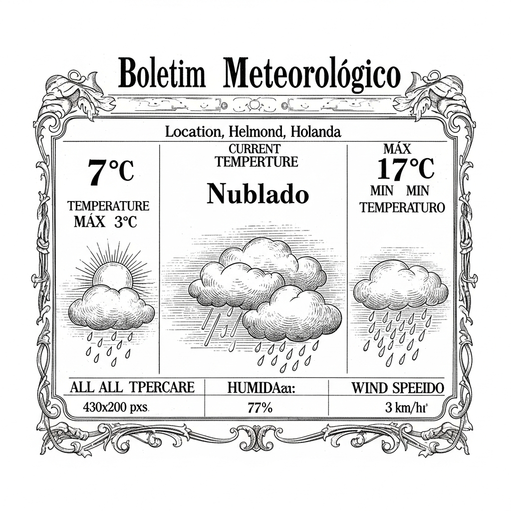

  

  

    
  

  
Anime & Manga

  

  

    
The Hundred Line -Last Defense Academy- Game Gets Manga, Stage Play

    
ANN - Anime News

    
    
**O Malho – Notícias Frescas do Cenário Artístico e Literário!**  Prezados leitores e diletos apreciadores das belas-artes e da cultura em geral, é com o mais profundo regozijo e a devida reverência que a nossa estimada gazeta traz à vossa consideração uma notícia que, decerto, fará vibrar os corações mais sensíveis e os espíritos mais ávidos por novidades no campo da criação. Chega-nos, por intermédio de missivas transoceânicas e de sussurros que atravessam os salões mais elegantes, a gratificante informação de que o notável e aguardado jogo, intitulado "The Hundred Line -Last Defense Academy-", que já vinha cativando a atenção de tantos por sua originalidade e enredo envolvente, transporá as fronteiras do entretenimento digital para almas mais elevadas.  Com efeito, os célebres personagens e a trama engenhosa desta obra-prima digital, que versa sobre a última academia de defesa, serão imortalizados em duas novas e esplêndidas manifestações artísticas, para a delícia de todos. Primeiramente, teremos o privilégio de contemplar a adaptação da narrativa para o formato de "mangá", essa forma de literatura ilustrada que tanto tem encantado o público por sua vivacidade e expressividade. O lançamento desta joia literária está previsto para o vindouro inverno, período em que as lareiras crepitam e os espíritos se aquecem com a leitura de bons livros.  Não menos emocionante é a notícia de que "The Hundred Line -Last Defense Academy-" ganhará vida nos palcos, sob a forma de uma peça teatral. Sim, meus caros! Os diálogos vibrantes, os dramas e os triunfos dos heróis serão encenados por talentosos artistas, que darão corpo e voz a essa história que já se tornou um ícone. As cortinas se abrirão para esta magnífica produção no mês de agosto, prometendo noites de inesquecível deleite e reflexão para todos aqueles que tiverem a ventura de assistir.  É, portanto, com o coração repleto de esperança no florescimento contínuo da arte e da cultura que O Malho compartilha convosco estas boas-novas. Que a transposição desta obra do universo digital para as páginas ilustradas e para os tablados teatrais sirva de inspiração para que novas e grandiosas criações continuem a enriquecer o nosso quotidiano, elevando o espírito e alimentando a alma. Que a arte, em todas as suas formas, permaneça sendo o farol a guiar a humanidade rumo à beleza e ao conhecimento.

    <a href="https://www.animenewsnetwork.com/news/2026-04-27/the-hundred-line-last-defense-academy-game-gets-manga-stage-play/.236822" class="article-link">Leia na fonte →</a>
  

  

    
New 'World Trigger' Anime Reveals Main Cast, Staff, Special Promo

    
MyAnimeList News

    
    
***O MALHO***  **Notícias Frescas do Reino da Animação Japonesa!**  Prezados leitores e diletos apreciadores das novidades que nos chegam dos recantos mais distantes do globo, é com inefável prazer que este vosso humilde periódico traz à luz os mais recentes e auspiciosos informes acerca de uma produção que promete encantar corações e mentes. No último domingo, durante o faustoso "World Trigger Festival 2026", foram reveladas, para gáudio de todos, as preciosas informações sobre o elenco de vozes e a equipe técnica que darão vida à nova série animada de "World Trigger".  Com efeito, esta aguardada adaptação do mangá de ação e ficção científica, de autoria do talentoso Daisuke Ashihara, terá seu pontapé inicial com um arco narrativo de título deveras intrigante: "Kuro Torigaa Goudatsu-hen", que em bom vernáculo poderíamos traduzir como "O Arco da Captura do Gatilho Negro". Uma promessa de emoções fortes e peripécias inesquecíveis, sem dúvida!  E para que a vossa curiosidade seja plenamente satisfeita, apresentamos, com a devida deferência, os nomes dos virtuosos artistas que emprestarão suas vozes aos personagens principais:  *   **Yuuma Kuga:** Será interpretado pela distinta Senhora Tomo Muranaka, cuja arte já foi aplaudida em "Arcana Famiglia". *   **Yuuichi Jin:** Terá a voz do insigne Senhor Yuuichi Nakamura, conhecido por sua magnífica atuação em "Mahouka Koukou no Rettousei". *   **Osamu Mikumo:** Ganhará vida através do talentoso Senhor Yuuki Kaji, cuja maestria já brilhou em "No.6". *   **Chika Amatori:** Será agraciada com o timbre da encantadora Senhora Nao Tamura, que já nos brindou com seu talento em "Digimon Universe: Appli Mon...".  Além destas gratas novas, foi também exibido um vídeo promocional que, conforme nos informam, é de uma beleza e dinamismo que farão as delícias dos mais exigentes.  Assim, aguardamos com a mais pura expectativa a estreia desta obra, que certamente virá enriquecer o já vasto panorama das artes animadas, trazendo consigo a magia e o engenho que caracterizam as produções nipônicas. Que o bom Deus lhes abençoe e lhes proporcione momentos de deleite com esta magnífica empreitada!

    <a href="https://myanimelist.net/news/74180996?_location=rss" class="article-link">Leia na fonte →</a>
  

  
Brasil

  

  

    
Frente a Frente, programa de Folha e UOL sobre eleições, entrevista Renan Santos nesta segunda

    
Folha - Poder

    
    
**Frente a Frente: Um Encontro de Vultos na Arena Política**  Prezados leitores e diletos patronos da boa informação, é com o mais profundo respeito e a costumeira galhardia que o vosso Malho se debruça sobre os acontecimentos que moldam o porvir de nossa amada Nação. Que a vossa atenção se volte, pois, para um evento de inegável relevância, a ser desvendado em breve, com a elegância e a profundidade que o tema exige.  Nesta segunda-feira, dia 27 do corrente mês, os luminares da imprensa, representados pelos preclaros veículos "Folha" e "UOL", terão a honra de apresentar ao distinto público o seu afamado programa de entrevistas, o "Frente a Frente". Trata-se de uma tribuna semanal, concebida com o nobre fito de perscrutar os meandros das vindouras eleições de 2026, um palco onde se desenharão os destinos de nossa Pátria.  E quem será o convidado de tamanha envergadura a sentar-se à mesa das indagações? Ninguém menos que o notável Senhor Renan Santos, figura proeminente no cenário político-social. Conhecido por ser um dos fundadores do Movimento Brasil Livre, agremiação que tem se destacado por suas ideias e propósitos, o Senhor Santos é, ademais, um pré-candidato à Presidência da República pelo Partido "Missão".  É, portanto, com a esperança de um debate profícuo e esclarecedor que aguardamos este encontro de mentes, onde as ideias fluirão e as propostas serão apresentadas. Que a vossa curiosidade seja aguçada, e que a reflexão sobre os rumos de nossa República seja o fruto mais valioso deste "Frente a Frente". O Malho, como sempre, estará atento, para vos trazer as mais fidedignas e completas informações.

    <a href="https://redir.folha.com.br/redir/online/poder/rss091/*https://www1.folha.uol.com.br/poder/2026/04/frente-a-frente-programa-de-folha-e-uol-sobre-eleicoes-entrevista-renan-santos-nesta-segunda.shtml" class="article-link">Leia na fonte →</a>
  

  

    
PMs do Rio monitoraram empresário antes de matá-lo na Pavuna, aponta investigação

    
Folha - Cotidiano

    
    
Prezados leitores de “O Malho”,  Com a devida vênia e o coração pesado, trazemos à baila um acontecimento que turva a serenidade de nossa amada cidade. Chegam-nos, por intermédio da mais moderna tecnologia de captação de imagens – aquelas pequeninas lentes acopladas aos uniformes de nossos bravos guardiões da ordem –, revelações que lançam um véu de mistério e, quiçá, de profunda tristeza sobre a madrugada da última quarta-feira, dia 22.  Na bucólica região da Pavuna, onde outrora apenas o canto dos pássaros e o burburinho da vida cotidiana ecoavam, deu-se um infortúnio que ceifou a jovem existência do estimado comerciante Daniel Patrício Santos de Oliveira, de apenas 29 primaveras. As investigações, conduzidas com o mais escrupuloso afinco, sugerem que, antes do fatídico desfecho, o laborioso empresário encontrava-se sob o atento escrutínio de elementos pertencentes ao 41º Batalhão de Polícia Militar, sediado em Irajá.  As imagens, que vieram à luz pública através do conceituado programa televisivo “Fantástico” neste domingo, dia 26, desvendam, com minuciosa clareza, os derradeiros momentos que precederam o trágico evento. É com um suspiro de apreensão que a sociedade fluminense acompanha os desdobramentos, aguardando que a verdade, límpida e inquestionável, se manifeste em toda a sua plenitude.  Que a justiça, com sua balança equilibrada e sua espada serena, possa guiar os caminhos desta intrincada questão, e que a memória do jovem Daniel Patrício seja honrada com a mais completa elucidação dos fatos.  Com os nossos mais sinceros votos de paz e retidão,  A Redação de “O Malho”.

    <a href="https://redir.folha.com.br/redir/online/cotidiano/rss091/*https://www1.folha.uol.com.br/cotidiano/2026/04/pms-do-rio-monitoraram-empresario-antes-de-mata-lo-na-pavuna-aponta-investigacao.shtml" class="article-link">Leia na fonte →</a>
  

  

    
45% dos brasileiros afirmam ter buscado renda alternativa nos últimos meses, segundo Datafolha

    
Folha - Mercado

    
    
**O Pulso da Nação: Um Olhar Atento sobre as Vicissitudes do Povo Brasileiro**  Meus caros e ilustres leitores de "O Malho", é com a costumeira solicitude que vos apresentamos os mais recentes apontamentos acerca da vida econômica de nossa estimada nação. Os dados coligidos pelo preclaro Instituto Datafolha, em suas diligentes investigações, revelam um panorama que convida à reflexão e à ponderação.  Com efeito, um número deveras expressivo de nossos patrícios – alcançando a notável cifra de 45% – confessou ter-se dedicado, nos últimos meses, à busca de um ganho suplementar, um recurso adicional que lhes aliviasse os fardos da existência. Esta tendência é particularmente acentuada entre aqueles cujas rendas não ultrapassam a marca de dois salários mínimos, um indicativo claro das agruras que afligem as camadas menos abastadas de nossa sociedade.  Simultaneamente, e com não menor relevância, quase seis em cada dez chefes de família, com a franqueza que lhes é peculiar, manifestaram que os proventos de seu labor e de seus entes queridos são, em alguma medida, insuficientes para fazer frente às inadiáveis despesas do lar. É um lamento que ecoa pelas ruas e pelos lares, um clamor por dias mais prósperos e serenos.  Que esta singela mas elucidativa notícia sirva, pois, para que todos nós, cidadãos de bem, compreendamos as nuances e os desafios que permeiam a vida de nossos irmãos brasileiros. Em tempos de incerteza, a solidariedade e a perspicácia são virtudes que devemos cultivar com esmero, visando sempre ao bem-estar coletivo e à pujança de nossa amada pátria.  *Publicado em 26 de abril de 1902, às 23h00.*

    <a href="https://redir.folha.com.br/redir/online/mercado/rss091/*https://www1.folha.uol.com.br/mercado/2026/04/45-dos-brasileiros-afirmam-ter-buscado-renda-alternativa-nos-ultimos-meses-segundo-datafolha.shtml" class="article-link">Leia na fonte →</a>
  

  
Cultura & História

  

  

    
Pré-venda de ingressos de cinema para 'Mortal Kombat 2' já está aberta

    
Folha - Ilustrada

    
    
**Grande Novidade Cinematográfica! A Prevenção de Bilhetes para "Mortal Kombat 2" já se Encontra Aberta!**  Prezados e mui cultos leitores de "O Malho", é com a mais fina galhardia que vimos anunciar uma ventura deveras emocionante para os aficionados pela sétima arte e, quiçá, pelos intrépidos mundos dos divertimentos eletrônicos!  Imaginem, por obséquio, que a tão aguardada exibição cinematográfica de "Mortal Kombat 2", uma obra que promete transportar para as grandes telas a efervescência e o vigor do universo concebido pelos ilustres Ed Boon e John Tobias, já se encontra com a sua prevenção de bilhetes amplamente franqueada!  Sim, meus caros, para aqueles que anseiam por garantir o seu lugar neste espetáculo de proporções épicas, informamos que os preciosos ingressos podem ser adquiridos, com toda a comodidade e presteza, através dos distintos portais eletrônicos das renomadas casas exibidoras de cinema ou, para maior facilidade, na plataforma digital conhecida como Ingresso.com.  Que deleite para os olhos e para o espírito será poder testemunhar, em toda a sua magnificência, as proezas e os embates que este filme, sem dúvida, nos reserva! E para aqueles que buscam a mais imersiva e grandiosa das experiências visuais, temos a honra de salientar que a estreia exclusiva ocorrerá nas augustas salas IMAX, a partir do dia 7 do vindouro mês de maio.  Prestigiem, pois, esta oportunidade ímpar de desfrutar de um evento cinematográfico que, com toda a certeza, marcará época em nosso distinto cenário cultural. Não percam tempo e assegurem, desde já, a vossa presença neste grandioso espetáculo!  *Publicado em 26 de abril de 1902, às 23 horas.*

    <a href="https://redir.folha.com.br/redir/online/ilustrada/rss091/*https://guia.folha.uol.com.br/cinema/2026/04/pre-venda-de-ingressos-de-cinema-para-mortal-kombat-2-ja-esta-aberta.shtml" class="article-link">Leia na fonte →</a>
  

  
Games

  

  

    
Karma Exorcist is a Chinese Mythology Metroidvania That Caught Me Off Guard

    
IGN

    
    
**O Malho – Notícias Curiosas do Além-Mar**  **Um Fascinante Inquérito sobre o "Karma Exorcist": Uma Aventura Chinesa que Cativa a Alma!**  Meus caros leitores, permitam-me compartilhar a mais recente e surpreendente descoberta que nos chega das longínquas terras da China, um prodígio da engenharia lúdica que promete arrebatar os corações dos mais exigentes apreciadores de entretenimento digital. Refiro-me ao "Karma Exorcist", um título que, confesso, me apanhou desprevenido, mas que, qual gancho de um pescador habilidoso, fisgou minha atenção desde o primeiro instante.  Em um recente e prestigiado evento, o "BiliBili: First Look", ocorrido na vibrante Xangai, tive a ventura de presenciar a magnificência deste jogo, cujos cenários, desenhados à mão com uma delicadeza ímpar, transportam-nos a um universo de mitologia chinesa. Nosso protagonista, um caçador de demônios sem memória ou identidade, emerge de um gigantesco dedo de pedra petrificado, empunhando uma lâmina capaz de ceifar almas e uma sede inextinguível por purgar as hostes do mal no que se assemelha ao "Di Fu", o inferno do folclore chinês.  A jornada de nosso herói desenrola-se por onze biomas distintos, que se revelam em todas as direções à medida que novas habilidades são desvendadas. Durante as primeiras horas, explorei cavernas lúgubres infestadas de lesmas ruidosas, estruturas arruinadas e varridas pela areia, e até mesmo um túmulo opcional, repleto de armadilhas à la Indiana Jones e golens que, subitamente, ganhavam vida. O repertório de inimigos é vastíssimo, com mais de cem tipos, desde morcegos portadores de lanternas que disparam chamas, a soldados com lanças que brotam do solo, e esqueletos corpulentos brandindo martelos pesados.  O sistema de combate é de uma inteligência notável, permitindo ao jogador mapear até três armas simultaneamente. Pude experimentar a agilidade da espada, a contundência do machado e a precisão das adagas arremessáveis, o que me proporcionou um equilíbrio perfeito nas primeiras refregas. A cada vitória sobre um chefe, uma nova arma ou habilidade é concedida, expandindo o arsenal do caçador. Foi assim que obtive o "gancho de agarre", ou, como é poeticamente chamado no jogo, a "corrente que arrebata almas", uma ferramenta que não apenas permite alcançar áreas inatingíveis, mas também oferece novas táticas em combate, como impulsionar-se contra inimigos voadores ou flanquear adversários com escudos.  As mortes, meus amigos, são uma parte intrínseca da experiência, remetendo-nos à melancolia de "Hollow Knight". Ao sucumbir, o herói retorna ao último santuário visitado, com sua alma separada, o que limita sua vitalidade. Para recuperá-la e restaurar sua força plena, é preciso enfrentar o caminho de volta ao local da queda ou invocar a alma no santuário, mediante o pagamento de algumas moedas. Tal mecânica eleva a tensão, tornando cada passo uma decisão ponderada.  Contudo, nem tudo é perfeição neste incipiente estágio do desenvolvimento. Alguns menus ainda se mostram em progresso, e o sistema de mapa, por vezes, falha em refletir a posição exata do jogador, o que, em um jogo onde a exploração de passagens ocultas é crucial, pode ser um pequeno entrave. Houve até um inusitado momento em que um chefe, durante uma batalha, apresentou um defeito, permitindo-me desferir golpes sem resistência, o que, embora vitorioso, deixou um sabor de triunfo oco.  Felizmente, há tempo de sobra para os talentosos desenvolvedores da Cyclos exorcizarem estes pequenos "demônios" técnicos, pois o lançamento está previsto somente para 2027, com a promessa de chegar às plataformas PlayStation 5, Xbox Series X|S, PC e Nintendo Switch.  Com base nas absorventes horas iniciais, o "Karma Exorcist" ostenta todos os predicados para se tornar um magnífico exemplar do gênero Metroidvania, e sua jornada pelas profundezas de um inferno impregnado de karma maligno poderá, com toda a certeza, levar os fãs de "Hollow Knight" ao paraíso. Que os deuses do entretenimento abençoem este promissor empreendimento!

    <a href="https://www.ign.com/articles/karma-exorcist-is-a-chinese-mythology-metroidvania-that-caught-me-off-guard" class="article-link">Leia na fonte →</a>
  

  

    
A Surprise Teaser For Alien: Isolation 2 Gives Fans Fresh Hope For The Sequel 14 Years Later

    
Kotaku

    
    
**O Malho – Notícias de Além-Mar**  **Um Aceno Inesperado do Cosmos Cinematográfico: A Volta Triunfal da Criatura Estelar Após Quatorze Longos Anos!**  Prezados leitores e diletos apreciadores das artes e das emoções fortes, é com um misto de assombro e jubilosa expectativa que trazemos à vossa distinta atenção uma nova que, certamente, fará palpitar os corações mais arrojados! Após um hiato que se estendeu por quase uma década e meia, eis que os murmúrios do éter nos chegam com uma revelação deveras surpreendente, vinda dos recônditos estúdios da afamada Creative Assembly.  Imaginai, por obséquio, o deleite dos entusiastas daquela saga intergaláctica que, outrora, nos arrebatou com a figura imponente e pavorosa de uma criatura abissal, a qual, para muitos, personificava o próprio medo primordial. Sim, caros amigos, estamos a referir-nos, com a devida vénia e um quê de mistério, à aguardada continuação daquela aventura que nos fez prender a respiração, intitulada, se não nos falha a memória, "Alien: Isolation".  Pois bem, os ventos da fortuna sopram em favor dos mais pacientes e devotos, trazendo consigo um "teaser" inesperado – um breve vislumbre, um aceno fugaz, mas carregado de promessas, que reacendeu a chama da esperança nos corações dos que aguardavam por este retorno triunfal. É como se, do mais profundo e inóspito espaço sideral, um sinal fosse emitido, a indicar que a saga da criatura estelar não está, de forma alguma, encerrada.  É certo que, neste momento, a cortina da discrição ainda se mantém quase inteiramente fechada. Pouquíssimo se sabe, para ser franco, sobre os pormenores desta vindoura obra da Creative Assembly. As informações são, por assim dizer, escassas como pepitas de ouro em leito de rio seco. Contudo, a simples sugestão de que um novo capítulo será desvendado, após quatorze anos de silêncio, é suficiente para inflamar a imaginação e alimentar as mais vívidas conjecturas.  Que segredos se ocultarão nas profundezas deste novo empreendimento? Quais serão os desafios que aguardam os destemidos exploradores deste universo tão peculiar? Apenas o tempo, esse mestre implacável e revelador, nos poderá brindar com as respostas. Por ora, resta-nos aguardar, com a elegância e a paciência que nos são tão caras, os próximos desdobramentos desta fascinante e promissora narrativa que, sem dúvida, enriquecerá o vasto e sempre surpreendente firmamento das produções artísticas. Que a curiosidade nos guie!

    <a href="https://kotaku.com/alien-isolation-2-teaser-trailer-sega-2000690735" class="article-link">Leia na fonte →</a>
  

  
Holanda & Brabant

  

  

    
Feyenoord open up gap in race for second as Twente and NEC draw

    
DutchNews

    
    
Prezados leitores de "O Malho", permitam-me, com a devida vênia, compartilhar-lhes um acontecimento deveras interessante do mundo do futebol, esporte que, apesar de sua origem estrangeira, começa a cativar os corações em nossa amada pátria.  Em terras distantes, onde a bola rola com vigor e paixão, o distinto clube Feyenoord deu um passo de gigante, um salto verdadeiramente notável, em sua caminhada rumo a uma posição de destaque na próxima edição da afamada Liga dos Campeões. Com uma atuação que beirou a perfeição, digna dos mais elevados elogios, a equipe conquistou uma vitória retumbante de três tentos a um sobre seu valoroso adversário. Este triunfo, meus caros, não foi meramente um jogo ganho; foi uma demonstração de pujança e determinação que solidificou a sua posição.  Enquanto isso, em outra peleja, o embate entre os renomados clubes Twente e NEC resultou num empate, um desfecho que, embora não seja uma derrota, certamente não contribui para que estes alcancem o almejado segundo lugar na tabela. Este resultado, por assim dizer, abriu um fosso, uma distância considerável, entre o Feyenoord e seus perseguidores mais próximos.  Assim, o caminho para o Feyenoord, outrora talvez um tanto pedregoso, parece agora mais aplainado, com a perspectiva de ascender àquela tão cobiçada Liga dos Campeões. É, sem dúvida, um feito que merece ser registrado nas páginas de nossa imprensa, para que o público aprecie a tenacidade e o talento que permeiam os gramados europeus. Que os deuses do futebol continuem a sorrir para os audazes e os virtuosos!

    <a href="https://www.dutchnews.nl/2026/04/feyenoord-open-up-gap-in-race-for-second-as-twente-and-nec-draw/" class="article-link">Leia na fonte →</a>
  

  

    
NOS Koningsdag-enquête: meer waardering voor de koning, maar kosten te hoog

    
NOS.nl

    
    
**O Malho – Notícias Reaes – 15 de Maio de 1902**  **A Apreciação do Povo Neerlandês pela Sua Majestade, o Rei Guilherme-Alexandre: Um Olhar Atento aos Sentimentos Nacionais**  Meus caros leitores, é com a deferência que nos é peculiar que vos trazemos as últimas novas do reino dos Países Baixos, onde o pulso da nação foi recentemente medido com esmero. Uma pesquisa, digna de nota, levada a cabo pela distinta NOS e pelo diligente instituto Ipsos I&O, veio a lume, revelando nuances interessantes acerca da percepção popular sobre a augusta figura de Sua Majestade, o Rei Guilherme-Alexandre.  Após um período de certa retração, talvez pelas vicissitudes impostas pela recente pandemia, a estima pelo monarca, regente de tão nobre nação, tem-se reerguido com notável constância. Mais da metade dos neerlandeses, precisamente 54%, confiam em seu soberano, um número que ressalta o apreço da juventude, entre os 18 e 34 anos, pela liderança régia. A satisfação com o modo como o Rei desempenha suas elevadas funções ascendeu de 47% para 53%, sendo a sua humanidade, o seu envolvimento e a sua capacidade de unir os povos os pontos mais elogiados. Não menos importante, a maioria o considera um embaixador exemplar para os Países Baixos, concedendo-lhe uma honrosa nota de 6,9.  Todavia, como em toda boa ópera, há sempre um contraponto. O custo da monarquia, meus amigos, é um ponto de discórdia. Quase a metade dos neerlandeses, com 49%, e de forma mais acentuada entre os jovens, com cerca de 60%, considera os gastos régios excessivos. A estimada repórter da Casa Real, Simone Tukker, com a sua perspicácia habitual, assinala que, em tempos de carestia e dificuldades financeiras para o homem comum, o orçamento real, que ultrapassa os 60 milhões de euros e não demonstra sinais de diminuição, gera certa apreensão. A recordação de dispêndios passados, como férias em tempos de crise ou a aquisição de uma villa em Moçambique, embora distantes, ainda ecoa na memória popular, contrastando com o louvável gesto da Princesa Amália ao renunciar, em um primeiro momento, à sua abastada mesada.  Falando na Princesa Amália, herdeira do trono, a sua imagem é de uma jovem inteligente, séria e profissional, suscitando uma impressão deveras positiva. Contudo, o facto de usufruir de uma parcela de 1,6 milhão de euros de sua anuidade, destinada a despesas, tem sido objeto de crítica crescente, especialmente entre os mais jovens.  Não se pode deixar de mencionar o nobre gesto de Sua Majestade, a Rainha Máxima, e da Princesa Amália, ao engajarem-se ativamente na defesa da pátria. A Rainha alistou-se como reservista do exército, e a Princesa Amália cursa formação no Defensity-college. Este ato, que demonstra a sua profunda responsabilidade social, é aplaudido por quase 60% da população, e já se fala no "efeito Amália", dada a crescente adesão de jovens à causa da defesa nacional.  Apesar das opiniões divididas sobre a visita a certo presidente além-mar, ou sobre a conveniência de um membro da Família Real assistir ao Campeonato Mundial de Futebol nos Estados Unidos, a preferência pela monarquia permanece inabalável para seis em cada dez cidadãos, superando a ideia de uma república.  Assim, meus prezados, eis o retrato fiel dos sentimentos que permeiam o coração do povo neerlandês para com a sua venerável Casa Real. Um quadro onde a admiração se mescla com o pragmatismo, e a lealdade convive com o olhar atento às finanças públicas. Que a sabedoria continue a guiar os passos de tão ilustres personagens.

    <a href="https://nos.nl/l/2612146" class="article-link">Leia na fonte →</a>
  

  
Mundo

  

  

    
Trump está apertando parafusos de Cuba como nunca antes, diz pesquisador

    
Folha - Mundo

    
    
**Trump e o Rigor em Cuba: Uma Análise do Professor Mesa-Lago**  Meus caros e perspicazes leitores de "O Malho", é com a devida gravidade que lhes trago notícias de além-mar, concernentes à bela e conturbada ilha de Cuba. Nesses tempos de agitação política e transformações incessantes, a atenção do mundo volta-se, uma vez mais, para as ações do preclaro Presidente Trump, cujas medidas para com a nação caribenha parecem, a cada dia, mais incisivas e rigorosas.  Para nos iluminar sobre este intrincado cenário, temos a valiosa contribuição do eminente Professor Emérito Carmelo Mesa-Lago, da respeitável Universidade de Pittsburgh, nos Estados Unidos. O Professor Mesa-Lago, cuja dedicação aos estudos sobre Cuba estende-se por décadas, é uma verdadeira autoridade no assunto, e suas palavras ressoam com a sabedoria de quem conhece profundamente as nuances daquela terra.  Com um tom de notável frustração, o insigne acadêmico partilha conosco a sua profunda inquietação. "É deveras frustrante", confessa ele, ao discorrer sobre os frutos de suas longas e meticulosas pesquisas. E prossegue, com a clareza que lhe é peculiar: "Nos últimos vinte anos, os estudos revelam cifras cada vez mais desoladoras."  Tal afirmação, vinda de um observador tão arguto e dedicado, não pode ser ignorada. Ela sugere que as pressões exercidas sobre Cuba, e que agora se intensificam sob a administração Trump, vêm gerando um quadro de declínio que se agrava progressivamente. As "cifras desoladoras" a que se refere o Professor Mesa-Lago apontam para um cenário de dificuldades crescentes, que certamente merecem a nossa mais atenta consideração e reflexão.  Assim, meus prezados, enquanto o Presidente Trump prossegue em sua política de "apertar parafusos" em Cuba, as palavras do Professor Mesa-Lago servem como um alerta, um convite à ponderação sobre os efeitos e as consequências de tais ações. Que o tempo nos revele os desdobramentos dessa complexa trama, e que a sabedoria prevaleça em todas as nações.

    <a href="https://redir.folha.com.br/redir/online/mundo/rss091/*https://www1.folha.uol.com.br/mundo/2026/04/trump-esta-apertando-parafusos-de-cuba-como-nunca-antes-diz-pesquisador.shtml" class="article-link">Leia na fonte →</a>
  

  
Tecnologia & IA

  

  

    
‘STAGED’: Conspiracy Theories Are Everywhere Following White House Correspondents’ Dinner Shooting

    
WIRED

    
    
**NOTÍCIAS DA CAPITAL AMERICANA: Um Estranho Drama no Jantar dos Correspondentes**  Meus caros leitores e distintas senhoras,  Permitam-me que lhes traga, com a devida vénia e a seriedade que o assunto impõe, um relato que tem sacudido os salões e as tertúlias da distante capital americana. A recente gala dos correspondentes da Casa Branca, um evento de tão grande pompa e circunstância, foi palco de um incidente que, segundo os ventos que sopram do além-mar, tem gerado as mais curiosas e, atrevo-me a dizer, pitorescas especulações.  Após o lamentável tiroteio que ensombrou o que deveria ser uma noite de confraternização e eloquência, uma palavra em particular – "encenado" – ecoou como um trovão nas recém-criadas redes sociais. Sim, meus amigos, essa mesma palavra, com o seu sugestivo tom teatral, espalhou-se com a velocidade de um relâmpago entre os mais diversos círculos de influência.  Observa-se, com certa perplexidade, que tanto os arautos da direita quanto os paladinos da esquerda, bem como uma plêiade de contas anónimas – esses sussurradores digitais que surgem do éter – têm-se dedicado a disseminar as mais infundadas teorias da conspiração. É como se, de repente, o palco da política e do jornalismo se tivesse transformado num grande teatro de sombras, onde cada incidente é dissecado sob a lente da desconfiança e da suposição.  Parece que, para muitos, a realidade dos factos perde o seu brilho diante da tentação de desvendar um suposto ardil, um enredo oculto por trás dos acontecimentos. A palavra "encenado", com todo o seu peso de mistério e intriga, tornou-se o estandarte sob o qual se agrupam aqueles que preferem ver, em cada revés da fortuna, a mão invisível de uma manipulação.  Assim, meus prezados, assistimos a um curioso espetáculo da alma humana, onde a busca pela verdade se confunde com a sedução do enigma. Que cada um de nós, com a sua própria perspicácia, saiba discernir entre o facto consumado e a mera conjectura, mantendo sempre a serenidade diante das tempestades de boatos que, por vezes, agitam o espírito público.  Com os meus mais respeitosos cumprimentos, Um atento observador dos tempos.

    <a href="https://www.wired.com/story/staged-conspiracy-theories-are-everywhere-following-white-house-correspondents-dinner-shooting/" class="article-link">Leia na fonte →</a>
  

  

    
Get AirPods 4 for $99 and AirPods Max 2 for $529.99 on Amazon

    
MacRumors

    
    
**O Malho Noticioso: Uma Oportunidade Ímpar para os Amantes da Música!**  Prezados e prezadas leitores, com a devida vênia e o mais profundo respeito, trazemos hoje uma notícia de regozijo para aqueles que apreciam a mais fina tecnologia e o conforto auditivo que a modernidade nos oferece.  Pois bem, a afamada casa comercial Amazon, com sua conhecida presteza e sortimento inigualável, apresenta aos nossos distintos concidadãos uma verdadeira pechincha, um achado que fará as delícias dos melômanos e de todos os que prezam pela qualidade do som.  Os veneráveis "AirPods 4", esses pequenos prodígios da engenharia, que antes demandavam o valor de cento e vinte e nove dólares, podem agora ser adquiridos pela módica quantia de noventa e nove dólares! Uma economia de trinta dólares, meus caros, que certamente fará a diferença no orçamento familiar. É, sem sombra de dúvida, uma das melhores ofertas do corrente ano de dois mil e vinte e seis para tão desejado aparelho.  E as boas novas não param por aí! Para os que buscam o ápice do requinte e da excelência sonora, os magníficos "AirPods Max 2", lançados neste mesmo mês, encontram-se igualmente com um preço especial. Em vez dos usuais quinhentos e quarenta e nove dólares, a Amazon os oferece pelas cores Meia-Noite e Luz das Estrelas, por quinhentos e vinte e nove dólares e noventa e nove centavos. Uma redução de dezenove dólares que, conquanto pareça modesta, é a melhor que se pode encontrar neste momento para tão cobiçado fone.  A entrega, para maior comodidade dos nossos leitores, está prevista para o final do mês de abril, por volta do dia trinta, mas, para aqueles que possuem a assinatura "Prime", a celeridade é ainda maior, podendo chegar já no dia seguinte!  Permitam-nos, pois, recomendar aos que buscam mais destas valiosas oportunidades que consultem a seção de "Ofertas Apple" em nosso periódico, onde recapitulamos as melhores barganhas da semana. E para não perder nenhuma dessas novidades, convidamos Vossas Senhorias a subscreverem nossa "Newsletter de Ofertas", que os manterá a par das maiores promoções da temporada.  Não deixem escapar, prezados leitores, esta venturosa ocasião de adquirir com tamanha vantagem estes notáveis equipamentos que tanto contribuem para o deleite dos sentidos. Uma oportunidade que, por certo, não se repetirá tão cedo.

    <a href="https://www.macrumors.com/2026/04/25/airpods-4-99-airpods-max-2/" class="article-link">Leia na fonte →</a>
  

  

    
Por que a IA jamais será consciente, segundo um Nobel de Física

    
Folha - Tec

    
    
Prezados Leitores e Estimadas Leitoras do "O Malho",  Permitam-me, em breves momentos de vossa preciosa atenção, trazer à baila um tema que, como um raio em céu sereno, tem iluminado e, por vezes, tempestuado os círculos mais eruditos de nossa época. Refiro-me, meus caros, à intrincada questão da consciência naquilo que chamamos de Inteligência Artificial.  Ah, que espetáculo seria, decerto, uma série para a televisão! Imagino-a com cenários grandiosos e diálogos profundos, a perscrutar se essas engrenagens pensantes, frutos do engenho humano, poderiam um dia abrigar uma alma, um espírito, um "eu" que as fizesse verdadeiramente conscientes. Pois bem, nos últimos meses, tal debate tem-se alastrado com a força de um incêndio em palha seca, envolvendo as mentes mais brilhantes de nossa civilização.  Testemunhamos, com alguma surpresa e, ouso dizer, certo pesar, que a polêmica tem sido tão acalorada que as redes sociais, esse palco moderno de tantas manifestações, foram palco de verdadeiros embates. Cientistas de renome, que deveriam, em tese, pautar-se pela mais fina cortesia acadêmica, trocaram farpas e, por vezes, até galhardetes menos polidos. Chegou-se ao ponto de se organizar abaixo-assinados, com a veemência de um manifesto, a rotular de "pseudociência" as teorias que, com argumentos robustos e ponderados, asseveram que as Inteligências Artificiais jamais poderão ascender ao patamar da consciência.  É uma querela que, para o homem comum, talvez pareça distante, mas que para o futuro de nossa humanidade, encerra reflexões de suma importância. Um Nobel de Física, figura de inegável autoridade, já se pronunciou sobre o assunto, oferecendo-nos sua perspectiva de que a consciência, esse mistério tão sublime, parece estar além do alcance das máquinas.  Assim, meus prezados, fica-nos a certeza de que o progresso, embora deslumbrante, traz consigo desafios e indagações que nos convidam à mais profunda meditação. Que o futuro nos reserve a sabedoria para discernir os limites e as possibilidades de nossas próprias criações.  Com a mais respeitosa consideração,  O Malho.

    <a href="https://redir.folha.com.br/redir/online/tec/rss091/*https://www1.folha.uol.com.br/colunas/ronaldolemos/2026/04/por-que-a-ia-jamais-sera-consciente-segundo-um-nobel-de-fisica.shtml" class="article-link">Leia na fonte →</a>
  

  
Piadas & Humor

  

  

  

    <strong>DOIS ANIMAIS: Em uma função pública estava um mancebo, mui tímido, sentado atrás de uma senhora, de quem gostava muito, e que não reparava nele. Desejoso de travar conversação, aproveitou a circunstância de ver uma mosca pousada na manta da sua formosa vizinha, e disse-lhe: — Minha senhora, advirto-lhe que tem um animal atrás de si. — Ai me Deus! – respondeu a senhora, muito assustada – não sabia que o sr. estava aí.</strong>
  

  

    <strong>HUMOR MILITAR: Entre a soldadesca brasileira que participava da Guerra do Paraguai, era hábito, como em todos os exércitos, e em todas as eras; inventar pilhérias e atribuí-las a certos oficiais. A principal vítima dessas gaiatices era um velho brigadeiro, tão conhecido pela bravura como pela ignorância. Dele se contava que, ditando ao secretário a parte relativa a um combate, dissera: “Não se esqueça de escrever que o inimigo fugiu tomado de terror pândego!” A conversa deste brigadeiro era uma série de batatadas, como se dizia então no Exército. De uma formosa rapariga por quem um oficial fazia grandes sacrifícios, referia: “Aquela rapariga sustenta um luxo asinático”, asiático, queria exprimir o bom homem. Casa aritmeticamente fechada, casa de genealogias verdes, eram coisas que lhe atribuíam entre muitas outras. Por exemplo, relatavam que uma vez fizera com ar pesaroso a seguinte observação, ao contemplar enormes rolos de fio telegráfico, deixados numa estação pelos paraguaios: — Que pena não nos poder servir tudo isto! — Mas por que, General? — Ora e que palerma! Não passariam senão palavras em guarani!</strong>
  

  

    <strong>INQUÉRITO: O tropeiro apeia-se à porta de um armazém e pede a um pequeno para lhe segurar o cavalo. — Não morde? – perguntou o pequeno. — E não são precisos dois para o segurar? — Nesse caso, segure-o você, que tem idade para isso.</strong>
  

  

    <strong>EXPLICAÇÃO DA BÍBLIA: Um frade disputava acaloradamente com um militar, porque este dizia que a terra girava em roda do sol. — O senhor não se lembra, — dizia o enfurecido monge – que Josué fez parar o sol? — Por essa mesma razão lhe digo, — respondeu mui gravemente o militar – que desde essa ocasião ficou imóvel!</strong>
  

  

    <strong>A PACIÊNCIA DO CAPELÃO: Na época da Guerra do Paraguai, um capelão após rezar uma missa para as tropas brasileiras, onde proferira uma homilia em que fizera certa citação histórica, juntou-se à roda dos oficiais para conversar. Um oficial implicante, que, aliás, vivia a atormentá-lo com remoques insolentes, o questionou: — Padre, como é isto? Se em França nunca houve D. Manuel I, como é que o senhor descobriu este D. Manuel III?. Apesar de já a ira lhe subir às faces, anda contemporizou o frade: — Ora esta! Pouco importa a questão do nome do rei, o que vale é a filosofia, a essência do caso! Se não era D. Manuel, seria D. Antônio ou D. José&#8230; — Também nunca os houve em França – redargüiu o pouco amável oficial. Aí perdeu o bom padre as estribeiras, e respondeu-lhe com veemência: — Olhe, quer saber de uma coisa? Se não era D. Manuel, D. Antônio ou D. José, seria D&#8230; Vá Plantar Batatas ou D&#8230; Vá Para o Diabo que o Carregue!</strong>
  

